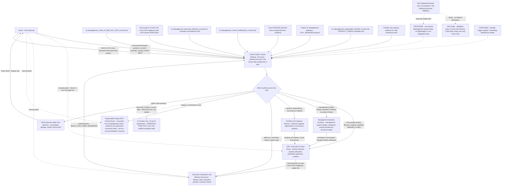
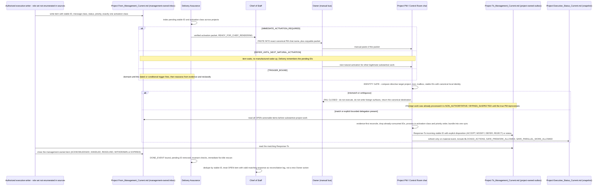
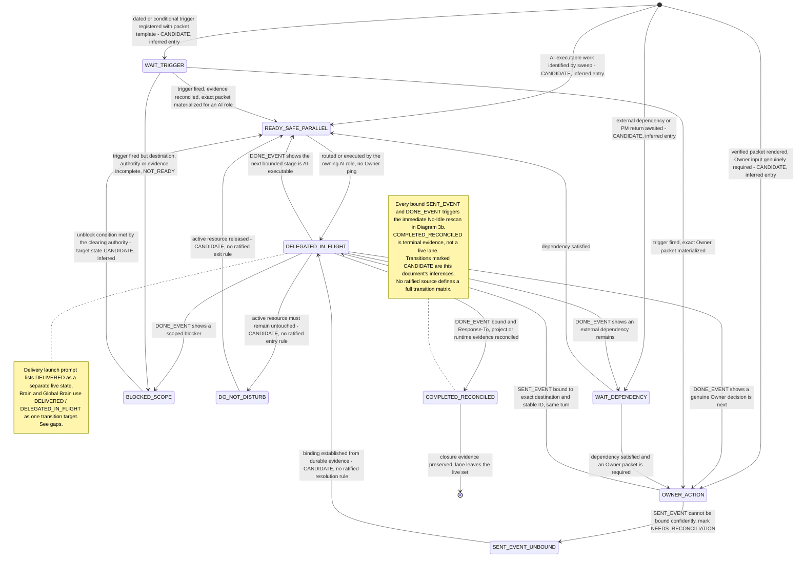
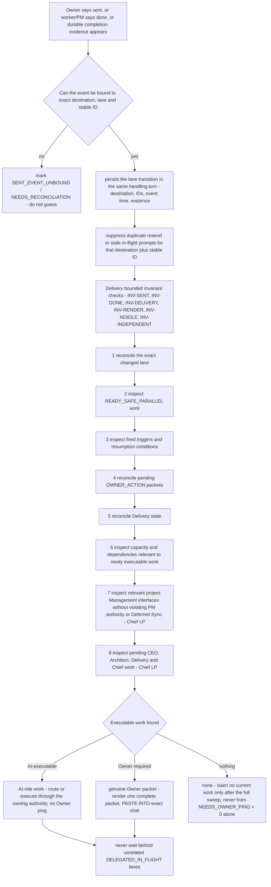
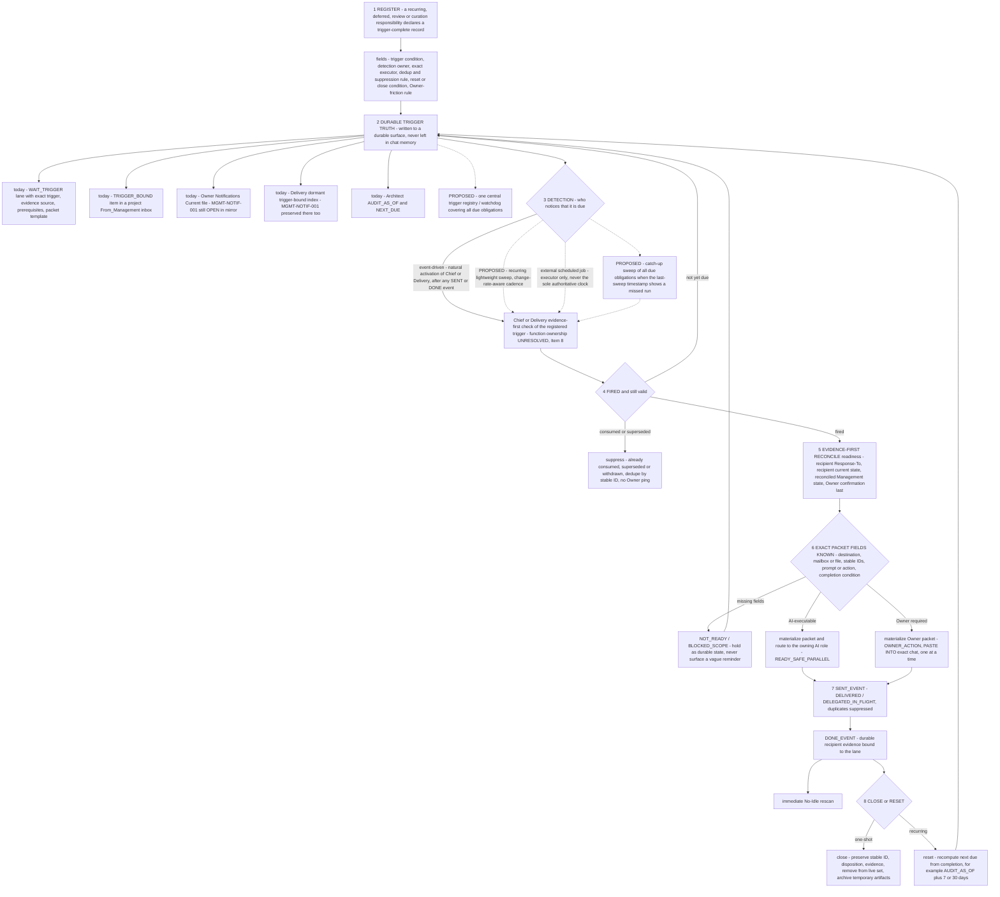
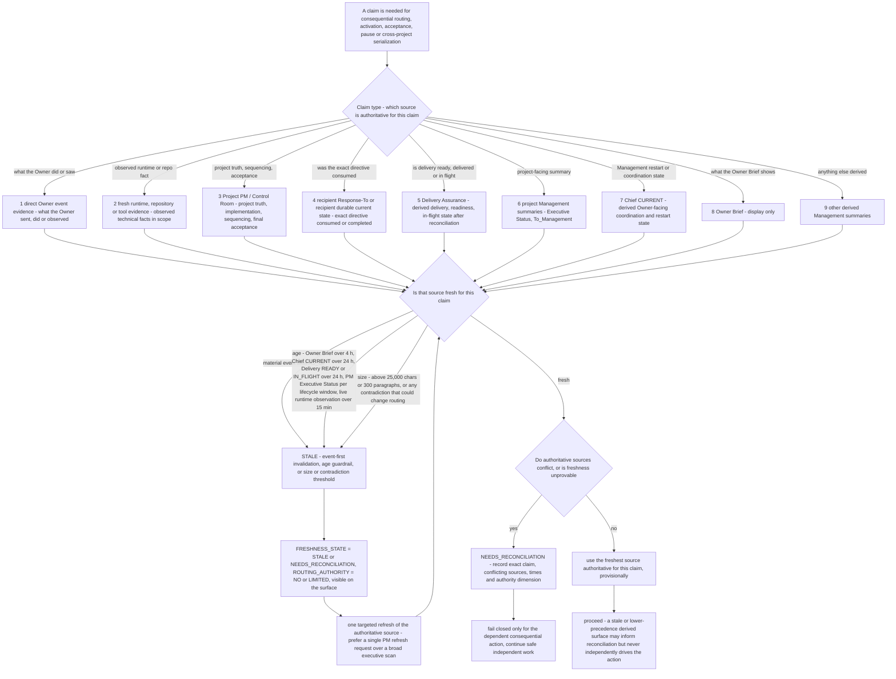
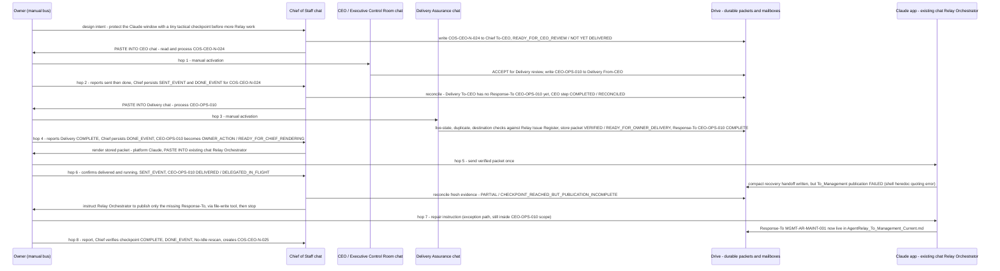
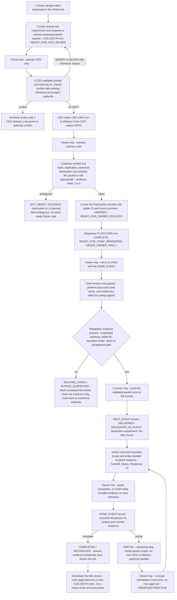
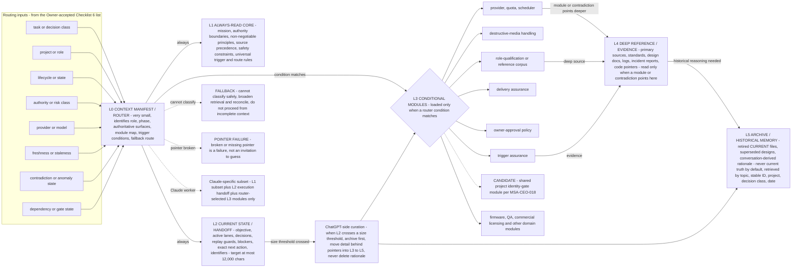

# AI Management — Flowchart and Routing Drafts (Workstream B)
Status: RESEARCH DRAFT / STAGING ONLY / NOT AUTHORITATIVE
Class: research / preparation / staging — no architecture ratification, no canonical mutation, no implementation authority
Prepared by: Claude cloud research session (bounded worker), 2026-09-30 to 2026-10-01
AS_OF: 2026-10-01 (UTC). Source mirror cut-off: the latest modifiedTime among consumed sources is 2026-09-30T22:20:47Z (AI_Management_Chief_of_Staff_Handoff_Current.txt); any canonical change after that time is not reflected here.
Source packet: AI_Management_Claude_Cloud_Refinement_Research_Packet_Current.md (Drive ID 1hAAagOUtIDu_fYRxh2LRdZv9b8Z1Xg12i7T-YXRwcAw)
Ratification path: Management Systems Architect (design review) -> CEO / Executive Control Room (ratification) -> Owner (final authority). Nothing in this document is ratified.
Sources consumed:
- AI_Management_Claude_Cloud_Refinement_Research_Packet_Current.md — 1hAAagOUtIDu_fYRxh2LRdZv9b8Z1Xg12i7T-YXRwcAw — 2026-09-30T21:28:54.801Z (full)
- AI_Global_Brain.md — 1tWUmmcM9KeL8IdZCSaUOdhkWbDCrUnDcGRp9vdsRW2A — 2026-09-30T03:39:25.734Z (full)
- AI_Management_Brain.md — 1wCIkKj2yeA0P5Xk3akwtK_ppM3A8IIpd2eBEH5Fsfjw — 2026-09-30T21:54:35.407Z (full)
- AI_Management_Current_Structure.md — 1zJJNqrie8v7Z_M3HnTxZiz-NwH3wLp4jCJdPQlKUJCk — 2026-09-30T02:51:28.914Z (full)
- AI_Management_Systems_Architecture_Current.md — 1xTQdDWb1lJnYsY16o2q55uETGu0NgJmfqtX_LsYLW2w — 2026-09-30T03:40:34.989Z (full)
- AI_Management_Chief_of_Staff_Handoff_Current.txt — 1HaZ-sUTpnwkjaqCc_Ff6MIBUKPhJlr0QTgW_kZjORZk — 2026-09-30T22:20:47.712Z (full)
- AI_Project_Management_Interface_Standard.md — 1zJK8lOqA_8_gOQrCeC91n5w5WzYBL49O — 2026-09-30T03:39:06.232Z (full)
- AI_Management_Executive_Operations_Delivery_Assurance_Launch_Prompt.md — 1gk4VN_TeqixNe_ZoMlSkXKcZIBCGx3qhurS9-wWktPw — 2026-09-30T03:17:34.094Z (full)
- AI_Management_Chief_of_Staff_Launch_Prompt.md — 1PlPfeOvn1iFuuJvB1s9uoRufhOdbIU6D-1X8RQXF_xw — 2026-09-30T04:12:34.171Z (full)
- AI_Management_Executive_Operations_To_CEO_Current.md — 17AWl_oe1NNipQvjMY18W9U3QtG5fmbwlHjMqClVmtww — 2026-09-30T22:14:39.459Z (selective: Response-To CEO-OPS-009, -010, -011, -012, -013, CEO-ULTUSB-CAP-001, ULTUSB-DA-PRODUCT003-CORRECT-001, Closure-Update)
- AI_Management_Executive_Operations_From_CEO_Current.md — 1cdBgoZUFMMWMm6FWaUd8e0oMPXHPGqkxOiVa3XAdDiw — 2026-09-30T21:55:19.399Z (selective: CEO-OPS-009 tail, -010, -011, -012, -013)
- AI_Management_CEO_OPS_010_Relay_Tactical_Checkpoint_Packet_Current.md — 1s8l4Dhq9k44dqkKZLKCaMRNLiGzZX9FkNRhdMWtbzL8 — 2026-09-30T18:20:18.015Z (full)
- AI_Management_CEO_OPS_011_New_Claude_Agent_Relay_Recovery_Activation_Packet_Current.md — 1DTYm6Hs-T-_F_QefDj758yINTBXbHfofRpSTvOhFi04 — 2026-09-30T19:03:28.130Z (full)
- AI_Management_CEO_OPS_012_ULTUSB_Claude_Orchestrator_Resume_Packet_Current.md — 12mqCOU5cAmo2m6e1EF66tmdSoML2ZMNIt5wH9bBzb_g — 2026-09-30T20:05:00.439Z (full)
- AI_Management_ULTUSB_DA_PRODUCT003_CORRECT_001_Packet_Current.md — 18vjWanL0bB-AqHT7LiEXsfzF_leDcIB9m-6Dc0Xs7hw — 2026-09-30T20:50:14.602Z (full)
- AI_Management_Handoff_Current.txt — 1olnjdY_qUyy7tMO4ePL_7BUyvtVM4n2t7amsnQgQSrQ — 2026-09-30T21:56:18.175Z (full)
- AI_Management_Prompt_Context_Engineering_Stage0_Design_Brief.md — 1J4uTBiniEdfcTqft0kPoQTW8Fuk2QSN1iZ-aEm0ahxI — 2026-09-30T16:41:04.815Z (full)
- AI_Management_Prompt_Context_Engineering_Stage0_Requirements.md — 1k_SDMgoJcIZoyUBI_ViTT-9cRGOC-_vNwhnqZw1bonA — 2026-09-30T16:34:49.931Z (full)
- AI_Management_Systems_Architect_To_CEO_Current.md — 1n1_wzeUhw5eTGX8yUuiIyALm3YcxEf9t8ndeN4mcjvw — 2026-09-30T03:41:58.087Z (selective: "Response-To: MSA-CEO-015" sections A-P; artifact lifecycle classes A-D)
- AI_Management_Systems_Architect_From_CEO_Current.md — 1Md1r2fo3gR-so1Gt5l0wnqx-t0cyP8hpbDhcpSwMvzA — 2026-09-30T21:55:06.223Z (selective: MSA-CEO-015 head and CEO DISPOSITION, MSA-CEO-016, MSA-CEO-018)
- AI_Management_Chief_of_Staff_To_CEO_Current.md — 1HGHbYPW5_0AtSpvHepTXgxCiQ1RvOxnpmdQ0zAsTZrU — 2026-09-30T21:43:12.885Z (selective: COS-CEO-N-023 through -027)
- AI_Management_Chief_of_Staff_From_CEO_Current.md — 1ARJTI8TrABlw1rx8ru7BUiUOkyzgoxh1fPcxt_Rntk0 — 2026-09-30T21:54:47.770Z (selective: CEO-COS-029 through -033)
- AI_Management_Executive_Delivery_Current.md — 1i1qZ3XcXqo8zSRLIi9Qw7lzccMw2KxZxoO3CkzQyO14 — 2026-09-30T22:14:16.642Z (full)
- AI_Management_Executive_Operations_Handoff_Current.txt — 13DZQlcAEwI1ao6EsG1fnnCpGb0tInMs1MNIi38hzAXo — 2026-09-30T22:14:20.032Z (full)
- AI_Management_Systems_Architect_Handoff_Current.txt — 1ONtkY1dMG6Pfwygb6DUw3Bh72n1amVJhLxMtyO_qwUM — 2026-09-30T03:40:37.192Z (full)
- AI_Management_Systems_Architect_Launch_Prompt.md — 1iHe3_Y4Ve0R0JE8lR1Wx3CXQNfqe76dV0EG8x4DM8BI — 2026-09-26T21:11:56.774Z (full)
- AI_Management_Portfolio_Capacity_Planner_Launch_Prompt.md — 1GynTGzrBiBRm-ZEm2oR8F3S8kB_Ryygn9N3hkUTK4YU — 2026-09-26T21:52:58.966Z (full)
- AI_Management_Owner_Notifications_Current.md — 16NCkG3VyyPGdtlGhLwxvYyWR_THJLslk — 2026-09-26T20:03:08.024Z (full)
- AI_Management_Owner_Brief_Current.md — 1AjsVrlNVOi9rBxaqtgWLUWaxZLHc0kStQutpc6Rjk88 — 2026-09-30T16:41:06.481Z (full)
- AI_Management_Project_Instructions.txt — 1rrCxnPIyAZptmVkz_ij-WJPFibOzdIzL — 2026-09-26T19:58:04.001Z (full)
- AI_Management_CEO_Bootstrap_Prompt.md — 1SmVdTyU-VKOSJMmuAQkyxVV03YDyZky0 — 2026-09-26T20:03:10.419Z (full)
- AI_Management_Lightweight_Portfolio_Current.md — 1zFQnsrUEoRnidlOWqfAMsb8zdslH-p0_7S2orj8864E — 2026-09-29T14:35:05.904Z (first 120 lines)
- AI_Ecosystem_Project_Registry.md — 1gPZQ7tfJf92EiyOBLDw0H0H6YF8VGJX-TKWv09eNdnQ — 2026-09-29T14:35:11.226Z (first 160 lines)
- AI_Management_Chat_Title_Stability_Test_Current.md — 1v3HBXuTUsaiVCjABYmMiMFX9PvKeWVKr_twk01uFYXo — 2026-09-28T00:32:28.709Z (first 60 lines)
- _manifest.json and _folder_inventory.json (provenance only; all Drive IDs above are taken from these two files)
- Not consumed (out of Workstream B scope): AI_Management_AgentRelay_Claude_Integration_Prompt.md, AI_Management_CEO_Execution_Checklist_Current.md, AI_Management_Portfolio_Capacity_Current.md, the three Portfolio & Capacity Planner mailbox/handoff files, AI_Management_Shared_Marketing_Communications_Pilot_Current.md, the three AI_Management_ULTUSB_DA_NOIDLE_*_Activation_Packet_Current.md files (their contents are summarized in AI_Management_Executive_Delivery_Current.md, which was read).

> **Reconciliation notice (added 2026-10-01 after the cross-draft consistency pass; see the staged appendix AI_Management_Refinement_Cross_Draft_Consistency_Report.md, topics T1–T26). The five workstream drafts were written independently. The items below record where this draft's wording, numbers or labels differ from a sibling draft and how the difference is to be read. Judgement disagreements are preserved, not resolved; factual notes state both methods; label corrections apply the FRAME discipline (RATIFIED = in Global Brain / Management Brain / Current Structure / Interface Standard or a recorded CEO disposition; ACCEPTED_IN_PRINCIPLE = recorded Owner checklist disposition; PROPOSED = Architect/Chief proposal; CANDIDATE = this research's own suggestion). Nothing in this notice changes any canonical file.**
>
> - T9 (method): § 6(c) counts eight Owner-carried chat switches for CEO-OPS-010 and about fourteen for the two-stage plan, merging adjacent 'confirms sent' and 'reports done' returns; Draft E § 2.3 counts every dated Owner report or confirmation block and reaches ten Owner transport turns for Chain A and sixteen for the two stages. Both are arithmetic over the same Chief-handoff entries.
> - T8-f (label): the Diagram 4 F-variant hedge should also carry the Chief handoff item 4 state line 'DESIGN ADVANCED / EXECUTION HOLD'; the Stage 0 requirements content is Owner-approved (ACCEPTED_IN_PRINCIPLE-class) while execution and routing remain on HOLD.
> - T6 (cross-reference): R6's three ownership options correspond to Draft A § 5.1 (six candidates), Draft D RAT-3 (four detector options) and Draft E § 7.5 (three positions); register RAT-017.
> - T7 (cross-reference): Diagram 7 gap 4 keeps the layer vocabulary open; Drafts A § 2.1 and C § 7.1 offer a CANDIDATE unification (CORE = L1 profile, ROUTER = L0, MODULE = L3, DEEP = L4/L5). Register RAT-001.
> - T18 (disagreement preserved): candidate quick win 2 (a pointer line on the Stage 0 Requirements file) is disputed by Draft E (EFF-006, R-11: not a quick win while both files sit under the Item #4 hold). Register QW-024 / RAT-050.
> - T19 (disagreement preserved): candidate quick win 1 and the other Chief quick wins are conditioned by Draft C (Unresolved question 17) on first confirming whether the Owner's 2026-09-30 read-only instruction (Chief handoff line 605) was one-off or standing.

## 0. How to read this document

### 0.1 Status tags used for every diagram element

- RATIFIED — the rule is already written into AI_Global_Brain.md, AI_Management_Brain.md, AI_Management_Current_Structure.md, AI_Project_Management_Interface_Standard.md, AI_Management_Systems_Architecture_Current.md, or a CEO-directed role launch prompt migrated under a ratified directive (CEO-COS-029 / CEO-OPS-009 / MSA-CEO-016). Where a rule is ratified only by reference (the CEO ratified "Response-To: MSA-CEO-015 without modification" [Source: AI_Management_Current_Structure.md § "Management Reliability Contract v1 — RATIFIED 2026-09-29"] but the detail was never transcribed into a Brain or Standard), the tag reads RATIFIED (by reference, not transcribed) and the item is also listed under "Source gaps".
- ACCEPTED_IN_PRINCIPLE — an Owner disposition recorded in AI_Management_Chief_of_Staff_Handoff_Current.txt, either a checklist disposition (Items #5, #6, #7) or another dated Owner disposition outside the checklist (for example the "Disposition: YES" on the six-step execution-packet chain). Not yet designed by the Architect, not yet ratified by the CEO. Note: the GLOBAL TRIGGER-COMPLETE DESIGN PRINCIPLE is Chief-authored design text inside the "WORKING #5 DESIGN DIRECTION TO DISCUSS WITH OWNER" block and carries no Owner disposition of its own; it is tagged PROPOSED, with only its direction ACCEPTED_IN_PRINCIPLE through the #5 and #7 dispositions (see Diagram 4).
- PROPOSED — an Architect or Chief proposal that exists in a mailbox or handoff but has no ratification (for example the P0A..P6 priority plan, the canonical-intake requirement list, the central Trigger Assurance registry).
- CANDIDATE — this document's own suggestion. Carries no authority.
- OBSERVED PRACTICE — vocabulary or behaviour visible in ratified-role mailboxes and handoffs (for example packet states such as READY_FOR_OWNER_DELIVERY) that is not defined in any Brain or Standard. Listed so the Architect can decide whether to standardize it.

### 0.2 Acronyms and names

CEO = the "AI Management — CEO / Executive Control Room" ChatGPT chat (executive authority, not a person). Chief = "AI Management — Chief of Staff / Owner Briefing". Architect or MSA = "AI Management — Management Systems Architect / Organizational Architecture". Delivery or DA = "AI Management — Executive Operations & Delivery Assurance". Planner or PCP = "AI Management — Portfolio & Capacity Planner / Delivery Planning". PM = Project Manager / Control Room chat of a project. IV = independent verification (Agent Relay context). Agent Relay, ULTUSB and GO10 are project names; no project-level document was read for this deliverable.

### 0.3 Scope note — the Prompt + Context Engineering Stage-1 tension (preserved, not resolved)

Two Owner-approved statements govern this workstream and pull in different directions:

1. "Owner disposition: HOLD STAGE 1 ROUTING until the full Management architecture/efficiency checklist is completed and Item 8 architecture re-review reconciles the combined design." [Source: AI_Management_Prompt_Context_Engineering_Stage0_Design_Brief.md § "Owner disposition: HOLD STAGE 1 ROUTING"] and "COS-CEO-N-023 is HOLD / DO NOT DELIVER until checklist + Item 8 are complete." [Source: AI_Management_Chief_of_Staff_Handoff_Current.txt § "ORIGINAL ARCHITECTURE / EFFICIENCY REVIEW CHECKLIST", item 4]
2. The research packet (modified 2026-09-30T21:28Z) authorizes "flowchart / routing drafts" and "prompt + context engineering prep" as "RESEARCH / PREP / STAGING ONLY" with "no architecture ratification" [Source: AI_Management_Claude_Cloud_Refinement_Research_Packet_Current.md § "Class" and § "B. FLOWCHART / ROUTING DRAFTS"].

This document treats the diagrams as preparation the Architect may consume during the future Item 8 / Stage-1 work. Nothing here is the Architect's Stage-1 design, nothing here routes COS-CEO-N-023, and Diagram 7 (context layers) and Diagram 4 (trigger assurance) are explicitly marked as ACCEPTED_IN_PRINCIPLE or PROPOSED content drawn as-is from Owner and Chief text, not as new design.

A related filename/content tension (stated here once; Source gaps item 2, Disagreements item 1, Unresolved question 17 and R15 point back here): the file named ..._Stage0_Requirements.md (ID 1k_SD...) carries "Status: OWNER-APPROVED REQUIREMENTS / STAGE 1 READY FOR ARCHITECT DESIGN" while the later-modified file named ..._Stage0_Design_Brief.md (ID 1J4uT...) carries the HOLD disposition. The HOLD is the fresher Owner statement (16:41Z vs 16:34Z) and is treated here as controlling; the discrepancy itself is NEEDS_RECONCILIATION.

### 0.4 Mermaid conventions

Solid edges = RATIFIED or ACCEPTED_IN_PRINCIPLE flow as written in the sources. Dashed edges (-.->) = PROPOSED or CANDIDATE paths, or Owner-carried manual hops that exist because Drive mailboxes are passive [Source: AI_Management_Brain.md § "Passive inbox and manual activation rule"]. Every diagram is followed by a table mapping each element to its exact source and status, so a reader who has not seen the sources can check each claim.

Render check: all nine Mermaid blocks (Diagrams 1, 2, 3a, 3b, 4, 5, 6a, 6b, 7) were rendered to SVG in this session with mermaid-cli 11.17.0 without syntax errors before the verification fixes; after the fixes (new nodes S8, B3b, B3c, DEL, BYP, REP and re-labelled transitions) every block was re-linted structurally and re-rendered; the rendered files are session verification artifacts only and are not deliverables. In stateDiagram-v2 (3a) dashed edges are not available, so inferred transitions are marked "CANDIDATE" in the transition text instead.

## 1. Diagram 1 — Owner -> Chief -> CEO / Architect / Delivery / Planner / PM routing

### 1(a) Purpose and scope

Shows how an unstructured Owner input enters Management through the Chief front door, how the Chief classifies it to the authority that owns it, what durable surfaces the Chief must sweep before saying "nothing to do", and where project-originated Owner obligations enter today versus where they have no defined destination. The diagram covers only the executive layer; project-internal routing is Diagram 2. The dashed intake path is the F-150 gap, drawn as PROPOSED because it exists only as an Owner requirement list for Item 8 [Source: AI_Management_Chief_of_Staff_Handoff_Current.txt § "ARCHITECTURE GAP — CANONICAL MANAGEMENT INTAKE / CHIEF INBOX SWEEP"].

### 1(b) Mermaid

### 1(c) Plain-English walkthrough

1. The Owner says anything management-related to the Chief chat, without needing to know the org chart, PM roster or mailbox topology.
2. Before acting, the Chief sweeps the seven ratified Full Work Sweep inputs: the CEO-to-Chief mailbox, every executive To-CEO/From-CEO mailbox and CEO OPEN items, Delivery Assurance's activation state, Owner Notifications, fired TRIGGER_BOUND items, the FULL_MANAGED projects' To_Management outboxes, and capacity evidence for safe productive work; plus one role-level input, the lightweight portfolio surface, which the Chief launch prompt lists as read-first and as an Opportunity Sweep input but which is not in the Global Brain or Brain sweep list. Only after that sweep may the Chief say there is no current work.
3. The Chief classifies the item to the authority that owns it: CEO for cross-project priority/lifecycle/standards, Architect for management-system design, Planner for capacity analysis, Delivery for activation/delivery state, the responsible PM for project issues (through that project's From_Management inbox, written by whichever executive role is an authorized writer; the sources do not enumerate that role set), or itself when the item is consolidation/rendering. Routing an R and D idea to Frontier is drawn dashed because it is observed in one Chief action, not in the ratified escalation path.
4. Architect proposals that would become mandatory cross-project standards go to the CEO for ratification; Planner output goes to the CEO as options, never as a final priority.
5. The CEO writes directives into role From-CEO mailboxes with stable IDs; Delivery verifies them into an exact activation packet; the Chief renders at most one Owner task at a time as "PASTE INTO: <exact chat>" plus a copyable packet; the Owner Brief is display-only.
6. Because Drive mailboxes do not wake chats, every dashed edge from the Owner to a chat is a manual paste. The Owner is the message bus.
7. A non-integrated domain chat (the F-150 warranty case) has no ratified destination: it is neither FULL_MANAGED (no To_Management outbox) nor writable into the lightweight index (which is Management-owned metadata, not a project-writable intake). Its obligation therefore stayed in chat memory. The proposed fix is one central Management-owned intake surface plus a durable trigger registry, both of which are PROPOSED only.

### 1(d) Rules encoded and (e) status of each element

| Element | Rule encoded | Source | Status |
|---|---|---|---|
| OWNER -> CHIEF | Chief is the primary Owner-facing intake/front door; Owner need not know org chart, PM roster or mailbox topology | [Source: AI_Management_Current_Structure.md § "Owner front door model — 2026-09-26"]; [Source: AI_Global_Brain.md § "Owner front door relay, PM freshness, and evidence-first delivery — ratified 2026-09-26"] | RATIFIED |
| CLASS branches to CEO / MSA / PCP / DA / PM | Escalation path: project issue -> PM; cross-project or executive decision -> CEO; design/standard -> Architect -> CEO when mandatory; capacity -> Planner -> CEO; delivery failure -> Delivery; Owner-facing consolidation -> Chief | [Source: AI_Management_Brain.md § "Chain of command and routing rule — ratified 2026-09-26", "Escalation path"] | RATIFIED |
| CLASS branch "workflow or product friction" -> MSA | Friction/annoyance intake goes through Chief to Architect (management-system/product-workflow), PM (project), Planner (capacity), Delivery (activation), CEO (policy); CEO chat is not the troubleshooting intake | [Source: AI_Management_Current_Structure.md § "Friction / annoyance intake routing"] | RATIFIED |
| CLASS -.-> FL | The ratified escalation path lists six destinations (PM, CEO, Architect -> CEO, Planner -> CEO, Delivery, Chief) and does not name Frontier; the Brain says Management consumes Frontier output as department input, not that the Chief routes to Frontier. The only evidence of Chief -> Frontier routing is one Chief handoff entry logging an Owner product concept into AI_Frontier_Lab_From_Management_Current.md as PARKED / R&D_BACKLOG (idea content deliberately not reproduced here) | [Source: AI_Management_Brain.md § "Chain of command and routing rule — ratified 2026-09-26", "Escalation path"]; [Source: AI_Management_Brain.md § "R&D / Innovation department"]; [Source: AI_Management_Chief_of_Staff_Handoff_Current.txt, entry "Owner supplied a future app concept ... Logged durably in AI_Frontier_Lab_From_Management_Current.md"] | OBSERVED PRACTICE (not in the ratified escalation path; Architect A1 question) |
| MSA -> CEO | Cross-project standards designed by the Architect require CEO review or ratification before they become mandatory | [Source: AI_Management_Brain.md § "Management systems architecture"]; [Source: AI_Management_Systems_Architect_Launch_Prompt.md § "AUTHORITY BOUNDARY"] | RATIFIED |
| PCP -> CEO | Planner is advisory only; does not set priority, start/stop projects or redesign architecture | [Source: AI_Management_Current_Structure.md § "Executive team — Portfolio & Capacity Planning", "Authority boundary"]; [Source: AI_Management_Portfolio_Capacity_Planner_Launch_Prompt.md § "AUTHORITY BOUNDARIES"] | RATIFIED |
| Sweep inputs FROMCEO, MAILBOXES, DELIV_STATE, NOTIF, TRIG, PROJ_TOMGMT, CAP | Seven-input Full Work Sweep required before any "nothing to do" claim; NEEDS_OWNER_PING = 0 is delivery-only | [Source: AI_Global_Brain.md § "Owner-front-door no-idle claim gate and activation destination contract — ratified 2026-09-27"]; [Source: AI_Management_Brain.md § "No-Idle Claim Gate / Full Work Sweep — ratified 2026-09-27"] | RATIFIED |
| Sweep input LW | PRIORITY_VISIBLE domains are tracked in one central AI-Management-owned lightweight index, metadata-first; the Chief launch prompt lists it as READ FIRST item 6 and as an input to the OWNER OPPORTUNITY SWEEP. It is NOT in the seven-item Full Work Sweep list of the Global Brain or the Brain. Canonical surfaces disagree on its status: Current Structure records "Stage 3 implementation: INITIALIZED. Central lightweight index created" and the index file reads "ACTIVE / STAGE 3 INITIALIZED", while the Brain (fresher mirror, 2026-09-30T21:54Z) still says "The future lightweight portfolio index is not yet authorized to exist operationally. Candidate tier recommendations remain proposals until CEO Stage 2 ratification." | [Source: AI_Management_Current_Structure.md § "Selective whole-life portfolio architecture — ratified 2026-09-28", "Stage gates"]; [Source: AI_Management_Chief_of_Staff_Launch_Prompt.md § "READ FIRST", item 6; § "OWNER OPPORTUNITY SWEEP", item 2]; [Source: AI_Management_Lightweight_Portfolio_Current.md § "STATUS", § "PURPOSE"]; [Source: AI_Management_Brain.md § "Selective whole-life portfolio architecture" paragraph "The future lightweight portfolio index is not yet authorized ..."] | RATIFIED (role-level: Chief LP read-first / Opportunity Sweep; Current Structure Stage 3) — Brain wording NEEDS_RECONCILIATION; not a Global Brain Full Work Sweep input |
| Sweep input NOTIF | Owner Notifications is a temporary Owner-facing follow-up surface the Chief must surface; fired notifications are first-class sweep inputs | [Source: AI_Management_Project_Instructions.txt § "OWNER NOTIFICATIONS"]; [Source: AI_Management_Brain.md § "No-Idle Claim Gate / Full Work Sweep — ratified 2026-09-27", item 4] | RATIFIED |
| CEO -> DA, DA -> CHIEF | Delivery Assurance owns passive-inbox delivery state and exact activation prompts; Chief consumes that state and renders | [Source: AI_Management_Current_Structure.md § "Passive inbox execution model — 2026-09-26"]; [Source: AI_Management_Brain.md § "Delivery versus briefing boundary"] | RATIFIED |
| CHIEF -> OWNER "PASTE INTO" | Owner Activation Destination Contract: exact canonical chat name adjacent to the copy-paste prompt, exact mailbox/file, stable IDs, completion condition, derived from current evidence | [Source: AI_Global_Brain.md § "Owner Activation Destination Contract"]; [Source: AI_Management_Brain.md § "Owner Activation Destination Contract — ratified 2026-09-27"] | RATIFIED |
| CHIEFWORK -> OWNER "Owner Brief - display only" | Owner Brief is display/rendering only, never independent routing authority; stale after 4 hours or a material event | [Source: AI_Management_Brain.md § "Management Reliability Contract v1 — ratified 2026-09-29", "Owner Brief is stale after 4 hours"]; [Source: AI_Management_Chief_of_Staff_Launch_Prompt.md § "OWNER BRIEF"] | RATIFIED |
| OWNER -.-> CEO / DA / PM (manual paste) | Drive mailboxes are durable routing surfaces only; they do not wake chats; manual activation is required and must be surfaced with the exact target chat name | [Source: AI_Management_Brain.md § "Passive inbox and manual activation rule"]; [Source: AI_Management_Current_Structure.md § "Passive inbox execution model — 2026-09-26"] | RATIFIED |
| PROJ_TOMGMT as an Owner-obligation entry point | Project PMs write future Owner follow-ups into To_Management with trigger/date, why it matters, requested action, expiry; Chief owns consolidation and deciding whether a scheduled task is needed | [Source: AI_Global_Brain.md § "Owner reminder / notification escalation", steps 1-3] | RATIFIED |
| NONINT -.-> GAP | "Chief inbox" meant only From-CEO in the F-150 case; the due-today obligation from a project chat never surfaced; the architectural defect, not the item, is the priority | [Source: AI_Management_Chief_of_Staff_Handoff_Current.txt § "ARCHITECTURE GAP — CANONICAL MANAGEMENT INTAKE / CHIEF INBOX SWEEP", "Owner observation"] | PROPOSED (gap statement is Owner-observed fact; the fix is proposed) |
| NONINT -.-> INTAKE -.-> CHIEF | Requirement 4: one central Management-owned intake/obligation surface for lightweight/non-integrated chats; requirement 5: minimal intake fields (stable ID, source chat, subject, due/trigger window, exact action, priority, completion/suppression condition, evidence pointer); requirement 7: Chief routine scan must include CEO mailbox, project intake surfaces, central lightweight intake, due trigger registry, Delivery state | [Source: AI_Management_Chief_of_Staff_Handoff_Current.txt § "ARCHITECTURE GAP — CANONICAL MANAGEMENT INTAKE / CHIEF INBOX SWEEP", "Requirement for Item #8 / final architecture", items 4, 5, 7] | PROPOSED (explicitly "Do not implement globally until Item #8 synthesis/prioritization is complete") |
| PROJ_TOMGMT preferred for FULL_MANAGED (scopes INTAKE) | Requirement 3: "For FULL_MANAGED projects, prefer the existing project To_Management interface" — the proposed INTAKE surface is for lightweight / non-integrated projects and ordinary chats only | [Source: AI_Management_Chief_of_Staff_Handoff_Current.txt § "ARCHITECTURE GAP — CANONICAL MANAGEMENT INTAKE / CHIEF INBOX SWEEP", "Requirement for Item #8 / final architecture", item 3] | PROPOSED (Owner requirement for Item 8) |
| Submission vs prioritization split (not drawn as a node) | Requirement 10: "A project may submit the obligation; Chief/Management owns prioritization/rendering. Project chats should not need to know executive priority order" | [Source: same section, item 10] | PROPOSED (Owner requirement for Item 8) |
| TRIGREG -.-> CHIEF | Central Trigger Assurance registry/watchdog is listed under P2 "Management minimum reliability foundation"; the intake sweep "should be reconciled with Trigger Assurance ... rather than implemented as a separate duplicate subsystem" | [Source: AI_Management_Chief_of_Staff_Handoff_Current.txt § "PROPOSED PRIORITY ORDER", P2]; same file § "ARCHITECTURE GAP ...", "Design implication" | PROPOSED |
| Chief also runs a whole-life Owner Opportunity Sweep when no A0/A1 obligation is ripe (not drawn) | Selection order: same-day recurring commitment, A2 work, triggered maintenance/study/admin, discretionary growth work | [Source: AI_Management_Chief_of_Staff_Launch_Prompt.md § "OWNER OPPORTUNITY SWEEP"] | RATIFIED (role-level launch prompt) |

Status line-set for Diagram 1: RATIFIED — OWNER, CHIEF, CLASS and the six solid classification branches (CEO, MSA, PCP, DA, PM, CHIEFWORK), MSA->CEO, PCP->CEO, CEO->DA, DA->CHIEF, CHIEF->OWNER, CHIEFWORK->OWNER, the seven ratified Full Work Sweep inputs (FROMCEO, MAILBOXES, DELIV_STATE, NOTIF, TRIG, PROJ_TOMGMT, CAP), the Owner-as-bus dashed pastes (the passivity rule is ratified; the hop itself is a consequence). RATIFIED (role-level only) with a Brain-wording conflict — sweep input LW. OBSERVED PRACTICE — the dashed CLASS -.-> FL branch. PROPOSED — INTAKE, TRIGREG, the dashed NONINT paths, requirements 3 and 10. CANDIDATE — none drawn. Not sourced in any role set — which executive roles write the PM node's From_Management inbox (see gap 6 and R17).

### 1(f) Known gaps / open questions this diagram exposes

1. The ratified Full Work Sweep already lists "relevant project Management interfaces" and "Owner Notifications" as inputs [Source: AI_Global_Brain.md § "Owner-front-door no-idle claim gate ...", items 4 and 6], yet the F-150 obligation was missed. Two distinct causes are visible in the sources and should not be conflated: (a) the F-150 domain has no Management interface at all ("F150 Lightning — DOMAIN ROOT / PM STATE NOT YET RECONCILED" [Source: AI_Ecosystem_Project_Registry.md § "F150 Lightning"]; listed under "Domain roots not yet promoted into the active executive bus" [Source: AI_Management_Current_Structure.md § "Domain roots not yet promoted into the active executive bus"]), so no ratified write destination exists for it; and (b) the Chief's check that day was a narrower "READ-ONLY INBOX CHECK" of From-CEO performed "Per Owner instruction, no action or processing" [Source: AI_Management_Chief_of_Staff_Handoff_Current.txt § "READ-ONLY INBOX CHECK 2026-09-30"]. Whether the fix is a new intake surface, a stricter definition of "Chief inbox", or both, is an Architect (A4) question.
2. Owner Notifications Current has not been updated since 2026-09-26 in the mirror; MGMT-NOTIF-001 (trigger date 2026-09-29) is still "OPEN / PENDING MANAGEMENT" there [Source: AI_Management_Owner_Notifications_Current.md § "MGMT-NOTIF-001"]. The latest CEO and Delivery statements keep it live: "MGMT-NOTIF-001 remains live / TRIGGER_BOUND and is not affected by this cleanup" [Source: AI_Management_Chief_of_Staff_From_CEO_Current.md § "CEO-COS-016", "Preserve"]; "MGMT-NOTIF-001 remains live / TRIGGER_BOUND and must not be affected" [Source: AI_Management_Executive_Operations_From_CEO_Current.md § "CEO-OPS-008", item 6]; "Dormant trigger-bound index remains preserved separately, including MGMT-NOTIF-001" and "MGMT-NOTIF-001 was not reclassified by this closure" [Source: AI_Management_Executive_Operations_To_CEO_Current.md § "DEFERRED / TRIGGER-BOUND STATE" (Response-To CEO-OPS-007 block) and § "Response-To: CEO-OPS-008"]. These entries are sequenced before CEO-COS-029 (2026-09-29) and carry no date, so what remains open is narrower than "is the surface live": (a) whether the 2026-09-29 trigger has been evaluated from evidence since it fired, and (b) whether the Owner Notifications file or Delivery's "dormant trigger-bound index" is the authoritative home of the obligation. A second passive-file observation in the same sources: CEO-COS-016 ordered "compact AI_Management_Owner_Notifications_Current.md so MGMT-NOTIF-002 is no longer OPEN", yet the mirror still shows MGMT-NOTIF-002 "Status: OPEN" [Source: AI_Management_Owner_Notifications_Current.md § "MGMT-NOTIF-002", Status line]. NEEDS_RECONCILIATION before the file is drawn as the canonical intake; see R16.
3. The lightweight index is written by Management, not by domains ("Central AI-Management-owned state ... not a project mailbox" [Source: AI_Management_Lightweight_Portfolio_Current.md § "PURPOSE"]). It therefore cannot serve as a project-writable intake without a rule change; the proposed intake surface is a genuinely new surface, which the anti-bureaucracy rule ("One owner briefing surface" [Source: AI_Management_Brain.md § "Anti-bureaucracy"]) should be weighed against.
4. Requirement 6 ("Project/role brain instructions must explicitly say where to place this class of information") implies an AI_Global_Brain.md delta; that is a CEO-ratification item, not a Chief or Architect action.
5. Chief -> Frontier routing is not in the ratified escalation path. The Brain's six-destination escalation path [Source: AI_Management_Brain.md § "Chain of command and routing rule — ratified 2026-09-26", "Escalation path"] has no Frontier branch; the Brain's R&D section defines Frontier as a supplier of department input to Management, not a Chief routing destination [Source: AI_Management_Brain.md § "R&D / Innovation department"]. One Chief handoff entry shows the Chief writing an Owner concept into Frontier's From_Management inbox. Whether that is legitimate within Chief authority or needs an explicit routing rule is an Architect A1 (invariant/authority map) question; drawn dashed as OBSERVED PRACTICE.
6. Who writes a project's From_Management inbox is not enumerated. The Interface Standard says the writer is an "explicitly authorized executive-management authority or higher-level PM/Control Room" [Source: AI_Project_Management_Interface_Standard.md § "3. <Project>_From_Management_Current.md", "Writer"]; the Brain says a chat receiving out-of-authority work should "route the request through the appropriate durable inbox/outbox using a stable ID" without naming which roles may write which inbox [Source: AI_Management_Brain.md § "Chain of command and routing rule — ratified 2026-09-26"]; the Architect launch prompt instructs the Architect to "publish the request through the project's Management interface" [Source: AI_Management_Systems_Architect_Launch_Prompt.md § "AUTHORITY BOUNDARY"]; the Chief launch prompt contains no From_Management write grant (grep: 0 hits). Diagram 1's PM branch and Diagram 2's writer participant are therefore both labelled "authorized executive writer — role set not enumerated". See R17.

## 2. Diagram 2 — Project PM <-> Management mailbox flow (three-file interface, activation classes, identity gate)

### 2(a) Purpose and scope

Shows one Management item travelling from an authorized executive writer into a project's From_Management inbox, through the project PM's newly ratified identity gate, into a Response-To reply in To_Management, and back to Management for reconciliation and closure. It encodes the three-file interface, the three activation classes, Deferred Project Sync, writer ownership, and evidence-first closure. The identity gate is drawn as a mandatory step because it was ratified 2026-09-30 after the GO10 -> ULTUSB misroute [Source: AI_Management_Brain.md § "Cross-project PM identity gate — ratified 2026-09-30"].

### 2(b) Mermaid

### 2(c) Plain-English walkthrough

1. Only an explicitly authorized executive writer writes into a project's From_Management inbox. The Standard names the class ("explicitly authorized executive-management authority or higher-level PM/Control Room") but no source enumerates which executive roles hold it; the CEO does so in every worked example read, and the Architect launch prompt directs the Architect to publish project-local requests through the project's Management interface. The Chief launch prompt grants no such write. Every actionable item carries a stable ID, a message class (MANAGEMENT_DIRECTIVE, PM_TO_PM_PROPOSAL, NOTIFICATION, FYI), a status, ordering context when needed, and exactly one activation class.
2. Delivery Assurance, not the Owner, remembers which projects have pending items and what class each has.
3. IMMEDIATE items become a verified activation packet that the Chief renders to the Owner as "PASTE INTO: <exact PM chat>"; the Owner pastes it. DEFERRED items wait for the project's next natural activation and are never the sole reason to wake a PM. TRIGGER_BOUND items sleep until their trigger fires and are then reclassified from current evidence.
4. When the PM chat receives any Owner/Management directive it first validates the directive's target project identity, root, mailbox and stable IDs against its own canonical identity. Prompt text and chat title are not trusted signals. On mismatch it fails closed and hands back the canonical destination without executing or writing anything foreign.
5. On match, the PM reads all OPEN items in its inbox before doing substantive work, removes already-consumed IDs, processes the rest in class/priority order, bundles them into one sync, and answers in To_Management with Response-To and an explicit disposition. It refreshes Executive Status only on material events, with scoped blocker fields.
6. The PM never edits or closes the management-owned inbox item. Management reads the response and closes its own item. Delivery binds the DONE_EVENT and rescans; the Chief dedupes by stable ID and treats an OPEN inbox item that already has a valid response as reconciliation lag, not new Owner work.

### 2(d) Rules encoded and (e) status of each element

| Element | Rule encoded | Source | Status |
|---|---|---|---|
| Participants FM, TM, ES | Exactly three files per participating project; no fourth mailbox; From_Management is management-owned inbox, To_Management is project-owned outbox, Executive Status is a snapshot not a queue | [Source: AI_Project_Management_Interface_Standard.md § "Purpose", § "1. <Project>_Executive_Status_Current.md", § "2. <Project>_To_Management_Current.md", § "3. <Project>_From_Management_Current.md"]; [Source: AI_Management_Brain.md § "Ratified mailbox standards — 2026-09-26"] | RATIFIED |
| MG->>FM item fields | Stable ID, status, priority/ordering, exactly one activation class; message classes MANAGEMENT_DIRECTIVE / PM_TO_PM_PROPOSAL / NOTIFICATION / FYI; writer is an "explicitly authorized executive-management authority or higher-level PM/Control Room"; the Architect is directed to "publish the request through the project's Management interface" for project-local structural changes; no source enumerates the full writer role set | [Source: AI_Project_Management_Interface_Standard.md § "3. <Project>_From_Management_Current.md", "Writer"]; [Source: AI_Management_Systems_Architect_Launch_Prompt.md § "AUTHORITY BOUNDARY"]; [Source: AI_Global_Brain.md § "Management authority levels"] | RATIFIED (fields and writer class); writer role set NOT ENUMERATED — see R17 |
| alt IMMEDIATE / DEFER / TRIGGER_BOUND | Activation class semantics; DEFER is the default for governance/hygiene; a Drive write alone is not a natural activation; Management must not manufacture a PM wake-up | [Source: AI_Project_Management_Interface_Standard.md § "Deferred Project Sync / next natural activation"]; [Source: AI_Global_Brain.md § "Deferred Project Sync / Next-Touch Activation — ratified 2026-09-26"] | RATIFIED |
| DA->>DA index | Delivery maintains the cross-project pending-ID / activation-class index; the project inbox remains the actual inbox | [Source: AI_Project_Management_Interface_Standard.md § "Deferred Project Sync / next natural activation", last paragraph]; [Source: AI_Management_Executive_Operations_Delivery_Assurance_Launch_Prompt.md § "DEFERRED PROJECT SYNC"] | RATIFIED |
| CH->>OW PASTE INTO | Owner Activation Destination Contract | [Source: AI_Global_Brain.md § "Owner Activation Destination Contract"] | RATIFIED |
| PM->>PM IDENTITY GATE; alt mismatch | Fail-closed invariant: validate target project identity/root before processing; prompt text, chat title, copied mailbox paths and foreign stable IDs are not authority; on mismatch do not execute, do not write foreign Current / To-Management / implementation surfaces, return canonical destination; already-processed foreign work is NON_AUTHORITATIVE / BYPASS_SUSPECTED | [Source: AI_Management_Brain.md § "Cross-project PM identity gate — ratified 2026-09-30"]; [Source: AI_Management_Handoff_Current.txt § "RATIFIED IDENTITY GATE — EFFECTIVE IMMEDIATELY"] | RATIFIED (2026-09-30, effective immediately; shared-module rollout MSA-CEO-018 still OPEN) |
| "explicit bounded delegation present" branch | Cross-project execution valid only with delegation naming source authority, target project, bounded scope, permitted surfaces/actions, return/acceptance path | [Source: AI_Management_Brain.md § "Cross-project PM identity gate — ratified 2026-09-30"] | RATIFIED |
| PM->>FM read before work | Receiving-project operating contract: check From_Management for OPEN actionable items before substantive PM work; only the established PM may disposition items; specialist chats must not self-appoint | [Source: AI_Project_Management_Interface_Standard.md § "Receiving-project operating contract"] | RATIFIED |
| PM->>PM reconcile, order, bundle | Next-natural-activation steps 1-5 | [Source: AI_Project_Management_Interface_Standard.md § "Deferred Project Sync / next natural activation", numbered list] | RATIFIED |
| PM->>TM Response-To with disposition | Response-To correlation; PM_TO_PM_PROPOSAL acknowledged as ACCEPT / MODIFY / DEFER / REJECT; a proposal is not implementation authority | [Source: AI_Project_Management_Interface_Standard.md § "2. <Project>_To_Management_Current.md" and § "3. <Project>_From_Management_Current.md"] | RATIFIED |
| PM->>ES refresh with blocker fields | Event-driven freshness; Management-visible blockers must identify BLOCKED_ACTIONS, SAFE_PREWORK_ALLOWED, SAFE_PARALLEL_WORK_ALLOWED; stale Executive Status fails visibly | [Source: AI_Project_Management_Interface_Standard.md § "PM status freshness contract", § "Reliability Contract v1 — project-facing delta"]; Rev 5 linkage: [Source: AI_Project_Management_Interface_Standard.md header "Version: 2026-09-29 Rev 5"]; [Source: AI_Management_Systems_Architect_Handoff_Current.txt, "AI_Project_Management_Interface_Standard.md: Rev 5; patched only with Management-visible blocker scope + fail-visible stale Executive Status"]; [Source: AI_Management_Systems_Architect_From_CEO_Current.md § "MSA-CEO-016", Class "RELIABILITY_CONTRACT_RATIFICATION_ROLLOUT"] | RATIFIED (Rev 5 under the MSA-CEO-016 rollout) |
| MG->>FM close | Project authority does not edit/close management-owned items; executive management reconciles and closes with ACKNOWLEDGED / HANDLED / RESOLVED / WITHDRAWN / EXPIRED | [Source: AI_Project_Management_Interface_Standard.md § "Response correlation and writer ownership"] | RATIFIED |
| CH->>CH reconciliation lag | OPEN From_Management item with valid matching response is reconciliation lag, not a new Owner action; Chief dedupes by stable ID | [Source: AI_Project_Management_Interface_Standard.md § "Response correlation and writer ownership"]; [Source: AI_Management_Brain.md § "Ratified mailbox standards — 2026-09-26"] | RATIFIED |
| DA->>DA DONE_EVENT, rescan | First-class DONE_EVENT with same-turn transition and immediate No-Idle rescan | [Source: AI_Global_Brain.md § "SENT_EVENT / DONE_EVENT"] | RATIFIED |
| Note "NON_AUTHORITATIVE / BYPASS_SUSPECTED" (misroute detection) | Routing-bypass guard: where an established PM / Control Room / Relay / consumer path exists, direct worker execution must carry evidence of originating authority, stable task/directive/ticket, delegated scope and expected return/acceptance path; missing evidence on a consequential direct-worker route is BYPASS_SUSPECTED; block only the suspect consequential write, allow independently safe read-only evidence gathering, route back to the canonical authority | [Source: AI_Management_Brain.md § "Management Reliability Contract v1 — ratified 2026-09-29", "Routing bypass"]; [Source: AI_Management_Chief_of_Staff_Launch_Prompt.md § "ROUTING BYPASS"]; [Source: AI_Management_Systems_Architect_To_CEO_Current.md § "Response-To: MSA-CEO-015", "L. ROUTING-BYPASS DETECTION"]; [Source: AI_Management_Chief_of_Staff_From_CEO_Current.md § "CEO-COS-029", item 11] | RATIFIED |
| Inheritance (not drawn) | A PM recognized for a FULL_MANAGED project inherits the interface contract automatically; no interface is created for PRIORITY_VISIBLE or REGISTERED_ONLY domains merely because a PM exists | [Source: AI_Global_Brain.md § "FULL_MANAGED PM bootstrap / recognition inheritance — ratified 2026-09-28"] | RATIFIED |

Status line-set for Diagram 2: RATIFIED — every drawn step and the BYPASS_SUSPECTED note. NOT ENUMERATED in sources — the executive role set behind participant MG (R17). PROPOSED — none. CANDIDATE — none. The identity-gate step is RATIFIED as an invariant but its shared-module implementation (MSA-CEO-018) is OPEN with "Response-To: MSA-CEO-018: NOT YET PRESENT" [Source: AI_Management_Handoff_Current.txt § "CURRENT RESPONSE EVIDENCE"].

### 2(f) Known gaps / open questions this diagram exposes

1. Where the identity gate lives is not yet decided. MSA-CEO-018 asks the Architect to "prefer updating shared/global standards and a reusable identity-check contract over duplicating long prose in every project" and to use the GO10 -> ULTUSB incident as the required negative test [Source: AI_Management_Systems_Architect_From_CEO_Current.md § "MSA-CEO-018", items 8-9]. Until then, the gate is an invariant without a defined enforcement surface; the diagram draws it inside the PM chat because that is where the Brain places the obligation.
2. "Canonical project identity" is not yet defined as a data structure (project name/key, root ID, interface surfaces, authority scope are listed as requirements only [Source: same, item 1]). The ULTUSB duplicate-root history shows why root ID alone may be insufficient [Source: AI_Management_Current_Structure.md § "Known reconciliation issue"].
3. Chat title is explicitly "not a trusted identity signal" [Source: AI_Management_Handoff_Current.txt § "RATIFIED IDENTITY GATE — EFFECTIVE IMMEDIATELY"]; the separate title-stability test (OWNER-MSA-001) was still "MANUAL UI EVIDENCE REQUIRED" [Source: AI_Management_Chat_Title_Stability_Test_Current.md § "Status"]. Yet the Owner Activation Destination Contract keys the Owner's paste on the exact canonical chat name. The two rules are consistent (name is for the human; identity check is for the chat) but the diagram cannot show what a PM uses as its canonical identity source if not the title. Architect question.
4. For the contaminated GO10-context response the reconciliation entry reads "do not delete the historical evidence; preserve it as incident evidence only." [Source: AI_Management_Executive_Delivery_Current.md § "CEO-OPS-013 ROUTING INCIDENT RECONCILIATION"]. The Interface Standard has no defined marker for a quarantined entry in a project-owned outbox; the superseding response coexists with it. Whether the Standard needs a QUARANTINED/NON_AUTHORITATIVE status value is an Architect question.
5. Executive Status is written by the PM but is read by Management for freshness decisions; the Standard permits "authorized project execution agents" to update factual evidence when delegated [Source: AI_Project_Management_Interface_Standard.md § "1. <Project>_Executive_Status_Current.md", "Writer"]. The diagram does not show that delegated-agent write path; it is legitimate only with the delegation evidence that the routing-bypass guard requires.

## 3. Diagram 3 — SENT_EVENT / DONE_EVENT / No-Idle transition flow (lane states)

### 3(a) Purpose and scope

Diagram 3a shows the seven canonical live lane states, the terminal COMPLETED_RECONCILED state, and the transitions caused by a bound SENT_EVENT, a bound DONE_EVENT, a fired trigger, a satisfied dependency, or a cleared blocker. One auxiliary holding state, SENT_EVENT_UNBOUND, is drawn because the ratified rule says an unbindable event must be marked NEEDS_RECONCILIATION rather than guessed; it is not a canonical lane. Diagram 3b shows the mandatory No-Idle rescan that must follow every bound event in the same handling turn. Both draw the ratified wording; the Delivery launch prompt's extra DELIVERED state is recorded under gaps.

### 3(b) Mermaid — 3a lane states

### 3(b) Mermaid — 3b same-turn event handling and No-Idle rescan

### 3(c) Plain-English walkthrough

1. A lane enters the live set in one of four ways: work an AI role can do now (READY_SAFE_PARALLEL), a verified packet that genuinely needs the Owner (OWNER_ACTION), a dated or conditional trigger with a packet template already attached (WAIT_TRIGGER), or an external dependency such as a PM return (WAIT_DEPENDENCY). These four entry points are inferred from the ratified lane definitions; no source writes an entry rule, so they are tagged CANDIDATE.
2. When the Owner says "sent", the handling chat must, in the same turn, bind the statement to an exact destination and stable ID. If it can, the lane moves to DELEGATED_IN_FLIGHT and duplicate resend prompts are suppressed. If it cannot, the event is parked as NEEDS_RECONCILIATION; guessing is forbidden.
3. When a worker or PM says "done", or durable completion evidence appears (a Response-To, an updated handoff, runtime evidence), the chat binds it to the exact lane, reconciles the evidence, and moves the lane to COMPLETED_RECONCILED or to whichever wait/blocked/ready/Owner state the evidence supports. Stale send/in-flight prompts are removed.
4. When a trigger fires, the lane does not become a reminder. Evidence is reconciled and the exact packet is materialized; if destination, authority or evidence fields are missing, the lane is BLOCKED_SCOPE / NOT_READY.
5. DO_NOT_DISTURB protects an active resource (for example a running Claude session). The ratified text defines it as a blocker attribute ("DO_NOT_DISTURB when an active resource must remain untouched") and forbids turning it into an ecosystem pause; it does not say how a lane enters or leaves it, so the drawn DELEGATED_IN_FLIGHT -> DO_NOT_DISTURB -> READY_SAFE_PARALLEL edges are this document's inference (CANDIDATE). BLOCKED_SCOPE lifts only when the clearing authority satisfies the unblock condition; that it returns specifically to READY_SAFE_PARALLEL is also inferred.
6. After every bound SENT or DONE event, the No-Idle rescan runs immediately (drawn as eight steps: six from MSA-CEO-015 § I, two from the Chief launch prompt; the numbering is this document's). It must find AI-executable work and route it, or a genuine Owner packet and render exactly one, or conclude "no current work" only after the full sweep. It never waits behind an unrelated in-flight lane, and one Owner-facing task is a rendering rule, not a concurrency limit.
7. COMPLETED_RECONCILED is terminal: closure evidence (stable ID, disposition, Response-To, outcome) is preserved and the lane leaves the live set.

### 3(d) Rules encoded and (e) status of each element

| Element | Rule encoded | Source | Status |
|---|---|---|---|
| Seven lane states | Canonical live lane states: OWNER_ACTION, READY_SAFE_PARALLEL, DELEGATED_IN_FLIGHT, WAIT_TRIGGER, WAIT_DEPENDENCY, BLOCKED_SCOPE, DO_NOT_DISTURB | [Source: AI_Management_Brain.md § "Management Reliability Contract v1 — ratified 2026-09-29", "Canonical live lane states"]; [Source: AI_Management_Current_Structure.md § "Management Reliability Contract v1 — RATIFIED 2026-09-29"] | RATIFIED |
| COMPLETED_RECONCILED terminal | "COMPLETED / RECONCILED is terminal evidence, not a permanent live lane" | [Source: AI_Management_Brain.md § "Management Reliability Contract v1 — ratified 2026-09-29"]; [Source: AI_Management_Executive_Operations_Delivery_Assurance_Launch_Prompt.md § "CANONICAL LIVE DELIVERY STATES"] | RATIFIED |
| Required lane fields (not drawn as nodes) | stable ID, subject, responsible authority/executor, state, AS_OF, evidence reference, BLOCKED_ACTIONS, SAFE_PREWORK_ALLOWED, SAFE_PARALLEL_WORK_ALLOWED, trigger/dependency/unblock condition, exact Owner packet reference, exact next-transition condition | [Source: AI_Management_Brain.md § "Management Reliability Contract v1 — ratified 2026-09-29", "Required lane fields"] | RATIFIED |
| OWNER_ACTION -> DELEGATED_IN_FLIGHT | SENT_EVENT: bind to exact destination and stable ID(s), transition READY/QUEUED -> DELIVERED / DELEGATED_IN_FLIGHT in the same turn, persist, suppress duplicates, update restart state, immediately rescan; directive existence alone is not delivery proof | [Source: AI_Management_Brain.md § "Management Reliability Contract v1 — ratified 2026-09-29", "SENT_EVENT"]; [Source: AI_Global_Brain.md § "SENT_EVENT / DONE_EVENT"] | RATIFIED |
| OWNER_ACTION -> SENT_EVENT_UNBOUND | "If the event cannot be bound confidently, mark it NEEDS_RECONCILIATION rather than guessing"; wording "SENT_EVENT_UNBOUND / NEEDS_RECONCILIATION" appears in MSA-CEO-015 § G step 2 and the Delivery launch prompt | [Source: AI_Global_Brain.md § "SENT_EVENT / DONE_EVENT"]; [Source: AI_Management_Systems_Architect_To_CEO_Current.md § "Response-To: MSA-CEO-015", "G. FIRST-CLASS OWNER SENT_EVENT", step 2]; [Source: AI_Management_Executive_Operations_Delivery_Assurance_Launch_Prompt.md § "FIRST-CLASS SENT_EVENT", step 2] | RATIFIED requirement; the state name is ratified by reference (MSA-CEO-015 § G) and transcribed only at Delivery role level |
| SENT_EVENT_UNBOUND -> DELEGATED_IN_FLIGHT | No source states how an unbound SENT_EVENT is later resolved; drawn as "binding established from durable evidence" by analogy with the evidence-first delivery rule | inference from [Source: AI_Global_Brain.md § "Owner front door relay, PM freshness, and evidence-first delivery — ratified 2026-09-26", "Evidence-first delivery rule"] | CANDIDATE (inferred; no ratified resolution rule) |
| [*] entry transitions (four) | Entry into READY_SAFE_PARALLEL / OWNER_ACTION / WAIT_TRIGGER / WAIT_DEPENDENCY inferred from each lane's definition; no source writes an entry rule | inference from [Source: AI_Management_Brain.md § "Management Reliability Contract v1 — ratified 2026-09-29", "Canonical live lane states"] | CANDIDATE (inferred from ratified lane semantics) |
| DELEGATED_IN_FLIGHT -> COMPLETED_RECONCILED / WAIT_DEPENDENCY / BLOCKED_SCOPE / OWNER_ACTION / READY_SAFE_PARALLEL | DONE_EVENT: bind to exact lane, reconcile Response-To/project/runtime evidence, transition to COMPLETED / RECONCILED or the correct WAIT / BLOCKED / READY / OWNER state, remove stale prompts, rescan | [Source: AI_Global_Brain.md § "SENT_EVENT / DONE_EVENT"]; [Source: AI_Management_Executive_Operations_Delivery_Assurance_Launch_Prompt.md § "FIRST-CLASS DONE_EVENT", step 3] | RATIFIED |
| READY_SAFE_PARALLEL -> DELEGATED_IN_FLIGHT | "If executable work belongs to an AI role and does not need Owner input, execute/route it instead of emitting a vague reminder" | [Source: AI_Management_Systems_Architect_To_CEO_Current.md § "Response-To: MSA-CEO-015", "J. EXACT-NEXT-ACTION RENDERING"]; [Source: AI_Management_Brain.md § "No-Idle Claim Gate / Full Work Sweep — ratified 2026-09-27", last paragraph] | RATIFIED |
| WAIT_TRIGGER transitions | "TRIGGER -> evidence reconcile -> READY_SAFE_PARALLEL or OWNER_ACTION -> exact packet/action -> SENT_EVENT / DELEGATED_IN_FLIGHT. If trigger fired but exact destination/authority/evidence is incomplete: BLOCKED_SCOPE / NOT_READY" | [Source: AI_Management_Systems_Architect_To_CEO_Current.md § "Response-To: MSA-CEO-015", "K. SCHEDULED / RESUMPTION WORKFLOW"]; [Source: AI_Global_Brain.md § "Exact resumption packet"] | RATIFIED (K is ratified by reference; the Global Brain transcribes the packet rule, not the state sequence) |
| WAIT_DEPENDENCY transitions | WAIT_TRIGGER / WAIT_DEPENDENCY must carry exact trigger, evidence source, readiness prerequisites, packet template; the K transition (TRIGGER -> evidence reconcile -> READY_SAFE_PARALLEL or OWNER_ACTION) "applies to ... external dependency completion" | [Source: AI_Management_Brain.md § "Management Reliability Contract v1 — ratified 2026-09-29", "Exact next action and resumption"]; [Source: AI_Management_Systems_Architect_To_CEO_Current.md § "Response-To: MSA-CEO-015", "K. SCHEDULED / RESUMPTION WORKFLOW", "This applies to"] | RATIFIED (field contract transcribed; the two WAIT_DEPENDENCY exits are K by reference) |
| BLOCKED_SCOPE -> READY_SAFE_PARALLEL | Blocker must state unblock condition and clearing authority/evidence; fail closed only on the affected action. No source names the state a cleared blocker returns to | [Source: AI_Global_Brain.md § "Scoped blockers"] | RATIFIED (unblock-condition requirement); CANDIDATE (that the target is READY_SAFE_PARALLEL rather than the pre-block state) |
| DO_NOT_DISTURB (state) | Preserve DO_NOT_DISTURB when an active resource must remain untouched; never convert it into an ecosystem pause. Defined as a blocker attribute and listed as a lane state; no entry or exit rule is written | [Source: AI_Management_Brain.md § "Management Reliability Contract v1 — ratified 2026-09-29", "Blockers"]; [Source: AI_Global_Brain.md § "Scoped blockers"]; [Source: AI_Management_Systems_Architect_To_CEO_Current.md § "Response-To: MSA-CEO-015", "C. ONE-OWNER-TASK RENDERING VS REAL CONCURRENCY"] | RATIFIED (state and attribute) |
| DELEGATED_IN_FLIGHT -> DO_NOT_DISTURB; DO_NOT_DISTURB -> READY_SAFE_PARALLEL | Drawn so the state is reachable; no source defines these edges | inference from the rows above | CANDIDATE (inferred; no ratified entry/exit rule) |
| 3b steps S1-S6 and G | MSA-CEO-015 § I numbers seven items: 1 reconcile the exact changed lane, 2 inspect READY_SAFE_PARALLEL work, 3 inspect fired triggers/resumption conditions, 4 reconcile pending OWNER_ACTION packets, 5 reconcile Delivery state, 6 inspect capacity/dependencies, 7 continue/route safe work without waiting behind unrelated DELEGATED_IN_FLIGHT lanes (drawn as G). The Brain transcribes the same six items plus the continue/route rule as one unnumbered sentence | [Source: AI_Management_Systems_Architect_To_CEO_Current.md § "Response-To: MSA-CEO-015", "I. MANDATORY POST-SENT / POST-DONE NO-IDLE RESCAN", items 1-7]; [Source: AI_Management_Brain.md § "Management Reliability Contract v1 — ratified 2026-09-29", "Post-event No-Idle rescan"] | RATIFIED (I by reference; Brain transcription unnumbered — the S-numbering is this document's) |
| 3b steps S7, S8 | Chief launch prompt NO-IDLE adds "inspect relevant project Management interfaces" and "inspect pending CEO/Architect/Delivery/Chief work" (six bullets in total; neither bullet is in the Brain sentence or § I) | [Source: AI_Management_Chief_of_Staff_Launch_Prompt.md § "NO-IDLE"] | RATIFIED (role-level; CEO-COS-029 migration) |
| 3b INV node | Bounded invariant checks run on SENT_EVENT, DONE_EVENT, before READY_FOR_CHIEF_RENDERING, on contradiction, during active-lane reconciliation; invariant IDs INV-CURRENT..INV-INDEPENDENT | [Source: AI_Management_Executive_Operations_Delivery_Assurance_Launch_Prompt.md § "BOUNDED LIVE INVARIANT CHECKS"]; [Source: AI_Management_Systems_Architecture_Current.md § "STRUCTURAL AUDIT OUTPUT FORMAT", "Core invariant IDs"] | RATIFIED |
| 3b R3 | NEEDS_OWNER_PING = 0 does not mean no work; no Owner action does not mean no Management work; no Management work does not mean no productive portfolio work | [Source: AI_Management_Brain.md § "No-Idle Claim Gate / Full Work Sweep — ratified 2026-09-27", "Required distinctions"] | RATIFIED |
| 3b G | One Owner-facing task is rendering only; never serialize independent lanes behind an unrelated Owner task or in-flight worker | [Source: AI_Global_Brain.md § "One Owner-facing task is rendering only"] | RATIFIED |

Status line-set for Diagram 3: RATIFIED — all seven lane states, COMPLETED_RECONCILED and its exit to [*], OWNER_ACTION -> DELEGATED_IN_FLIGHT (SENT_EVENT), OWNER_ACTION -> SENT_EVENT_UNBOUND (requirement; state name ratified by reference in MSA-CEO-015 § G, transcribed at Delivery role level), the five DONE_EVENT exits from DELEGATED_IN_FLIGHT, READY_SAFE_PARALLEL -> DELEGATED_IN_FLIGHT and the three WAIT_TRIGGER exits (K/J by reference), the two WAIT_DEPENDENCY exits (K by reference), the BLOCKED_SCOPE unblock-condition requirement, and all of 3b (S1-S6 and G from § I by reference; S7-S8 role-level). CANDIDATE (inferred, no ratified transition matrix) — the four [*] entry transitions, SENT_EVENT_UNBOUND -> DELEGATED_IN_FLIGHT, DELEGATED_IN_FLIGHT -> DO_NOT_DISTURB, DO_NOT_DISTURB -> READY_SAFE_PARALLEL, and the target state of the BLOCKED_SCOPE exit. Roughly 7 of the 22 drawn transitions are therefore this document's inferences. PROPOSED — none. OBSERVED PRACTICE — none.

### 3(f) Known gaps / open questions this diagram exposes

1. State-count discrepancy. The Delivery launch prompt lists eight live states including DELIVERED as its own state [Source: AI_Management_Executive_Operations_Delivery_Assurance_Launch_Prompt.md § "CANONICAL LIVE DELIVERY STATES"], while the Brain, Current Structure and Chief launch prompt list seven and treat "DELIVERED / DELEGATED_IN_FLIGHT" as a single transition target [Source: AI_Management_Brain.md § "Management Reliability Contract v1 — ratified 2026-09-29"]. The Global Brain writes "DELIVERED / IN_FLIGHT" [Source: AI_Global_Brain.md § "SENT_EVENT / DONE_EVENT"]. Three spellings of one transition. NEEDS_RECONCILIATION; drawn as the Brain's seven.
2. Packet-state vocabulary is not in the lane model. Mailboxes and handoffs use READY_FOR_CEO_REVIEW / NOT_DELIVERED, PASSIVE_ACTIVATION_PENDING, VERIFIED / READY_FOR_OWNER_DELIVERY, READY_FOR_CHIEF_RENDERING, PARTIAL / CHECKPOINT_REACHED_BUT_PUBLICATION_INCOMPLETE, OPEN / WAIT_CORRECTION_CONSUMPTION, PAUSED_BY_CAPACITY / CLEAN_CHECKPOINT [Source: AI_Management_Chief_of_Staff_Handoff_Current.txt § "EXECUTION START — FIRST APPROVAL STEP", § "DONE_EVENT — COS-CEO-N-024 / CEO ROUTING COMPLETE", § "CHECKPOINT RECONCILIATION — CEO-OPS-010 PARTIAL COMPLETION"; AI_Management_Executive_Operations_To_CEO_Current.md § "Response-To: CEO-OPS-010", "DELIVERY STATE"]. Only READY_FOR_CHIEF_RENDERING and NOT_READY / BLOCKED are defined in a role launch prompt. These are sub-states of OWNER_ACTION or DELEGATED_IN_FLIGHT in practice; whether they should be formalized is an Architect (Item 8 A1/A3) question. See Diagram 6b, which draws them as OBSERVED PRACTICE.
3. Who persists the transition when the Owner reports "sent" in the Chief chat but Delivery owns delivery truth? Both the Chief launch prompt and the Delivery launch prompt require same-turn persistence in their own surfaces [Source: AI_Management_Chief_of_Staff_Launch_Prompt.md § "SENT_EVENT"; AI_Management_Executive_Operations_Delivery_Assurance_Launch_Prompt.md § "FIRST-CLASS SENT_EVENT"]. The worked example shows the Chief recording SENT_EVENT while the Delivery surface still showed the item READY until Delivery's next activation ("Stale READY_FOR_CHIEF_RENDERING / NEEDS_OWNER_PING for CEO-OPS-011 was removed" only during CEO-OPS-012 processing [Source: AI_Management_Executive_Operations_To_CEO_Current.md § "Response-To: CEO-OPS-012", "RELAY SENT / DUPLICATE RECONCILIATION"]). Because chats are passive, the two ledgers diverge between activations by design; the precedence ladder (Diagram 5) resolves reads, but the write-side rule "which surface is updated first" is not written down.
4. The 3a diagram cannot express "same turn". The ratified requirement is temporal (persist before the response ends); a state chart shows only the resulting state. Reviewers should read 3b as the mandatory procedure attached to every 3a transition.
5. No ratified transition matrix exists. The sources define the seven states, the terminal state, the SENT/DONE-driven transitions and the K resumption sequence, but not: how a lane enters the live set, how DO_NOT_DISTURB is entered or released (it is written as a blocker attribute [Source: AI_Management_Brain.md § "Management Reliability Contract v1 — ratified 2026-09-29", "Blockers"] and as a lane state in the same section), how a SENT_EVENT_UNBOUND / NEEDS_RECONCILIATION event is later resolved, or which state a cleared BLOCKED_SCOPE returns to. The CANDIDATE edges in 3a fill those holes so the chart is connected; they must not be read as rules. Architect question for R4.

## 4. Diagram 4 — Trigger Assurance lifecycle

### 4(a) Purpose and scope

Shows the life of one recurring, deferred or dated obligation from registration to close or reset, including who detects that it fired, how a fired trigger becomes an exact packet rather than a reminder, and how a missed run is caught up. Most of this diagram is NOT ratified: the ratified parts are the resumption workflow (K), the Architect cadence next-due semantics, the TRIGGER_BOUND activation class, evidence-first suppression, and the completion-tag rule for scheduled routines. The registry itself and the trigger-complete field set are Chief-authored design text (PROPOSED) whose direction the Owner accepted through the #5 and #7 dispositions; the recurring sweep and change-rate-aware cadence are Owner #7 dispositions (ACCEPTED_IN_PRINCIPLE, cadence undecided); missed-run catch-up is an Owner Item 8 requirement (PROPOSED). Who owns trigger detection as a function is itself an open Item 8 question (see gap 7).

### 4(b) Mermaid

### 4(c) Plain-English walkthrough

1. Any responsibility that must recur, wait, or be reviewed later is registered with a complete trigger record: what fires it, who is responsible for noticing, who executes, how duplicates are suppressed, when it closes or resets, and what the Owner is and is not asked to do.
2. That record is written somewhere durable. Today the durable homes are a WAIT_TRIGGER lane in a role's CURRENT state, a TRIGGER_BOUND item in a project inbox, the Owner Notifications file, Delivery's separately preserved "dormant trigger-bound index" (MGMT-NOTIF-001 appears in both), and the Architect's AUDIT_AS_OF / NEXT_DUE fields. A single central registry/watchdog is proposed but does not exist.
3. Detection today is event-driven: whenever the Chief or Delivery is naturally activated, and after every SENT or DONE event, they check registered triggers. Which function should own detection in the target design is unresolved (Item 8); the sources place it four different ways, listed in gap 7. A recurring lightweight sweep, a cadence that tightens for fast-changing lanes, and an external scheduled job acting as an executor (but never as the only clock) are proposed. A catch-up path for a missed sweep is proposed and depends on recording when the last sweep ran.
4. If the trigger has fired, the item is first checked against durable recipient evidence in the ratified order; anything already consumed or superseded is suppressed by stable ID with no Owner ping.
5. A genuinely fired, still-valid item must become an exact packet. If any required field is unknown, the item is held as NOT_READY / BLOCKED_SCOPE in durable state; it must never be presented as "resume X" or "Claude is available".
6. If an AI role can execute, it is routed there without the Owner. If the Owner is genuinely required, one complete "PASTE INTO" packet is rendered.
7. Sending binds a SENT_EVENT; durable recipient evidence later binds a DONE_EVENT; both trigger the immediate No-Idle rescan.
8. A one-shot obligation closes with its stable ID, disposition and evidence preserved. A recurring one resets: the next due date is recomputed from the completion time (the ratified example is the Architect audit, AUDIT_AS_OF plus 7 or 30 days).

### 4(d) Rules encoded and (e) status of each element

| Element | Rule encoded | Source | Status |
|---|---|---|---|
| A, F trigger-complete fields | "Any recurring/deferred/review/learning/curation/audit responsibility is incomplete unless it defines: event/state/freshness/cadence trigger; who owns trigger detection; exact executor; dedup/suppression; reset/close condition; Owner-friction rule". This heading sits inside the Chief's "WORKING #5 DESIGN DIRECTION TO DISCUSS WITH OWNER" block and has no Owner disposition of its own; the #5 disposition accepts "the control-kernel direction" with four preservation points and the #7 disposition accepts "TRIGGER ASSURANCE" as item 5 of the trigger architecture, neither naming the six fields | [Source: AI_Management_Chief_of_Staff_Handoff_Current.txt § "WORKING #5 DESIGN DIRECTION TO DISCUSS WITH OWNER", sub-heading "GLOBAL TRIGGER-COMPLETE DESIGN PRINCIPLE"]; [Source: same file § "CHECKLIST #5 — OWNER DISPOSITION"; § "CHECKLIST #7 — OWNER DISPOSITION / PROACTIVE SCAN REQUIREMENT", item 5] | PROPOSED (Chief design text); direction ACCEPTED_IN_PRINCIPLE via the #5 and #7 dispositions; not in any Brain |
| F variant with eight fields | "event triggers; state/freshness triggers; cadence safety net where useful; owner of trigger detection; execution target; dedup/suppression; close/reset condition; Owner-friction rule" | [Source: AI_Management_Prompt_Context_Engineering_Stage0_Design_Brief.md § "6. Trigger-complete design requirement"] | PROPOSED (Chief-authored Stage 0 text under Owner EXECUTION HOLD; the companion Requirements file calls its content Owner-approved, so the field list's acceptance status is itself uncertain — see gap 1) |
| B "never left in chat memory" | "trigger obligations live in durable Trigger Assurance state, not conversational memory" is one bullet in a list the Chief heads "Potential reliability controls to evaluate"; "Prefer central Management Trigger Assurance / Watchdog over self-triggering passive chats" is Chief design text in the same block. The #5 disposition accepts the direction, not this item by name | [Source: AI_Management_Chief_of_Staff_Handoff_Current.txt § "WORKING #5 DESIGN DIRECTION TO DISCUSS WITH OWNER", "Potential reliability controls to evaluate"; sub-heading "GLOBAL TRIGGER-COMPLETE DESIGN PRINCIPLE"]; [Source: same file § "CHECKLIST #5 — OWNER DISPOSITION"] | PROPOSED (a control "to evaluate"); direction ACCEPTED_IN_PRINCIPLE (#5 disposition "ACCEPTED / COMPLETE ENOUGH TO ADVANCE") |
| B1 WAIT_TRIGGER lane contents | WAIT_TRIGGER must include exact trigger evidence required, destination binding, stop point, stable IDs, files to read, allowed/prohibited actions, completion condition; the trigger firing must materialize the executable packet | [Source: AI_Management_Executive_Operations_Delivery_Assurance_Launch_Prompt.md § "EXACT RESUMPTION CONTRACT"]; [Source: AI_Management_Brain.md § "Management Reliability Contract v1 — ratified 2026-09-29", "Exact next action and resumption"] | RATIFIED |
| B2 TRIGGER_BOUND inbox item | Dormant until dated/conditional trigger fires; then reassess and reclassify as immediate, deferred or resolved | [Source: AI_Project_Management_Interface_Standard.md § "3. <Project>_From_Management_Current.md", "Activation classes"] | RATIFIED |
| B3 Owner Notifications file | Temporary Owner-facing follow-ups "that must not depend on memory"; Chief surfaces due/triggered items. MGMT-NOTIF-001 is "OPEN / PENDING MANAGEMENT" in the mirror (trigger 2026-09-29) | [Source: AI_Management_Owner_Notifications_Current.md § "Purpose", § "MGMT-NOTIF-001"]; [Source: AI_Management_Project_Instructions.txt § "OWNER NOTIFICATIONS"] | RATIFIED (surface exists); whether the file or Delivery's index is the authoritative home is open — see Diagram 1 gap 2 and R16 |
| B3b Delivery dormant trigger-bound index | "Dormant trigger-bound index remains preserved separately, including MGMT-NOTIF-001"; "MGMT-NOTIF-001 was not reclassified by this closure"; CEO: "MGMT-NOTIF-001 remains live / TRIGGER_BOUND and is not affected by this cleanup" | [Source: AI_Management_Executive_Operations_To_CEO_Current.md § "DEFERRED / TRIGGER-BOUND STATE" (Response-To CEO-OPS-007 block); § "Response-To: CEO-OPS-008"]; [Source: AI_Management_Chief_of_Staff_From_CEO_Current.md § "CEO-COS-016", "Preserve"]; [Source: AI_Management_Executive_Operations_From_CEO_Current.md § "CEO-OPS-008", item 6] | RATIFIED (CEO directive level); the index is a Delivery-maintained surface, not a Standard-defined one |
| B3c AUDIT_AS_OF / NEXT_DUE | Each completed audit records AUDIT_AS_OF and cadence mode; NEXT_DUE = AUDIT_AS_OF + 7 (ACTIVE) or + 30 (DORMANT) days; a material reliability event triggers an earlier audit; an early audit resets AUDIT_AS_OF; NEXT_DUE is durable activation state, not proof of execution | [Source: AI_Management_Systems_Architecture_Current.md § "ARCHITECT SAFETY-NET CADENCE — RATIFIED", "Next-due semantics" 1-8] | RATIFIED |
| B4 central registry / watchdog | "central Trigger Assurance registry/watchdog model" (P2); "Management should maintain durable trigger truth and a periodic central sweep/watchdog" | [Source: AI_Management_Chief_of_Staff_Handoff_Current.txt § "PROPOSED PRIORITY ORDER", P2]; [Source: AI_Management_Prompt_Context_Engineering_Stage0_Design_Brief.md § "8. Trigger Assurance dependency"] | PROPOSED |
| C event-driven detection | Fired TRIGGER_BOUND items and fired Owner Notifications are Full Work Sweep inputs; rescan after every SENT/DONE inspects fired triggers | [Source: AI_Management_Brain.md § "No-Idle Claim Gate / Full Work Sweep — ratified 2026-09-27", items 4-5]; [Source: AI_Management_Brain.md § "Management Reliability Contract v1 — ratified 2026-09-29", "Post-event No-Idle rescan"] | RATIFIED |
| C detection for the Architect audit | Delivery flags/routes the due Architect activation; Chief/Delivery/CEO routing surfaces it; Architect performs the audit; "Do not create a new Auditor role"; "Use existing Chief/Delivery routing. Do not create a new role" | [Source: AI_Management_Executive_Operations_Delivery_Assurance_Launch_Prompt.md § "ARCHITECT SAFETY-NET"]; [Source: AI_Management_Systems_Architecture_Current.md § "ARCHITECT SAFETY-NET CADENCE — RATIFIED", item 8]; [Source: AI_Management_Chief_of_Staff_From_CEO_Current.md § "CEO-COS-029", item 12] | RATIFIED |
| D detection owner (as a function) | For the existing trigger classes, detection is RATIFIED to Chief/Delivery (Full Work Sweep item 5; Architect safety-net). As a Management function, ownership is unresolved: Item 8 "must reconcile ... trigger ownership"; #7 places Trigger Assurance as the Efficiency function's wake-up path; the proposed priority plan P2 makes a "central Trigger Assurance registry/watchdog model" a Management foundation; A2/A5 list it among overlaps with Chief/Delivery and ask "what should NOT become a new role"; the research packet lists Trigger Assurance as a role/function candidate; CEO-COS-029 item 12 and the Delivery launch prompt forbid a new role for the safety-net case | [Source: AI_Management_Chief_of_Staff_Handoff_Current.txt § "ORIGINAL ARCHITECTURE / EFFICIENCY REVIEW CHECKLIST", item 8; § "CHECKLIST #7 — OWNER DISPOSITION / PROACTIVE SCAN REQUIREMENT", item 5; § "POST-CHECKLIST PRIORITY / APPROVAL / IMPLEMENTATION PLAN — PROPOSED 2026-09-30", P2; § "Item 8" scope list A2, A5]; [Source: AI_Management_Claude_Cloud_Refinement_Research_Packet_Current.md § "A. ROLE / EXPERT REFERENCE CORPUS RESEARCH"]; [Source: AI_Management_Chief_of_Staff_From_CEO_Current.md § "CEO-COS-029", item 12]; [Source: AI_Management_Executive_Operations_Delivery_Assurance_Launch_Prompt.md § "ARCHITECT SAFETY-NET"] | RATIFIED for existing trigger classes — FUNCTION OWNERSHIP UNRESOLVED (Item 8, A2/A5); see gap 7 and R6 |
| C recurring lightweight sweep, change-rate-aware cadence | Checklist #7: event/exception triggers, regular broad scan, deep-dive triggers, change-rate-aware cadence, trigger assurance; "Exact cadence remains for Item #8" | [Source: AI_Management_Chief_of_Staff_Handoff_Current.txt § "CHECKLIST #7 — OWNER DISPOSITION / PROACTIVE SCAN REQUIREMENT"] | ACCEPTED_IN_PRINCIPLE (cadence undecided) |
| C intake sweep "proactive, not Owner-prompted" | Event-driven scan on natural Chief activation and after SENT/DONE; recurring lightweight sweep as safety net; missed-sweep timestamps must be catch-up detectable; avoid reminder-slot explosion with one recurring sweep | [Source: AI_Management_Chief_of_Staff_Handoff_Current.txt § "ARCHITECTURE GAP — CANONICAL MANAGEMENT INTAKE / CHIEF INBOX SWEEP", items 8-9] | PROPOSED (Owner requirement for Item 8) |
| C external scheduled job "executor only, never sole clock" | "External Claude/Codex/cloud scheduled jobs may execute tasks but should not be the sole authoritative trigger clock when Relay/provider occupancy can skip them" | [Source: AI_Management_Chief_of_Staff_Handoff_Current.txt § "GLOBAL TRIGGER-COMPLETE DESIGN PRINCIPLE"]; [Source: AI_Management_Prompt_Context_Engineering_Stage0_Design_Brief.md § "8. Trigger Assurance dependency"] | ACCEPTED_IN_PRINCIPLE |
| CATCH missed-run catch-up | "missed-sweep timestamps must be catch-up detectable"; Relay backlog candidate "durable triggered/recurring workflows with missed-run recovery and capacity-aware scheduling" | [Source: AI_Management_Chief_of_Staff_Handoff_Current.txt § "ARCHITECTURE GAP ...", item 8; § "GLOBAL TRIGGER-COMPLETE DESIGN PRINCIPLE", "Future Relay candidate"] | PROPOSED (Relay part is "Backlog only, post-stabilization") |
| E -> SUP | Evidence-first: matching Response-To, recipient current state, reconciled inbox state, Owner confirmation last; if consumption is proven, suppress the old activation and advance the chain | [Source: AI_Project_Management_Interface_Standard.md § "Passive-chat limitation and evidence-first delivery"]; [Source: AI_Global_Brain.md § "Owner front door relay, PM freshness, and evidence-first delivery — ratified 2026-09-26", "Evidence-first delivery rule"] | RATIFIED |
| G, H, NR, P1, P2, S | Resumption workflow: TRIGGER -> evidence reconcile -> READY_SAFE_PARALLEL or OWNER_ACTION -> exact packet -> SENT_EVENT; incomplete fields -> BLOCKED_SCOPE / NOT_READY; "Do not replace the missing executable packet with a generic reminder" | [Source: AI_Management_Systems_Architect_To_CEO_Current.md § "Response-To: MSA-CEO-015", "K. SCHEDULED / RESUMPTION WORKFLOW"]; [Source: AI_Global_Brain.md § "Exact resumption packet"] | RATIFIED (K by reference; packet rule transcribed) |
| P2 one at a time | One Owner-facing task rendering rule | [Source: AI_Global_Brain.md § "One Owner-facing task is rendering only"] | RATIFIED |
| DN, NI | DONE_EVENT and immediate rescan | [Source: AI_Global_Brain.md § "SENT_EVENT / DONE_EVENT"] | RATIFIED |
| CL close | Preserve stable ID, disposition, Response-To, outcome, evidence, live follow-up before leaving CURRENT; archive/remove temporary briefing/chat/task created solely for a notification once resolved | [Source: AI_Global_Brain.md § "Management artifact lifecycle and hygiene — ratified 2026-09-26"]; [Source: AI_Global_Brain.md § "Owner reminder / notification escalation", step 7] | RATIFIED |
| RS reset | AUDIT_AS_OF reset and NEXT_DUE recalculation on completed audit | [Source: AI_Management_Systems_Architecture_Current.md § "ARCHITECT SAFETY-NET CADENCE — RATIFIED", items 7-8] | RATIFIED (for the Architect audit only; generalization is CANDIDATE) |
| Completion tags for scheduled routines (not drawn) | When several completion-gated routines can each wait for YES/NO, each gets a unique confirmation tag; a bare YES/NO that could match more than one is not guessed | [Source: AI_Global_Brain.md § "Completion-gated scheduled routines"] | RATIFIED |
| Routing-bypass signal as an early-audit trigger (not drawn) | "A material reliability event, contradiction, stale CURRENT finding, routing-bypass signal, sent/done advancement failure, or new/changed Management role/interface triggers an earlier audit when surfaced" | [Source: AI_Management_Systems_Architecture_Current.md § "ARCHITECT SAFETY-NET CADENCE — RATIFIED", "Next-due semantics", item 6] | RATIFIED |
| Escalation of Owner reminders (not drawn) | Route project follow-ups upward via To_Management rather than scattered local reminders; one executive briefing/reminder mechanism; one-time or safety/time-critical reminders may still be scheduled directly; disable redundant local reminders once Management assumes ownership | [Source: AI_Global_Brain.md § "Owner reminder / notification escalation", steps 1-6] | RATIFIED |

Status line-set for Diagram 4: RATIFIED — B1, B2, B3 (surface exists), B3b, B3c, C event-driven edge, D for the existing trigger classes only, Architect NEXT_DUE detection and reset, E->SUP, G, H, NR, P1, P2, S, DN, NI, CL, RS (Architect case). FUNCTION OWNERSHIP UNRESOLVED — D as a Management function (Item 8, A2/A5). ACCEPTED_IN_PRINCIPLE — recurring sweep and change-rate cadence (#7 disposition, cadence undecided); external-scheduler-not-sole-clock only as direction (#7 item 5). PROPOSED — A and F (both field lists; Chief design text, direction accepted via #5/#7), B's "never chat memory" (a control "to evaluate"), B4 central registry/watchdog, CATCH missed-run catch-up, the proactive intake-sweep requirement. CANDIDATE — generalizing the Architect's AUDIT_AS_OF reset pattern to all recurring triggers (this document's inference from the only ratified worked example).

### 4(f) Known gaps / open questions this diagram exposes

1. Two field lists for "trigger-complete" exist, both authored by the Chief on 2026-09-30: six fields in the handoff and eight in the Stage 0 Design Brief (the brief separates event from state/freshness triggers and adds "cadence safety net where useful"; the Requirements file's "TRIGGER-COMPLETE DESIGN" lists candidate triggers rather than fields). Neither list carries an explicit Owner disposition: the handoff list sits inside "WORKING #5 DESIGN DIRECTION TO DISCUSS WITH OWNER" and the #5/#7 dispositions accept direction only; the Design Brief is under Owner EXECUTION HOLD while its companion Requirements file calls its content Owner-approved. Not contradictory, but a canonical schema does not exist and its acceptance status is unproven. NEEDS_RECONCILIATION at Item 8 (A4).
2. Nothing in the ratified sources defines who owns detection for obligations that are neither a WAIT_TRIGGER lane in Delivery state, nor a TRIGGER_BOUND project-inbox item, nor the Architect audit. Owner Notifications is nominally that surface, but its last update is 2026-09-26 and MGMT-NOTIF-001's fired trigger (2026-09-29) is still OPEN in the mirror [Source: AI_Management_Owner_Notifications_Current.md § "MGMT-NOTIF-001"]. The latest CEO and Delivery statements (CEO-COS-016; CEO-OPS-008 item 6; Delivery's "Dormant trigger-bound index remains preserved separately, including MGMT-NOTIF-001") keep it live and TRIGGER_BOUND, and all predate the 2026-09-29 trigger; the open point is therefore whether the fired trigger has been evaluated since, and which of the two surfaces (file or Delivery index) is authoritative. Full citations in Diagram 1 gap 2. Separately, the same file still shows MGMT-NOTIF-002 OPEN after CEO-COS-016 ordered its compaction — the clearest evidence in the corpus that a passive file does not close itself.
3. The only ratified recurring cadence (Architect 7/30 days) is itself "a passive-chat activation policy" [Source: AI_Management_Current_Structure.md § "Management Reliability Contract v1 — RATIFIED 2026-09-29"]. The sources are explicit that no clock exists ("the design does not pretend passive Drive state executes itself" [Source: AI_Management_Systems_Architect_To_CEO_Current.md § "Response-To: MSA-CEO-015", "M. PROACTIVE SYSTEMS ARCHITECT STRUCTURAL AUDIT"]). Every detection edge in this diagram therefore depends on the Owner opening a Chief or Delivery chat. The Chief's own text names this as the reason a watchdog is needed; the mechanism (ChatGPT scheduled task, Relay job, cloud job) is undecided and is explicitly deferred to Item 8 for "reminder-slot, tool, and execution-cost constraints" [Source: AI_Management_Chief_of_Staff_Handoff_Current.txt § "CHECKLIST #7 — OWNER DISPOSITION / PROACTIVE SCAN REQUIREMENT"].
4. The "missed sweep" branch requires a last-sweep timestamp on some durable surface. No current surface records one; AS_OF fields record state freshness, not sweep execution. Distinguishing "state is fresh" from "the sweep ran" is a small schema decision for the Architect.
5. The Prompt + Context Engineering triggers (oversized packet, compaction failure, repeated misunderstanding, new provider, usage-with-low-progress, repeated Owner prompt repair) are listed as things that "should register with the future central Management Trigger Assurance model" [Source: AI_Management_Prompt_Context_Engineering_Stage0_Requirements.md § "TRIGGER-COMPLETE DESIGN"]. They are not drawn because they belong to a function on EXECUTION HOLD; the registry must be designed to accept them later.
6. Efficiency-scan triggers (Item #7) and intake-sweep triggers (F-150 gap) and Trigger Assurance are three overlapping proposals; the Chief itself asks that they be "reconciled ... rather than implemented as a separate duplicate subsystem" [Source: AI_Management_Chief_of_Staff_Handoff_Current.txt § "ARCHITECTURE GAP ...", "Design implication"]. This diagram draws one lifecycle deliberately so the overlap is visible; whether one registry serves all three is the A2 overlap question.
7. Who owns Trigger Assurance detection as a function is unresolved, and the sources place it four different ways: (a) Item 8 must reconcile "trigger ownership" [Source: AI_Management_Chief_of_Staff_Handoff_Current.txt § "ORIGINAL ARCHITECTURE / EFFICIENCY REVIEW CHECKLIST", item 8]; (b) Checklist #7 item 5 treats Trigger Assurance as the wake-up path of the Efficiency / System Optimization function [Source: same file § "CHECKLIST #7 — OWNER DISPOSITION / PROACTIVE SCAN REQUIREMENT"]; (c) the proposed priority plan makes a "central Trigger Assurance registry/watchdog model" a P2 Management foundation, and A2/A5 ask how it overlaps Chief/Delivery and "what should NOT become a new role" [Source: same file § "POST-CHECKLIST PRIORITY / APPROVAL / IMPLEMENTATION PLAN — PROPOSED 2026-09-30"; Item 8 scope A2, A5]; (d) the research packet lists Trigger Assurance as a role/function candidate for reference-corpus research [Source: AI_Management_Claude_Cloud_Refinement_Research_Packet_Current.md § "A. ROLE / EXPERT REFERENCE CORPUS RESEARCH"], while CEO-COS-029 item 12 and the Delivery launch prompt say "Use existing Chief/Delivery routing. Do not create a new role" for the safety-net case. Node D is drawn as Chief or Delivery because that is the only ratified placement for existing trigger classes; it is not a settlement of the function question. See Disagreements preserved item 9 and R6.

## 5. Diagram 5 — CURRENT / freshness source precedence and the stale / fail-visible decision

### 5(a) Purpose and scope

Shows how a chat should pick the source for one claim before taking a consequential action, using the ratified claim-type precedence ladder, then test that source's freshness (event-first invalidation, age guardrails, size thresholds), then handle conflicts. It is a decision procedure, not a data-flow diagram. Size thresholds are drawn because the Chief handoff itself (71,454 clean characters / 693 paragraphs in the mirror, per _manifest.json) is above the ratified hard fail-visible threshold; see gaps.

### 5(b) Mermaid

### 5(c) Plain-English walkthrough

1. Before a consequential action (activating a chat, accepting work as done, pausing something, or serializing one project behind another), name the exact claim being relied on.
2. Pick the source that is authoritative for that kind of claim. There is no single total order: the Owner is authoritative for what the Owner did; runtime evidence for what a system shows; the PM for project truth and acceptance; the recipient's own Response-To or current state for whether a directive was consumed; Delivery for derived readiness; project summaries, Chief CURRENT, Owner Brief and other summaries are progressively lower and derived.
3. Test freshness of that source. A known material event after its AS_OF makes it stale immediately. Age guardrails apply when no event is known: Owner Brief 4 hours; Chief restart CURRENT 24 hours; Delivery READY/IN_FLIGHT 24 hours unless a longer trigger contract is documented; PM Executive Status 7 days (active), through-trigger plus 1 day (blocked with dated trigger), 14 days (blocked without), 30 days (maintenance), targeted refresh before consequential restart (parked); a live-running runtime observation older than 15 minutes. A CURRENT surface above 25,000 characters or 300 paragraphs, or carrying a routing-relevant contradiction, fails visibly regardless of age.
4. A stale source must say so on its face (FRESHNESS_STATE, ROUTING_AUTHORITY) and the fix is one targeted refresh of the authoritative source, not a broad scan.
5. If two authoritative sources disagree or freshness cannot be established, mark NEEDS_RECONCILIATION with the claim, sources, times and authority dimension, and fail closed only for the action that depends on the disputed fact. Everything independent continues.
6. Otherwise use the freshest authoritative source provisionally and proceed. In the ratified-by-reference wording, "A file named CURRENT does not outrank fresher authoritative evidence merely because of its title" (MSA-CEO-015 § E); the Chief launch prompt transcribes the same rule as "Derived state never outranks fresher authoritative Owner/runtime/PM/Response-To evidence merely because its filename says CURRENT."

### 5(d) Rules encoded and (e) status of each element

| Element | Rule encoded | Source | Status |
|---|---|---|---|
| T and L1-L9 | Claim-specific precedence 1-9; "No single total precedence order is correct for all facts" | [Source: AI_Management_Brain.md § "Management Reliability Contract v1 — ratified 2026-09-29", "Freshness and precedence are claim-specific"]; [Source: AI_Management_Systems_Architect_To_CEO_Current.md § "Response-To: MSA-CEO-015", "E. FRESHNESS / PRECEDENCE / CONTRADICTION CONTRACT"] | RATIFIED |
| L1 caveat | Owner event evidence "does not silently replace PM technical/acceptance authority" | [Source: AI_Management_Systems_Architect_To_CEO_Current.md § "Response-To: MSA-CEO-015", "E", item 1] | RATIFIED (by reference, not transcribed) |
| FR event-first | "Known material events invalidate affected derived state immediately" | [Source: AI_Management_Brain.md § "Management Reliability Contract v1 — ratified 2026-09-29"]; [Source: AI_Global_Brain.md § "Owner front door relay, PM freshness, and evidence-first delivery — ratified 2026-09-26"] | RATIFIED |
| FR age - Owner Brief 4 h, Chief CURRENT 24 h, Delivery 24 h | Stated verbatim in the Brain; Delivery 24 h also in the Delivery launch prompt | [Source: AI_Management_Brain.md § "Management Reliability Contract v1 — ratified 2026-09-29", "Owner Brief is stale after 4 hours ..."]; [Source: AI_Management_Executive_Operations_Delivery_Assurance_Launch_Prompt.md § "FRESHNESS / FAIL-VISIBLE CURRENT"] | RATIFIED |
| FR age - PM Executive Status windows | 7 / through-trigger+1 / 14 / 30 / PARKED targeted refresh; a project may define shorter windows | [Source: AI_Project_Management_Interface_Standard.md § "PM status freshness contract"]; [Source: AI_Global_Brain.md § "Owner front door relay, PM freshness, and evidence-first delivery — ratified 2026-09-26", "PM status freshness defaults"] | RATIFIED |
| FR age - live runtime observation 15 min | "A live-running claim has point-in-time semantics. Re-check before consequential routing if the observation is older than 15 minutes or a relevant event occurred after it" | [Source: AI_Management_Systems_Architect_To_CEO_Current.md § "Response-To: MSA-CEO-015", "E", item 2] | RATIFIED (by reference only; appears in no Brain, Standard or launch prompt — see gaps) |
| FR size thresholds | Target at most 12,000 chars and 150 paragraphs; mandatory compaction above 15,000 chars, 200 paragraphs, 2 successor/reset blocks, 20 resolved items inline, 25% closed paragraphs, or known contradiction; hard fail-visible above 25,000 chars or 300 paragraphs or routing-relevant contradiction | [Source: AI_Global_Brain.md § "Compact CURRENT / fail-visible stale state"]; [Source: AI_Management_Brain.md § "Management Reliability Contract v1 — ratified 2026-09-29", "Core restart/current-state contract"] | RATIFIED |
| Mailbox containment (not drawn as a node) | Archive/compact closed mailbox traffic when above 40,000 chars, 50 closed items, or 60% resolved entries | [Source: AI_Management_Systems_Architect_To_CEO_Current.md § "Response-To: MSA-CEO-015", "A. COMPACT AUTHORITATIVE CURRENT / RESTART-STATE CONTRACT", "CURRENT mailbox containment"] | RATIFIED (by reference only; not transcribed anywhere — see gaps) |
| MARK | Surfaces must expose AS_OF, FRESHNESS_STATE = CURRENT / STALE / NEEDS_RECONCILIATION, ROUTING_AUTHORITY = YES / LIMITED / NO; stale Executive Status fails visibly as STALE / NEEDS_RECONCILIATION / NOT_ROUTING_AUTHORITY | [Source: AI_Management_Brain.md § "Management Reliability Contract v1 — ratified 2026-09-29"]; [Source: AI_Project_Management_Interface_Standard.md § "Fail-visible stale Executive Status"] | RATIFIED |
| REF targeted refresh | "prefer one targeted PM refresh request over a broad executive source scan"; "If status is stale, request a targeted PM refresh before performing a broad source scan unless consequential contradiction requires deeper evidence" | [Source: AI_Project_Management_Interface_Standard.md § "PM status freshness contract", "When status is stale"]; [Source: AI_Management_Brain.md § "Owner briefing model"] | RATIFIED |
| CF, NR, FC | Contradiction algorithm: record claim, sources, time, authority dimension; use freshest authoritative source provisionally; if authoritative sources conflict or freshness cannot be established mark NEEDS_RECONCILIATION; fail closed only for the dependent consequential action; continue safe independent work | [Source: AI_Management_Brain.md § "Management Reliability Contract v1 — ratified 2026-09-29", "When sources conflict"]; [Source: AI_Management_Systems_Architect_To_CEO_Current.md § "Response-To: MSA-CEO-015", "E", "Contradiction algorithm"] | RATIFIED |
| GO | "Stale derived surfaces may inform reconciliation but may not independently generate consequential activation, acceptance, pause, or cross-project serialization" [Brain]; "A file named CURRENT does not outrank fresher authoritative evidence merely because of its title" [MSA-CEO-015 § E, last line — verbatim only there]; role-level transcription: "Derived state never outranks fresher authoritative Owner/runtime/PM/Response-To evidence merely because its filename says CURRENT." [Chief LP] | [Source: AI_Management_Brain.md § "Management Reliability Contract v1 — ratified 2026-09-29"]; [Source: AI_Management_Systems_Architect_To_CEO_Current.md § "Response-To: MSA-CEO-015", "E. FRESHNESS / PRECEDENCE / CONTRADICTION CONTRACT", last line]; [Source: AI_Management_Chief_of_Staff_Launch_Prompt.md § "RATIFIED MANAGEMENT RELIABILITY CONTRACT V1", "CURRENT / freshness"] | RATIFIED (Brain sentence transcribed; the "does not outrank" sentence is ratified by reference with a role-level paraphrase in the Chief LP) |
| Chief memory retrieval order (not drawn; relates L7 to archives) | Interim flow: compact Chief CURRENT first; archives by topic/ID/date for historical rationale; PM surfaces for implementation truth; recipient Response-To and Delivery before historical Chief material; contradiction -> reconcile precedence, never delete older evidence | [Source: AI_Management_Chief_of_Staff_Handoff_Current.txt § "CHECKLIST #5 — OWNER CONTEXT-PRESERVATION GUARD", "Chief memory retrieval flow — interim"] | ACCEPTED_IN_PRINCIPLE (#5 disposition) |

Status line-set for Diagram 5: RATIFIED — Q0, T, L1-L9, FR (event-first, Brain/Standard age guardrails, size thresholds), ST, MARK, REF, CF, NR, FC, USE, GO. RATIFIED (by reference, not transcribed) — the 15-minute runtime re-check, the Owner-evidence caveat, and the mailbox containment thresholds. ACCEPTED_IN_PRINCIPLE — the Chief memory retrieval order. PROPOSED / CANDIDATE — none drawn.

### 5(f) Known gaps / open questions this diagram exposes

1. Ratified-by-reference details. The Current Structure records that the CEO ratified MSA-CEO-015 "without modification" [Source: AI_Management_Current_Structure.md § "Management Reliability Contract v1 — RATIFIED 2026-09-29"], and the CEO disposition says "RATIFY ... Accepted recommendation" [Source: AI_Management_Systems_Architect_From_CEO_Current.md § "MSA-CEO-015 — CEO DISPOSITION"]. But three details of that proposal were never transcribed into any Brain, Standard or launch prompt: the 15-minute point-in-time rule for live runtime claims, the mailbox containment thresholds (40,000 chars / 50 closed / 60% resolved), and the "Owner evidence does not replace PM acceptance authority" caveat. A grep of AI_Global_Brain.md, AI_Management_Brain.md, AI_Management_Current_Structure.md, AI_Project_Management_Interface_Standard.md and AI_Management_Systems_Architecture_Current.md for "40,000", "60%", "15 minutes" and "point-in-time" returns nothing. Whether a rule that lives only in a To-CEO mailbox entry is enforceable is an Architect/CEO question. NEEDS_RECONCILIATION.
2. Evidence that the size branch is live and currently failing. The mirrored AI_Management_Chief_of_Staff_Handoff_Current.txt is 71,454 clean characters and 693 paragraphs (per _manifest.json), against a hard fail-visible threshold of 25,000 / 300. The handoff itself records that it "had grown to ~49k document characters, violating Reliability Contract targets" and was archived on 2026-09-30 [Source: AI_Management_Chief_of_Staff_Handoff_Current.txt § "CHECKLIST #5 — CURRENT QUESTION", "Immediate evidence"]; it has since regrown past the prior size. By the ratified rule this surface would read FRESHNESS_STATE = STALE / NEEDS_RECONCILIATION and ROUTING_AUTHORITY = NO for consequential routing until compacted; the mirror shows no AS_OF / FRESHNESS_STATE / ROUTING_AUTHORITY header on it, although CEO-COS-029 item 4 requires those fields [Source: AI_Management_Chief_of_Staff_From_CEO_Current.md § "CEO-COS-029", item 4]. This is recorded as an observation for the Architect's next structural audit (INV-CURRENT / INV-FRESH), not as a finding this session can act on. The Owner's context-preservation guard ("compact working state, not durable memory") means compaction must archive first [Source: AI_Management_Chief_of_Staff_Handoff_Current.txt § "CHECKLIST #5 — OWNER DISPOSITION"].
3. The Owner Brief mirror (modified 2026-09-30T16:41Z) still names "Next item: #5" while the Chief handoff records #5, #6 and #7 as accepted the same day, and it carries no AS_OF or FRESHNESS_STATE line [Source: AI_Management_Owner_Brief_Current.md § "NOW / OWNER ACTION"; compare AI_Management_Chief_of_Staff_Handoff_Current.txt § "CHECKLIST #7 — OWNER DISPOSITION / PROACTIVE SCAN REQUIREMENT"]. Under the 4-hour rule it is stale; under CEO-COS-029 item 6 it should expose AS_OF. Observation only.
4. Precedence vs. passivity. Level 4 (recipient Response-To) outranks level 5 (Delivery) for "was it consumed", yet Delivery's index is what the Chief reads first for rendering. The worked example shows the Chief reading fresher recipient evidence (Relay recovery handoff, AgentRelay_To_Management) and overriding a stale Delivery representation [Source: AI_Management_Chief_of_Staff_Handoff_Current.txt § "DONE_EVENT — COS-CEO-N-024 / CEO ROUTING COMPLETE", "Reconciliation"]. The ladder handles this correctly, but it means the Chief performs cross-project reads that the front-door model wanted to minimize. Efficiency question for Workstream E, noted here because it is visible in the diagram.
5. The Delivery launch prompt transcribes only levels 1-5 of the ladder and then says derived summaries "do not override fresher authoritative evidence" [Source: AI_Management_Executive_Operations_Delivery_Assurance_Launch_Prompt.md § "AUTHORITY / EVIDENCE PRECEDENCE"]. Consistent with the Brain but abbreviated; the Chief handoff transcribes all nine [Source: AI_Management_Chief_of_Staff_Handoff_Current.txt § "RELIABILITY CONTRACT"]. Not a conflict; noted for the modularization audit (Workstream C) as a duplication with divergent depth.

## 6. Diagram 6 — Execution packet lifecycle: Owner intent -> Chief -> CEO -> Delivery -> worker -> durable acknowledgement

### 6(a) Purpose and scope

Diagram 6a replays the actual CEO-OPS-010 tactical-checkpoint chain of 2026-09-30 as a sequence, with each Owner-carried chat switch numbered, so the manual-bus cost of one execution packet is countable from evidence. Diagram 6b generalizes it into the six-step minimum chain the Owner and Chief agreed after the Chief "moved too quickly from design agreement to an executable Owner packet" [Source: AI_Management_Chief_of_Staff_Handoff_Current.txt § "PROCESS CORRECTION — TACTICAL CLAUDE RECOVERY PROMPT"], including the packet-state vocabulary observed in the mailboxes. Every hop in 6a is evidenced by a dated handoff entry; the count is an inference from those entries, not a logged metric.

### 6(b) Mermaid — 6a the CEO-OPS-010 worked example

### 6(b) Mermaid — 6b the generic six-step minimum chain with observed packet states

### 6(c) Plain-English walkthrough (6a, the actual chain)

1. In the Chief chat the Owner approves the intent: protect the Claude usage window by checkpointing the running Relay Orchestrator with a tiny recovery handoff before any more heavy Relay work.
2. The Chief writes COS-CEO-N-024 to its To-CEO mailbox and tells the Owner exactly which chat to activate. Hop 1: the Owner pastes into the CEO chat.
3. The CEO accepts and writes CEO-OPS-010 into Delivery's From-CEO inbox. Hop 2: the Owner comes back to the Chief and reports; the Chief persists SENT_EVENT and DONE_EVENT for COS-CEO-N-024 and, reading Drive, sees CEO-OPS-010 is written but unanswered.
4. Hop 3: the Owner activates Delivery. Delivery consumes fresher Relay evidence (the Issue Register shows MGMT-AR-MAINT-001 DELIVERED / RUNNING / IN_FLIGHT in "Relay Orchestrator"), confirms no duplicate lane, stores the packet file, and answers COMPLETE. Hop 4: the Owner returns to the Chief; the Chief persists DONE_EVENT and the packet becomes the one Owner task.
5. The Chief renders the packet with platform and exact chat name. Hop 5: the Owner pastes it once into the Claude chat. Hop 6: the Owner returns to the Chief and confirms; SENT_EVENT moves CEO-OPS-010 to DELIVERED / DELEGATED_IN_FLIGHT.
6. Claude writes the compact recovery handoff but its Drive publication of the Response-To fails on a shell quoting error. The Chief reads the durable evidence, classifies the checkpoint PARTIAL, and because the missing write is inside the approved packet scope, requires no new CEO or Delivery approval. Hop 7: the Owner tells the Claude chat to publish the one missing line via a file-write tool and stop.
7. Claude publishes it. Hop 8: the Owner returns to the Chief, which verifies completion, persists DONE_EVENT, rescans, and opens the next stage as a new item (COS-CEO-N-025) rather than reusing the terminal packet.

Plain-English walkthrough (6b, the generic chain):

1. The Owner states a design intent in the Chief chat (step 1). The Chief records the requirement and prepares a concise proposed packet request as a COS-CEO-N item in READY_FOR_CEO_REVIEW (step 2).
2. Owner hop: the CEO chat is activated. The CEO validates priority and authority fit and checks for conflicts with existing directives and project authority (step 3). It may ACCEPT, send the item back to the Chief with a minimum reason, or involve the Architect only if it detects a structural or authority conflict.
3. On ACCEPT the CEO writes a CEO-OPS item into Delivery's From-CEO inbox. Owner hop: the Delivery chat is activated.
4. Delivery verifies live state, duplicates, canonical destination and whether the packet is still appropriate, in the ratified evidence order (step 4). If the destination or any required field is ambiguous the packet is NOT_READY / BLOCKED and no send-ready Owner task exists. Otherwise the final packet is stored durably with a stable ID and source pointers (step 5) and Delivery answers Response-To COMPLETE with READY_FOR_CHIEF_RENDERING.
5. Owner hop: back to the Chief with the DONE_EVENT. The Chief renders exactly one packet with platform and exact chat name (and model plus effort for coding agents).
6. Before the send, the ratified routing-bypass guard applies: the direct-worker route must carry delegation evidence (originating authority, stable ID, bounded scope, return or acceptance path). In this chain the evidence exists because steps 2-5 produced it; without it the route is BYPASS_SUSPECTED and only read-only evidence gathering may proceed. This is what makes hop 6 a legitimate direct-worker send rather than a bypass.
7. Owner hop (step 6): the validated packet is sent once to the worker. The SENT_EVENT is bound, the lane becomes DELIVERED / DELEGATED_IN_FLIGHT, duplicates are suppressed and the No-Idle rescan runs.
8. The worker executes its bounded scope and writes durable recipient evidence. Either the Owner reports completion or the Chief reads the evidence at its next activation. The DONE_EVENT reconciles Response-To, project and runtime evidence: COMPLETE closes the lane (COMPLETED / RECONCILED) and the next stage becomes a new COS-CEO-N item; PARTIAL inside packet scope is handled by one Owner-carried remediation instruction to the worker (observed practice, not a resend of the packet) and returns to the worker step, not to the send step.

Manual-hop count from evidence: eight Owner-carried chat switches for one execution packet (four forward activations into CEO, Delivery, Claude, Claude; four returns to the Chief to report). The happy path without the publication repair is six. The same pattern then repeated for CEO-OPS-011 (Chief -> CEO -> Chief -> Delivery -> Chief -> new Claude session -> Chief), so the two-stage "tactical checkpoint then fresh session" plan consumed on the order of fourteen Owner-carried hops. Each hop is evidenced in the handoff entries cited below; the totals are this document's arithmetic.

### 6(d) Rules encoded and (e) status of each element

| Element | Rule encoded | Source | Status |
|---|---|---|---|
| 6b steps 1-6 | Minimum proper chain: Owner design intent -> Chief records and prepares proposed packet -> CEO validates priority/authority and conflicts -> Delivery verifies live state, destination, duplicates, appropriateness -> final prompt stored durably with stable ID and source pointers -> Owner sends only the final validated packet; Architect review only if CEO detects a structural/authority conflict | [Source: AI_Management_Chief_of_Staff_Handoff_Current.txt § "PROCESS CORRECTION — TACTICAL CLAUDE RECOVERY PROMPT", "Disposition: YES", "Minimum proper chain" 1-6] | ACCEPTED_IN_PRINCIPLE (Owner disposition "YES" of 2026-09-30 recorded in the Chief handoff; not written into Brain or Standard; promotion to a general rule is R10) |
| Packet is an execution packet if it alters a running lane | "Because the prompt would alter behavior of an already-running Relay/Claude lane, it must be treated as an execution packet" | same section | ACCEPTED_IN_PRINCIPLE (part of the same Owner disposition; general test not in Brain or Standard) |
| C4 evidence order 1-4 | Evidence-first: Response-To, recipient current state, reconciled inbox, Owner confirmation last | [Source: AI_Project_Management_Interface_Standard.md § "Passive-chat limitation and evidence-first delivery"] | RATIFIED |
| C4 -> NR | Owner Activation Packet Contract: if destination identity or another required field is ambiguous, NOT_READY / BLOCKED, no send-ready Owner task | [Source: AI_Management_Executive_Operations_Delivery_Assurance_Launch_Prompt.md § "OWNER ACTIVATION PACKET CONTRACT"]; [Source: AI_Global_Brain.md § "Owner Activation Destination Contract"] | RATIFIED |
| C5 durable storage before Owner delivery | "Before Owner delivery, store the final verified packet durably under CEO-OPS-010 correlation"; "Store the final verified packet durably under CEO-OPS-011 correlation before it is surfaced for Owner delivery" | [Source: AI_Management_Executive_Operations_From_CEO_Current.md § "CEO-OPS-010" paragraph and § "CEO-OPS-011", item 6] | RATIFIED (CEO directive level; general rule PROPOSED via step 5 above) |
| C6 READY_FOR_CHIEF_RENDERING, NEEDS_OWNER_PING | Delivery's send-readiness signal to Chief; Chief renders one at a time | [Source: AI_Management_Executive_Operations_Delivery_Assurance_Launch_Prompt.md § "OWNER ACTIVATION PACKET CONTRACT"]; [Source: AI_Management_Executive_Operations_To_CEO_Current.md § "Response-To: CEO-OPS-010", "DELIVERY STATE"] | RATIFIED (role-level) |
| C7 platform plus exact chat, model plus effort | Owner preferences: name platform as well as chat title; include recommended model and effort on coding-agent prompts; render pasteable prompts in a copy box | [Source: AI_Management_Chief_of_Staff_Handoff_Current.txt § "Owner preference: future activation instructions should explicitly name the platform", § "OWNER WORKFLOW PREFERENCE — CODING AGENT PROMPTS", § "OWNER UX PREFERENCE — COPYABLE PROMPTS"]; copy-block rule [Source: AI_Global_Brain.md § "Copy/paste UX"] | Copy-block: RATIFIED (Global Brain). Platform and model/effort: PROPOSED (Owner preference recorded in Chief handoff only, not yet in the Destination Contract) |
| DEL, BYP | Routing-bypass guard: where an established PM / Control Room / Relay / consumer path exists, direct worker execution must carry evidence of originating authority, stable task/directive/ticket, delegated scope and expected return/acceptance path; if missing, ROUTING_STATE = BYPASS_SUSPECTED, block only the suspect consequential write/action, allow independently safe read-only evidence gathering, route back to the canonical authority, do not make Chief or CEO the implementation authority; "Legitimate direct worker execution with explicit delegated scope is not bypass" | [Source: AI_Management_Brain.md § "Management Reliability Contract v1 — ratified 2026-09-29", "Routing bypass"]; [Source: AI_Management_Systems_Architect_To_CEO_Current.md § "Response-To: MSA-CEO-015", "L. ROUTING-BYPASS DETECTION"]; [Source: AI_Management_Chief_of_Staff_Launch_Prompt.md § "ROUTING BYPASS"]; [Source: AI_Management_Chief_of_Staff_From_CEO_Current.md § "CEO-COS-029", item 11] | RATIFIED |
| C8, C9 | SENT_EVENT / DONE_EVENT same-turn transitions and rescan | [Source: AI_Global_Brain.md § "SENT_EVENT / DONE_EVENT"] | RATIFIED |
| W durable recipient evidence | Completion condition requires recipient-side durable evidence (compact handoff, Response-To in To_Management, updated Status/Handoff) before COMPLETED / RECONCILED | [Source: AI_Management_CEO_OPS_010_Relay_Tactical_Checkpoint_Packet_Current.md § "Completion condition for this packet"]; [Source: AI_Management_CEO_OPS_012_ULTUSB_Claude_Orchestrator_Resume_Packet_Current.md § "Completion / acknowledgement condition"] | RATIFIED (packet-level, Delivery-verified) |
| P -> REP -> W (PARTIAL within scope) | "The missing publication is already within the approved CEO-OPS-010 packet scope. No new CEO/Delivery approval is required to finish this one durable write"; the evidenced path (6a hop 7) was an in-scope repair instruction to the worker, not a resend of the packet, so it returns to the worker step and not to the single-entry send step | [Source: AI_Management_Chief_of_Staff_Handoff_Current.txt § "CHECKPOINT RECONCILIATION — CEO-OPS-010 PARTIAL COMPLETION"] | OBSERVED PRACTICE (Chief judgement in one case; no written rule for in-scope remediation) |
| NI next stage is a new item | "CEO-OPS-010 checkpoint packet is terminal and must not be reused"; next stage routed as COS-CEO-N-025 -> CEO-OPS-011 | [Source: AI_Management_Executive_Operations_To_CEO_Current.md § "Response-To: CEO-OPS-011", "DUPLICATE / CONFLICT RESULT"]; [Source: AI_Management_Chief_of_Staff_Handoff_Current.txt § "CHECKPOINT COMPLETE / NEXT EXECUTION STAGE PREPARED"] | RATIFIED (duplicate-suppression rule) plus OBSERVED PRACTICE (one packet per stage) |
| 6a hop 1 | COS-CEO-N-024 created; "Next Owner action: activate AI Management — CEO / Executive Control Room" | [Source: AI_Management_Chief_of_Staff_Handoff_Current.txt § "EXECUTION START — FIRST APPROVAL STEP"]; [Source: AI_Management_Chief_of_Staff_To_CEO_Current.md § "COS-CEO-N-024"] | evidence |
| 6a hop 2 | "Owner confirmed the activation was sent ... Transition READY_FOR_CEO_REVIEW / NOT_DELIVERED -> DELIVERED / DELEGATED_IN_FLIGHT"; then "Owner reported CEO completion. Fresh CEO handoff verifies COS-CEO-N-024 = ACCEPT and downstream CEO-OPS-010 routed" | [Source: AI_Management_Chief_of_Staff_Handoff_Current.txt § "SENT_EVENT — COS-CEO-N-024" and § "DONE_EVENT — COS-CEO-N-024 / CEO ROUTING COMPLETE"]; CEO acceptance text [Source: AI_Management_Chief_of_Staff_From_CEO_Current.md § "CEO disposition: COS-CEO-N-024 accepted for Delivery Assurance review" (unlabeled entry following CEO-COS-029)] | evidence |
| 6a hop 3 and Delivery work | Live-state, duplicate, destination verification; packet stored 1s8l4Dhq9k44dqkKZLKCaMRNLiGzZX9FkNRhdMWtbzL8; NEEDS_OWNER_PING 1 | [Source: AI_Management_Executive_Operations_To_CEO_Current.md § "Response-To: CEO-OPS-010"] | evidence |
| 6a hop 4 | "Owner reported CEO-OPS-010 COMPLETE ... CEO-OPS-010 = OWNER_ACTION / READY_FOR_CHIEF_RENDERING" | [Source: AI_Management_Chief_of_Staff_Handoff_Current.txt § "DONE_EVENT — CEO-OPS-010 DELIVERY VERIFICATION COMPLETE"] | evidence |
| 6a hops 5-6 | "Owner indicates the verified CEO-OPS-010 packet has been delivered to the existing Claude chat titled Relay Orchestrator and is running. Transition: READY_FOR_OWNER_DELIVERY -> DELIVERED / DELEGATED_IN_FLIGHT" | [Source: AI_Management_Chief_of_Staff_Handoff_Current.txt § "SENT_EVENT — CEO-OPS-010 TACTICAL CHECKPOINT"] | evidence |
| 6a hop 7 | Publication failed "due a shell heredoc quoting error"; "Next Owner action: in the existing Claude chat Relay Orchestrator, instruct it to publish only the missing Response-To" | [Source: AI_Management_Chief_of_Staff_Handoff_Current.txt § "CHECKPOINT RECONCILIATION — CEO-OPS-010 PARTIAL COMPLETION"] | evidence |
| 6a hop 8 | "Fresh durable evidence verifies Response-To: MGMT-AR-MAINT-001 is now live ... Chief created COS-CEO-N-025" | [Source: AI_Management_Chief_of_Staff_Handoff_Current.txt § "CHECKPOINT COMPLETE / NEXT EXECUTION STAGE PREPARED"] | evidence |
| CEO-OPS-011 repeat of the pattern | Chief -> CEO (COS-CEO-N-025) -> Chief -> Delivery (CEO-OPS-011) -> Chief -> new Claude session -> Chief | [Source: AI_Management_Chief_of_Staff_Handoff_Current.txt § "OWNER CAPACITY UPDATE / CEO-OPS-011 ROUTING", § "CEO-OPS-011 DELIVERY VERIFICATION COMPLETE", § "SENT_EVENT — CEO-OPS-011"]; [Source: AI_Management_Chief_of_Staff_From_CEO_Current.md § "CEO-COS-031"] | evidence |
| Owner is the manual bus (all dashed/hop edges) | Drive writes do not wake chats; "No standing CEO automation is required for this function. If automation is explicitly authorized later, it is only an Owner-notification surface"; today no automation activates a chat, so the Owner carries every activation; "the Owner is currently the manual message bus" is the sum of the passivity rule and the eight evidenced hops | [Source: AI_Management_Brain.md § "Passive inbox and manual activation rule"]; [Source: AI_Management_Current_Structure.md § "Passive inbox execution model — 2026-09-26"] | RATIFIED rule; hop count is this document's inference |

Status line-set for Diagram 6: RATIFIED — evidence-first order, NOT_READY rule, SENT/DONE transitions, duplicate suppression, copy-block rendering, packet completion conditions, the DEL/BYP routing-bypass guard. ACCEPTED_IN_PRINCIPLE — the six-step minimum chain and the "execution packet if it alters a running lane" test (Owner disposition 2026-09-30; not in Brain or Standard). PROPOSED — the six-step chain as a written general standard (R10), platform and model/effort fields in the Destination Contract. OBSERVED PRACTICE — READY_FOR_CEO_REVIEW, VERIFIED / READY_FOR_OWNER_DELIVERY, PASSIVE_ACTIVATION_PENDING, PARTIAL and the REP in-scope remediation hop, one-packet-per-stage. CANDIDATE — none; the hop count is arithmetic over cited evidence.

### 6(f) Known gaps / open questions this diagram exposes

1. Cost of the chain. Eight Owner-carried hops (six on the happy path) for one packet, and roughly fourteen for the two-stage Relay recovery plan, is the direct consequence of two ratified facts and one present-day condition: mailboxes are passive and do not wake chats [Source: AI_Management_Brain.md § "Passive inbox and manual activation rule"; AI_Management_Current_Structure.md § "Passive inbox execution model — 2026-09-26"]; each role is a separate passive chat [Source: AI_Management_Current_Structure.md § "Executive team"]; and today no automation activates a chat ("No standing CEO automation is required ... If automation is explicitly authorized later, it is only an Owner-notification surface" [Source: AI_Management_Brain.md § "Passive inbox and manual activation rule"]), so the Owner carries every activation. The chain is correct by the ratified rules; its cost is a Workstream E (efficiency) input. Whether any two consecutive roles could share a chat or a role could be invoked in-line (for example Delivery verification performed inside the CEO turn) is an Architect/CEO structural decision, not something this document can propose as a rule.
2. Half of the hops are returns to the Chief to report "sent" or "done". The ratified evidence-first rule already lets the Chief derive DONE from Drive without the Owner saying so [Source: AI_Global_Brain.md § "Owner front door relay, PM freshness, and evidence-first delivery — ratified 2026-09-26", "Evidence-first delivery rule"], but only when the Chief is activated. A return hop is therefore an activation, not information. This is the strongest single argument in the evidence for the proactive sweep/watchdog of Diagram 4.
3. The repair hop (hop 7) shows a class of failure the packet model does not name: the worker did the work but could not write the durable evidence. The Chief's ruling that an in-scope remediation needs no new approval is sensible but unwritten; a rule for "in-scope completion repair" belongs with the packet contract.
4. The chain sends the same content through three surfaces (Chief To-CEO, Delivery From-CEO, stored packet file) with near-identical prose. This is faithful to the ratified writer-ownership model but is a duplication candidate for Workstream C.
5. "Platform plus exact chat" and "model plus effort" are Owner preferences recorded only in the Chief handoff [Source: AI_Management_Chief_of_Staff_Handoff_Current.txt § "OWNER WORKFLOW PREFERENCE — CODING AGENT PROMPTS", § "OWNER CAPACITY / MODEL-SELECTION PREFERENCE — CLAUDE SURGE WINDOW"]. The CEO reused them in CEO-OPS-012 item 7 [Source: AI_Management_Executive_Operations_From_CEO_Current.md § "CEO-OPS-012", item 7], so they are operating de facto. Promoting them into the Destination Contract is a CEO ratification item.
6. Chat identity for the worker destination relied on the chat title "Relay Orchestrator" as recorded in the Relay Issue Register; the Delivery migration had earlier held CEO-OPS-009's Relay resumption at "NOT_READY / BLOCKED_DESTINATION_BINDING until the exact canonical existing Claude chat name is durably proven" [Source: AI_Management_Executive_Operations_To_CEO_Current.md § "Response-To: CEO-OPS-009", "CURRENT OPERATIONAL RECONCILIATION"]. Destination binding for Claude chats has no identity gate equivalent to Diagram 2's PM gate; a misroute into the wrong Claude chat would be caught only by the recipient's own scope discipline.
7. Stage 0 gate classes are not drawn. The Prompt + Context Engineering Stage 0 texts define AUTO_CONTINUE / REVIEW_REQUIRED / WAIT_DEPENDENCY / STOP_ON_EXCEPTION with AUTO_CONTINUE as default and the rule that the "Owner must not become routine 'continue' button" [Source: AI_Management_Chief_of_Staff_Handoff_Current.txt § "ORIGINAL ARCHITECTURE / EFFICIENCY REVIEW CHECKLIST", item 4, "Gate classes"; AI_Management_Prompt_Context_Engineering_Stage0_Design_Brief.md § "Gate classes"; AI_Management_Prompt_Context_Engineering_Stage0_Requirements.md § "Gate classes"]. Applied to this chain they would remove some Owner return hops (the worker continuing through acceptance evidence instead of returning for a routine "continue"). They are not drawn because Stage 1 routing is on Owner HOLD (§ 0.3); recorded so the Architect sees the dependency between Diagram 6 hop cost and the held Stage 1 design.

## 7. Diagram 7 — Context architecture: L0 router, L1 core, L2 current state, L3 conditional modules, L4 evidence, L5 archive

### 7(a) Purpose and scope

Shows the six-layer progressive-disclosure documentation architecture the Owner accepted in principle under Checklist #6, with the routing inputs that select L3 modules, the fallback and pointer-integrity rules, the size-budget curation loop, and the Claude-specific subset. Everything in this diagram is ACCEPTED_IN_PRINCIPLE "subject to Item #8" except where a layer's behaviour already coincides with a ratified rule (anti-bloat thresholds, archive-before-compact, source precedence, the read-first lists in launch prompts). It is preparation for the Architect's A3 section, not a Context Architecture Standard.

### 7(b) Mermaid

### 7(c) Plain-English walkthrough

1. A fresh session (or a fresh Claude worker) opens a very small L0 manifest that says who it is, what phase it is in, which surfaces are authoritative, which modules exist, what conditions load them, and what to do if none apply.
2. L0 always loads two things: the L1 core (mission, authority, principles, source precedence, safety, universal trigger/route rules; no history and no task detail) and the L2 current state (objective, lanes, decisions and their rationale, replay guards, blockers, exact next action, identifiers; aggressively compact but not lossy because deeper material is routed).
3. Eight routing inputs decide which L3 modules load: what kind of task or decision, which project or role, what lifecycle state, what authority or risk class, which provider or model, how fresh the state is, whether a contradiction or anomaly is present, and what dependency or gate applies. Only matching modules load. Each module names its applicability trigger and its owner.
4. L4 deep evidence is read only when a module or a contradiction points there. L5 archive is retrieved by topic, stable ID, project, decision class or date when historical reasoning is needed; it is never treated as current truth because it is detailed.
5. If L0 cannot classify safely it broadens retrieval and reconciles rather than proceeding from incomplete context. A broken or missing pointer is a failure to be surfaced, not a reason to guess.
6. When L2 crosses a size threshold, ChatGPT-side curation (not the scarce external agent) archives first, then moves detail behind pointers into L3-L5. Nothing is deleted merely because it is no longer always-read.
7. A Claude worker receives only an L1 subset, the L2 execution handoff, and the router-selected L3 modules; detailed future stages and history stay behind pointers.

### 7(d) Rules encoded and (e) status of each element

| Element | Rule encoded | Source | Status |
|---|---|---|---|
| L0 | "very small; identifies role/project, current phase, authoritative surfaces, module map, trigger conditions, and fallback route; deterministic enough that a fresh session knows what to read next" | [Source: AI_Management_Chief_of_Staff_Handoff_Current.txt § "CHECKLIST #6 — PROPOSED MODULAR / CONDITIONAL DOCUMENTATION ARCHITECTURE", "L0 — CONTEXT MANIFEST / ROUTER"] | ACCEPTED_IN_PRINCIPLE ("Router is not a separate agent" [same file § "CHECKLIST #6 — OWNER DISPOSITION"]) |
| L0 de facto today | Every role launch prompt has a numbered READ FIRST list and the Project Instructions fix the read order; these are an existing, ratified, non-conditional L0 | [Source: AI_Management_Chief_of_Staff_Launch_Prompt.md § "READ FIRST"]; [Source: AI_Management_Project_Instructions.txt "At the beginning of every new conversation"]; [Source: AI_Management_Handoff_Current.txt § "RESTART RULE"] | RATIFIED (as read-order rules, not as a router) |
| L1 | "mission/purpose; authority boundaries; non-negotiable Owner/project principles; source precedence; critical safety/capability constraints; trigger/route rules that are universal. No historical narrative or task-specific detail" | [Source: AI_Management_Chief_of_Staff_Handoff_Current.txt § "CHECKLIST #6 ...", "L1 — ALWAYS-READ CORE / CONSTITUTION"] | ACCEPTED_IN_PRINCIPLE |
| L2 contents | "current objective; active lanes; immediate decisions/rationale; completed work/replay guards; blockers/dependencies; exact next executable action; current identifiers/evidence pointers" | same, "L2 — CURRENT STATE / HANDOFF" | ACCEPTED_IN_PRINCIPLE |
| L2 size budget | Target at most 12,000 chars / 150 paragraphs; compaction and hard-fail thresholds | [Source: AI_Global_Brain.md § "Compact CURRENT / fail-visible stale state"] | RATIFIED |
| L2 required restart fields | STATUS, AS_OF, FRESHNESS_STATE, ROUTING_AUTHORITY, source pointers, live lanes, scoped blockers, unresolved IDs/triggers, exact Owner packet, next-transition condition, replay-prevention evidence | [Source: AI_Management_Brain.md § "Management Reliability Contract v1 — ratified 2026-09-29", "Core restart/current-state contract"] | RATIFIED |
| L3 and M1-M6, M8 | "Loaded only when a router condition matches. Examples: provider/quota/scheduler, destructive-media handling, role-qualification corpus, delivery assurance, owner-approval policy, firmware, QA, commercial licensing, trigger assurance. Each module states its applicability/trigger and owner" | [Source: AI_Management_Chief_of_Staff_Handoff_Current.txt § "CHECKLIST #6 ...", "L3 — CONDITIONAL DOMAIN / TASK MODULES"] | ACCEPTED_IN_PRINCIPLE |
| M7 identity-gate module | MSA-CEO-018 asks for "a reusable identity-check contract over duplicating long prose in every project" and "the minimum inheritance/reference mechanism" | [Source: AI_Management_Systems_Architect_From_CEO_Current.md § "MSA-CEO-018", item 8] | CANDIDATE (this document's observation that the ratified gate is a natural first L3 shared module; the Architect has not said so) |
| L4 | "Primary sources, standards, detailed design docs, logs, research, incident reports, source code pointers, long rationale. Normally not read unless a module or contradiction points there" | [Source: AI_Management_Chief_of_Staff_Handoff_Current.txt § "CHECKLIST #6 ...", "L4 — DEEP REFERENCE / EVIDENCE"] | ACCEPTED_IN_PRINCIPLE |
| L5 | "Full retired CURRENT files, prior decisions, superseded designs, conversation-derived rationale, audit history. Never treated as current truth merely because it is detailed. Retrieved by topic/stable ID/date" | same, "L5 — ARCHIVE / HISTORICAL MEMORY" | ACCEPTED_IN_PRINCIPLE |
| L5 exists today | The "AI Management > 90 Archive" folder holds 20 archived files. The pre-Checklist-5 Chief archive (AI_Management_Chief_of_Staff_Handoff_ARCHIVE_2026-09-30_PreChecklist5Compact.txt, ID 1DUm89HYeValdx2zLt7afa6T3ByxNA2oirHak998nAzs, fileSize 27,105 in the inventory; the handoff reports ~51,968 chars / 578 paragraphs at readback and says "Treat this archive as durable retained context, not disposable material") is stored in "AI Management > Chief of Staff" beside the live Chief files, NOT in 90 Archive | [Source: _folder_inventory.json "AI Management > 90 Archive" (20 entries) and "AI Management > Chief of Staff" (entry 1DUm89...)]; [Source: AI_Management_Chief_of_Staff_Handoff_Current.txt § "CHECKLIST #5 — OWNER CONTEXT-PRESERVATION GUARD"] | RATIFIED practice (archive-before-compact) [Source: AI_Global_Brain.md § "Management artifact lifecycle and hygiene — ratified 2026-09-26"]; placement inconsistency recorded in gap 6 |
| R1-R8 routing inputs | "task/decision class; project/role; lifecycle/state; authority/risk class; provider/model; freshness/staleness; contradiction/anomaly state; dependency/gate state" | [Source: AI_Management_Chief_of_Staff_Handoff_Current.txt § "CHECKLIST #6 ...", "Routing inputs should include"] | ACCEPTED_IN_PRINCIPLE |
| FB | Reliability rule 4 FALLBACK ROUTE | same, "Reliability rules", item 4 | ACCEPTED_IN_PRINCIPLE |
| PF | Reliability rule 3 POINTER INTEGRITY | same, item 3 | ACCEPTED_IN_PRINCIPLE |
| CUR | Reliability rules 7 CONTEXT BUDGETS ("crossing threshold triggers ChatGPT-side curation, not deletion") and 8 PRESERVATION; "ChatGPT-side project specialists curate/promote/demote context across layers"; Claude usage "should not be spent maintaining its own context architecture" | same, items 7-8 and "Claude-specific application"; [Source: AI_Management_Prompt_Context_Engineering_Stage0_Design_Brief.md § "5. Context architecture"] | ACCEPTED_IN_PRINCIPLE; archive-before-compact part RATIFIED |
| Owner preservation guard (governs CUR) | "Compact CURRENT working state, not durable memory/history ... Deeper context must remain retrievable through a flowchart/router" | [Source: AI_Management_Chief_of_Staff_Handoff_Current.txt § "CHECKLIST #5 — OWNER CONTEXT-PRESERVATION GUARD"] | ACCEPTED_IN_PRINCIPLE (Owner disposition) |
| CS Claude subset | "Claude should normally receive only L1 subset + L2 execution handoff + router-selected L3 module(s); detailed future stages and history stay behind pointers" | [Source: AI_Management_Chief_of_Staff_Handoff_Current.txt § "CHECKLIST #6 ...", "Claude-specific application"]; pilot-side wording [Source: AI_Management_Prompt_Context_Engineering_Stage0_Requirements.md § "PROGRESSIVE-DISCLOSURE MODEL"] | ACCEPTED_IN_PRINCIPLE; pilot execution on HOLD (see § 0.3) |
| Write once / reference many, module ownership, freshness metadata, source precedence (not drawn as nodes) | Reliability rules 1, 2, 5, 6 | same, "Reliability rules" | Rule 6 RATIFIED (precedence ladder); rules 1, 2, 5 ACCEPTED_IN_PRINCIPLE |
| Simple-role exception (not drawn) | "Do not force this full stack where a project/role remains small enough for one concise current document" | same, item 10 | ACCEPTED_IN_PRINCIPLE |
| Potential global standard (not drawn) | "If Item 8 validates this architecture, create one lightweight global Context Architecture Standard defining the layer semantics and invariants while allowing each project/role to choose its own module topology" | same, "Potential future standard" | PROPOSED (explicitly conditional on Item 8) |

Status line-set for Diagram 7: RATIFIED — L2 size budget and required fields, archive-before-compact, source precedence (rule 6), read-first lists as a de facto L0. ACCEPTED_IN_PRINCIPLE — L0 as router, L1, L2 contents, L3 with M1-M6/M8, L4, L5, R1-R8, FB, PF, CUR, CS, rules 1-5, 7-10. PROPOSED — a global Context Architecture Standard. CANDIDATE — M7 (identity gate as first shared L3 module).

### 7(f) Known gaps / open questions this diagram exposes

1. Who writes L0. The Owner disposition says the router is "a compact document-style router/flowchart" and "not a separate agent" [Source: AI_Management_Chief_of_Staff_Handoff_Current.txt § "CHECKLIST #6 — OWNER DISPOSITION"]. Module ownership is required for L3 (rule 2), but the owner of each role's L0 and the trigger for reviewing it are not assigned; rule 9 says these reviews must have "external/durable triggers" and therefore belong in Diagram 4's registry. Circular dependency between #6 and Trigger Assurance to be resolved at A2/A3.
2. The layer model and the existing surfaces do not map one-to-one. Today's Brain files mix L1 constitution with L3-style conditional rules (for example, the whole-life tier rules and the identity gate live in AI_Management_Brain.md alongside authority principles), and AI_Management_Current_Structure.md mixes L1 structure with L2 operational notes ("Current operational note: Agent Relay ... WAIT_TRIGGER" [Source: AI_Management_Current_Structure.md § "Management Reliability Contract v1 — RATIFIED 2026-09-29"]). The Architect explicitly avoided duplicating CEO-owned sections [Source: AI_Management_Systems_Architecture_Current.md § "RATIFIED RELIABILITY MODEL"], which is rule 1 in action, but a layer assignment for each existing file does not exist. That inventory is Workstream C's job; this diagram only shows the target shape.
3. Whether L3 modules are files, sections, or Drive folders is undecided. The Interface Standard's three-file constraint ("Do not add a fourth project mailbox file" [Source: AI_Project_Management_Interface_Standard.md § "Purpose"]) applies to project Management folders and would constrain any per-project L3 module placement there.
4. The Claude subset (CS) is the Prompt + Context Engineering pilot in different words. Drawing it here is permitted because it is Owner-accepted #6 text; acting on it is not, because Stage 1 routing is on HOLD [Source: AI_Management_Prompt_Context_Engineering_Stage0_Design_Brief.md § "Owner disposition: HOLD STAGE 1 ROUTING"]. The same architecture appears in three places with slightly different layer names (L0-L5 in the handoff; "SMALL CORE -> ROUTER / FLOWCHART -> TASK/DOMAIN MODULE -> DEEP SOURCE/EVIDENCE" in the Design Brief § 5; a six-item list "SMALL ALWAYS-READ CORE ... CHATGPT-SIDE CURATION" in the Requirements § "PROGRESSIVE-DISCLOSURE MODEL"; "ROLE CORE -> KNOWLEDGE ROUTER -> DOMAIN MODULE -> DEEP SOURCE/EVIDENCE" for reference corpora in Checklist #3). These are compatible, but a single vocabulary does not exist. NEEDS_RECONCILIATION at A3.
5. Routing input R6 (freshness) and R7 (contradiction) tie L0 to Diagram 5: a router that loads a stale L2 must load the fail-visible marking with it. No source says how L0 detects L2 staleness other than reading AS_OF; a broken L2 with no AS_OF (as observed on the mirrored Chief handoff and Owner Brief) would defeat the router. Small but concrete schema requirement.
6. L5 placement is inconsistent today. The one archive created under the Checklist #5 compaction sits in the live "AI Management > Chief of Staff" folder, not in "AI Management > 90 Archive" where the other 20 archived files live [Source: _folder_inventory.json]. A retired CURRENT file beside live role files is exactly what the L5 definition ("never treated as current truth merely because it is detailed") is meant to prevent a router from loading by mistake. Hygiene observation for the Architect (INV-CURRENT) and for Workstream C; no action here.

## Unresolved questions

1. What is the canonical meaning of "Chief inbox"? The Owner requires an explicit definition covering CEO mailbox, project intake surfaces, a central lightweight/non-integrated intake, a due-trigger registry and Delivery state [Source: AI_Management_Chief_of_Staff_Handoff_Current.txt § "ARCHITECTURE GAP — CANONICAL MANAGEMENT INTAKE / CHIEF INBOX SWEEP", items 1 and 7]. The ratified Full Work Sweep is close but does not name a surface for non-integrated domains. (Diagram 1)
2. Where does a project-originated Owner obligation from a domain with no Management interface go today? No ratified answer exists. (Diagram 1)
3. MGMT-NOTIF-001: the latest CEO/Delivery statements keep it live / TRIGGER_BOUND, so the question is narrower than "is the file live": has the 2026-09-29 trigger been evaluated from evidence since it fired, and is the Owner Notifications file or Delivery's dormant trigger-bound index the authoritative home? See Diagram 1 gap 2 (full citations) and R16. (Diagrams 1 and 4)
4. Where is the identity gate enforced and what is the "canonical project identity" data structure? MSA-CEO-018 is OPEN with no Response-To yet [Source: AI_Management_Handoff_Current.txt § "CURRENT RESPONSE EVIDENCE"]. (Diagram 2)
5. Is DELIVERED a lane state (Delivery launch prompt) or a transition label (Brain, Global Brain, Chief launch prompt)? See Diagram 3 gap 1 and R4. (Diagram 3)
6. Should the packet-state vocabulary in use (READY_FOR_CEO_REVIEW, PASSIVE_ACTIVATION_PENDING, VERIFIED / READY_FOR_OWNER_DELIVERY, READY_FOR_CHIEF_RENDERING, PARTIAL, WAIT_CORRECTION_CONSUMPTION) be standardized as sub-states, and by whom? (Diagrams 3 and 6)
7. Which surface is updated first when the Owner reports SENT in the Chief chat: Chief CURRENT or Delivery CURRENT? Both launch prompts require same-turn persistence in their own surface. (Diagram 3)
8. Which trigger-complete field list is canonical (six fields in the Chief handoff, eight in the Stage 0 Design Brief)? (Diagram 4)
9. What durable surface records "the sweep ran" (last-sweep timestamp) as distinct from "state is fresh" (AS_OF)? Missed-run detection depends on it. (Diagram 4)
10. What mechanism (ChatGPT scheduled task, Relay job, cloud job, Owner routine) provides the external clock for the recurring sweep, given the sources' rule that an external job may execute but must not be the sole authoritative clock? Deferred to Item 8 by the Owner. (Diagram 4)
11. Are rules that exist only inside the ratified MSA-CEO-015 mailbox entry (15-minute runtime re-check, mailbox containment 40,000 / 50 / 60%, Owner-evidence-does-not-replace-PM-acceptance caveat) enforceable, and should they be transcribed? (Diagram 5)
12. Does the Chief handoff at 71,454 chars / 693 paragraphs currently carry ROUTING_AUTHORITY = NO under the ratified hard threshold, and who compacts it (Chief under CEO-COS-029) while honouring the Owner's preservation guard? (Diagram 5)
13. Can any two consecutive roles in the six-step execution chain be collapsed into one activation without violating the ratified independence of Delivery checking from Chief rendering? (Diagram 6)
14. Should "platform plus exact chat" and "model plus effort" become fields of the Owner Activation Destination Contract? (Diagram 6)
15. Is there, or should there be, a destination identity check for Claude worker chats analogous to the PM identity gate? (Diagram 6)
16. Which of the four progressive-disclosure vocabularies (L0-L5; SMALL CORE -> ROUTER -> MODULE -> DEEP SOURCE; the six-item Requirements list; ROLE CORE -> KNOWLEDGE ROUTER -> DOMAIN MODULE -> DEEP SOURCE) is the canonical one, and who owns each role's L0? (Diagram 7)
17. Hygiene: the superseded Stage 0 Requirements file (ID 1k_SD...) still carries "STAGE 1 READY FOR ARCHITECT DESIGN" although the Chief handoff names the Design Brief (ID 1J4uT...) as the Stage 0 brief that is "NOT active authorization" and the Owner HOLD governs (§ 0.3). Largely answered in the sources; only the stale status line is open — see R15. (§ 0.3)
18. Which executive roles are authorized From_Management writers for project inboxes? The Standard names a class, not a role set; the CEO writes in every worked example, the Architect launch prompt directs the Architect to publish through the project interface, the Chief launch prompt grants nothing. See Diagram 1 gap 6 and R17. (Diagrams 1 and 2)
19. Who owns Trigger Assurance detection as a Management function (Chief/Delivery as today, the Efficiency function per #7 item 5, a central registry/watchdog per P2, or no new role per CEO-COS-029 item 12)? See Diagram 4 gap 7 and R6. (Diagram 4)
20. Is the lightweight portfolio index operational (Current Structure: Stage 3 INITIALIZED; index file: ACTIVE) or "not yet authorized to exist operationally" (Brain, fresher mirror)? See Diagram 1 table row LW and Disagreements preserved item 10. (Diagram 1)
21. May an Owner return hop be dropped when Drive evidence will show the result, i.e. may a SENT_EVENT be derived from recipient evidence at the Chief's next activation instead of from Owner confirmation? The ratified rule binds on explicit Owner confirmation in the same handling turn; see R18. (Diagrams 3 and 6)

## Source gaps and uncertainty

1. Ratified-by-reference-only content. The CEO ratified MSA-CEO-015 without modification, but the following details from that proposal are absent from every Brain, Standard, Current and launch prompt read: the 15-minute point-in-time re-check for live runtime claims (E.2); the mailbox containment thresholds >40,000 chars / >50 closed items / >60% resolved (A); the caveat that Owner event evidence "does not silently replace PM technical/acceptance authority" (E.1); and the K state sequence "TRIGGER -> evidence reconcile -> READY_SAFE_PARALLEL or OWNER_ACTION -> exact packet -> SENT_EVENT" (only the packet rule was transcribed). Verified by grep over the five canonical files listed in Diagram 5 gap 1.
2. Stage 0 filename/content mismatch — stated once in § 0.3; see also Disagreements preserved item 1 and R15. Short form: the Design Brief (ID 1J4uT..., 16:41Z) carries "REQUIREMENTS CAPTURED / EXECUTION HOLD"; the Requirements file (ID 1k_SD..., 16:34Z) carries "OWNER-APPROVED REQUIREMENTS / STAGE 1 READY FOR ARCHITECT DESIGN"; the Chief handoff names the Design Brief as "NOT active authorization" [Source: AI_Management_Chief_of_Staff_Handoff_Current.txt § "ORIGINAL ARCHITECTURE / EFFICIENCY REVIEW CHECKLIST", item 4]. The Requirements file's status line is stale relative to the Owner HOLD.
3. CEO acceptance of COS-CEO-N-024 appears in the Chief From-CEO mailbox as an unlabeled paragraph after CEO-COS-029 ("CEO disposition: COS-CEO-N-024 accepted for Delivery Assurance review") with no CEO-COS-030 stable ID visible in the mirror; CEO-COS-031 follows. The ID CEO-COS-030 is inferred to be missing or unlabeled; this document does not assert it.
4. Owner Notifications Current: unchanged since 2026-09-26 in the mirror. CEO-COS-016, CEO-OPS-008 item 6 and Delivery's dormant trigger-bound index all keep MGMT-NOTIF-001 live / TRIGGER_BOUND (citations in Diagram 1 gap 2), but every such statement predates the 2026-09-29 trigger and none of the sources read records an evaluation of the fired trigger; AI_Management_AgentRelay_Claude_Integration_Prompt.md exists but was not read (out of Workstream B scope). The mirror also still shows MGMT-NOTIF-002 OPEN after CEO-COS-016 ordered its compaction. NEEDS_RECONCILIATION; see R16.
5. Owner Brief Current in the mirror lacks AS_OF / FRESHNESS_STATE and lags the Chief handoff by three checklist items; CEO-COS-029 items 4 and 6 require those fields. Cannot tell whether a fresher version exists that the mirror missed (mirror modifiedTime 2026-09-30T16:41Z; Chief handoff 22:20Z).
6. The manual-hop count for CEO-OPS-010 (8) and the two-stage plan (~14) is arithmetic over dated handoff entries. The entries do not time-stamp each Owner message, so two adjacent entries (SENT_EVENT and DONE_EVENT for COS-CEO-N-024) might have been one Owner turn; the count is therefore 7-8 for the first packet. Presented as a range in spirit; the diagram shows the maximum evidenced.
7. Project-level documents (AgentRelay_Issue_Register_Current.md, AgentRelay_To_Management_Current.md, ULTUSB_To_Management_Current.md, GO10 surfaces) were not read, per scope. Every statement about them is taken from Management-side citations of them and is marked as such.
8. No external URL was fetched or verified in this deliverable (0 external references); all evidence is the mirrored Drive corpus.
9. Whether READY_FOR_CHIEF_RENDERING and NOT_READY (defined in a role launch prompt) count as RATIFIED depends on whether a CEO-directed launch-prompt migration (CEO-OPS-009) confers standard status. This document tags them "RATIFIED (role-level)" and flags the classification itself as uncertain.
10. Lightweight portfolio index status conflict between canonical surfaces: AI_Management_Brain.md (mirror 2026-09-30T21:54Z) still states "The future lightweight portfolio index is not yet authorized to exist operationally. Candidate tier recommendations remain proposals until CEO Stage 2 ratification." while AI_Management_Current_Structure.md (mirror 2026-09-30T02:51Z) records Stage 2 COMPLETE / Stage 3 INITIALIZED and AI_Management_Lightweight_Portfolio_Current.md reads "ACTIVE / STAGE 3 INITIALIZED". The fresher mirror carries the older wording, so freshness alone does not resolve it. Flagged for Workstream C and the Architect's INV-CURRENT audit; this document does not decide which is correct.
11. No ratified transition matrix for the seven lane states exists (Diagram 3 gap 5); roughly a third of Diagram 3a is therefore inferred and tagged CANDIDATE.
12. The From_Management writer role set is not enumerated in any source read (Diagram 1 gap 6).

## Disagreements preserved

1. Stage-1 authorization — see § 0.3 (stated once there). Design Brief HOLD versus Requirements file "STAGE 1 READY" versus research packet "research/prep only"; the HOLD is treated as controlling for what this document may do. NEEDS_RECONCILIATION; R15.
2. Lane-state count — see Diagram 3 gap 1 (stated once there): seven states with "DELIVERED / DELEGATED_IN_FLIGHT" as a transition target (Brain, Current Structure, Chief LP) versus eight with DELIVERED separate (Delivery LP) versus "DELIVERED / IN_FLIGHT" (Global Brain). Drawn as seven. NEEDS_RECONCILIATION; R4.
3. Trigger-complete fields. Chief handoff: six fields. Stage 0 Design Brief § 6: eight fields. Both accepted-in-principle Owner/Chief text of the same day. NEEDS_RECONCILIATION.
4. Precedence ladder depth. Brain and Chief handoff: nine levels. Delivery launch prompt: five levels plus a catch-all. Consistent in substance; divergent in transcription. Recorded, not resolved.
5. Owner Brief "Next item: #5" versus Chief handoff "#5, #6, #7 ACCEPTED". Same-day derived surfaces disagree; by the ratified ladder the Chief handoff (level 7) outranks the Owner Brief (level 8) and is fresher. Recorded as evidence of the staleness the contract targets, not resolved here.
6. Architect proposal M says a "true periodic cadence requires an approved activation/scheduling mechanism"; the ratified Current Structure describes the cadence as "a passive-chat activation policy implemented through existing Chief/Delivery routing". These are compatible only if the Owner opening a Chief or Delivery chat within the window is treated as the mechanism. The Owner's #7 disposition rejects reliance on the function "remembering to run itself". Tension preserved for A4.
7. Front door minimization versus Chief cross-project reads. The front-door model wants the Owner not to consult every chat; the precedence ladder makes the Chief read recipient surfaces (level 4) above Delivery's index (level 5) for consumption claims, which the worked example shows the Chief doing across Relay and ULTUSB files. Both are ratified; the efficiency cost is preserved for Workstream E.
8. Anti-bureaucracy "one owner briefing surface" versus the proposed additional central intake surface. Both are Owner positions (one ratified, one proposed for Item 8). Preserved for A2/A4.
9. Trigger Assurance ownership. Four placements in the sources: Chief/Delivery routing for existing trigger classes (ratified; CEO-COS-029 item 12 "Do not create a new role"); the Efficiency function's wake-up path (#7 item 5); a central registry/watchdog as a P2 Management foundation (proposed priority plan); an Item 8 A2/A5 overlap question with "what should NOT become a new role" explicitly open; and the research packet treating it as a role/function candidate. Diagram 4 node D draws the ratified placement only. Preserved for Item 8; R6.
10. Lightweight portfolio index authorization. Brain (fresher mirror): "not yet authorized to exist operationally". Current Structure and the index file: Stage 3 INITIALIZED / ACTIVE. The Chief launch prompt treats it as a read-first and Opportunity Sweep input. Preserved for Workstream C / Architect INV-CURRENT; not resolved here.
11. Whether an Owner return hop may be dropped. The ratified SENT_EVENT rule binds on explicit Owner confirmation in the same handling turn (Global Brain § SENT_EVENT / DONE_EVENT; Brain; Chief LP § SENT_EVENT; CEO-COS-029 item 7); the evidence-first rule lets consumption and DONE be derived from durable recipient evidence. Whether SENT may likewise be derived at the next activation is not written anywhere; an earlier version of this draft called it "a rendering choice already permitted", which overstated the sources. Preserved as R18.

## Items requiring Architect / CEO / Owner ratification

| # | What | Who decides | Why it cannot be decided here | Options evidenced in sources | Consequence / default if undecided |
|---|---|---|---|---|---|
| R1 | Canonical definition of "Chief inbox" and the sweep surface set (Diagram 1 sweep inputs plus proposed INTAKE and TRIGREG) | Architect designs (Item 8 A4) -> CEO ratifies -> Owner if it changes Owner-facing behaviour | It changes a ratified Global Brain sweep list and creates a new Management surface | (A) keep the seven-item Full Work Sweep and define "Chief inbox" as exactly that list [Global Brain / Brain]; (B) the Owner's five-part definition: CEO mailbox + project intake surfaces + central lightweight/non-integrated intake + due trigger registry + Delivery state [Chief handoff § ARCHITECTURE GAP item 7]; (C) B minus the new surfaces, i.e. a stricter reading of "relevant project Management interfaces" plus Owner Notifications [Diagram 1 gap 1(b)] | Default = A as drawn (solid). Undecided: a repeat of the F-150 miss remains possible for any domain without a Management interface |
| R2 | Whether to create one central Management-owned intake surface for non-integrated chats, and its minimal field schema | Architect -> CEO | New surface conflicts with "one owner briefing surface" unless reconciled; requires a Global Brain delta so project/role brains know where to write | (A) new central intake surface with the eight minimal fields [handoff § ARCHITECTURE GAP items 4-5]; (B) extend the lightweight index with a project-writable intake section (needs a rule change: today "not a project mailbox") [Lightweight Portfolio § PURPOSE]; (C) fold intake into the Trigger Assurance registry so there is one surface [handoff "Design implication"]; (D) no new surface — Owner Notifications remains the only Management-side obligation file [Project Instructions § OWNER NOTIFICATIONS] | Default = D (status quo). Undecided: requirement 6 (brains must say where to write) cannot be written, so chats keep inventing destinations |
| R3 | Enforcement surface and identity data structure for the PM identity gate (MSA-CEO-018) | Architect (already commissioned) -> CEO | OPEN directive; only the Architect may propose the shared module and negative test | (A) shared/global reusable identity-check contract referenced by every project [MSA-CEO-018 item 8]; (B) long prose duplicated per project (explicitly disfavoured by the CEO); (C) A plus an L3 shared module as Diagram 7 M7 suggests (CANDIDATE) | Default = gate enforced inside each PM chat by Brain obligation, no shared module (as drawn). Undecided: no negative test exists for the GO10 -> ULTUSB class |
| R4 | Lane-state vocabulary: DELIVERED as state or label; formalization of packet sub-states; a ratified transition matrix | Architect -> CEO | Changes ratified Brain wording and three role launch prompts | (A) DELIVERED is its own live state [Delivery LP § CANONICAL LIVE DELIVERY STATES] — Brain, Current Structure, Chief LP and Global Brain change; (B) DELIVERED is a transition label into DELEGATED_IN_FLIGHT [Brain, Global Brain, Chief LP] — Delivery LP changes; for sub-states: (i) formalize READY_FOR_CEO_REVIEW etc. as sub-states of OWNER_ACTION / DELEGATED_IN_FLIGHT, (ii) leave them role-level; for the matrix: write entry/exit rules for DO_NOT_DISTURB, SENT_EVENT_UNBOUND resolution and BLOCKED_SCOPE return state, or declare them implementation detail | Default = B as drawn (seven states); sub-states stay OBSERVED PRACTICE; the CANDIDATE edges in Diagram 3a remain inferences |
| R5 | Write-order rule for same-turn persistence when Chief and Delivery both own a copy of delivery state | Architect -> CEO | Cross-role conflict; CEO adjudicates cross-role contradictions by the ratified model | (A) the chat that receives the Owner event persists first and Delivery reconciles at next activation (observed in CEO-OPS-011/012) [Diagram 3 gap 3]; (B) Delivery is the only writer of delivery truth and the Chief records only a pending event [Brain § "Delivery versus briefing boundary"]; (C) both persist independently and the precedence ladder resolves reads (today's de facto rule) | Default = C. Undecided: the two ledgers diverge between activations and stale READY prompts can survive, as happened for CEO-OPS-011 |
| R6 | Canonical trigger-complete schema; the central trigger registry / watchdog, including the last-sweep timestamp field and missed-run catch-up; and who owns Trigger Assurance detection as a function | Architect (A4, A2, A5) -> CEO -> Owner for cadence and reminder-slot cost | Owner explicitly deferred cadence to Item 8; registry is P2 in a priority plan that is itself not ratified; function ownership is an open Item 8 question | Schema: (A) six fields [Chief handoff] / (B) eight fields [Design Brief § 6]; Registry: (A) one central registry/watchdog [P2] / (B) keep the four existing durable homes (WAIT_TRIGGER lanes, TRIGGER_BOUND inbox items, Owner Notifications + Delivery dormant index, Architect NEXT_DUE) and ratify only a sweep-order rule; Ownership: (A) Chief/Delivery as today, no new role [CEO-COS-029 item 12] / (B) Efficiency function's wake-up path [#7 item 5] / (C) a dedicated Trigger Assurance function [research packet § A; P2] | Default = Registry B, Ownership A (as drawn). Undecided: missed-run detection is impossible (no last-sweep timestamp) and the three overlapping trigger proposals stay unreconciled |
| R7 | External clock mechanism for recurring sweeps | Architect -> CEO -> Owner | Involves tool/subscription/reminder-slot constraints only the Owner can weigh | (A) ChatGPT scheduled task / reminder slot; (B) Agent Relay durable recurring job ("Backlog only, post-stabilization") [Chief handoff "Future Relay candidate"]; (C) external cloud scheduled job (Claude/Codex) — permitted as executor, "should not be the sole authoritative trigger clock" [same]; (D) Owner routine (status quo: the Owner opening a Chief or Delivery chat is the clock) | Default = D. Undecided: every detection edge in Diagram 4 depends on an Owner activation; the Architect 7/30-day cadence is a policy without a clock |
| R8 | Transcription (or explicit retirement) of ratified-by-reference details: 15-minute runtime re-check, mailbox containment thresholds, Owner-evidence caveat, K state sequence, "does not outrank" sentence | Architect proposes text -> CEO ratifies | Global Brain and Brain edits are CEO/Architect-owned surfaces | (A) transcribe each into the Brain / Standard; (B) retire them explicitly as non-binding proposal detail; (C) declare that a mailbox entry ratified "without modification" is enforceable as written, so no transcription is needed | Default = C by implication of the Current Structure wording, but no source says so. Undecided: a rule that lives only in a To-CEO entry may be unknown to roles whose launch prompts omit it |
| R9 | Compaction of the Chief handoff (currently above the hard fail-visible threshold) under the Owner preservation guard | Chief executes under CEO-COS-029 item 5 (existing authority); Architect audits (INV-CURRENT) | Chief-owned surface; this session must not mutate canonical files | Not a ratification choice — pointer to Candidate quick win 1. Listed here only so the Architect audit confirms the compaction honoured the preservation guard | Default = file stays above threshold and, by the ratified rule, carries ROUTING_AUTHORITY = NO for consequential routing |
| R10 | Promotion of the six-step execution-packet chain, the "alters a running lane" test, and in-scope completion repair into a written standard | Architect -> CEO | Would become a mandatory cross-role process | (A) write the six steps into the Brain / Destination Contract as mandatory for any packet that alters a running lane; (B) keep it as an Owner disposition in the Chief handoff (ACCEPTED_IN_PRINCIPLE, enforced by Chief discipline only); (C) A plus a written rule for in-scope remediation (Diagram 6 REP) | Default = B. Undecided: the next "moved too quickly" event is caught only by the Owner |
| R11 | Adding platform, exact chat, model and effort fields to the Owner Activation Destination Contract | CEO (Global Brain and Brain sections) | Contract text is ratified Global Brain content | (A) add all four fields to the Contract; (B) add platform + chat only (identity) and leave model/effort to Delivery packet construction; (C) leave as Owner preference in the Chief handoff | Default = C, operating de facto via CEO-OPS-012 item 7 |
| R12 | Whether any two consecutive roles in the packet chain may be collapsed into one activation | Architect (A2 overlap, A5 placement) -> CEO | Touches the ratified independence between Delivery checking and Chief rendering | (A) keep every role in a separate passive chat (status quo, 6-8 hops); (B) allow Delivery verification inside the CEO turn for narrow tactical packets; (C) allow the Chief to render directly from a CEO-verified packet when Delivery has nothing to add — each weakens an independence the Brain ratified | Default = A. Undecided: hop cost stays at the evidenced level |
| R13 | Destination identity check for Claude worker chats | Architect -> CEO | Extends the identity gate beyond PMs | (A) extend the PM identity gate to Claude worker destinations (title + durable identity evidence); (B) rely on the recipient's scope discipline (status quo); (C) require Delivery to hold NOT_READY / BLOCKED_DESTINATION_BINDING until the exact chat is durably proven (already applied once for CEO-OPS-009) | Default = B/C mix as observed |
| R14 | Single vocabulary and ownership model for L0-L5, including who writes each role's L0 and the trigger for router review; whether to create a global Context Architecture Standard | Architect (A3) -> CEO -> Owner (the Owner conditioned acceptance on Item 8) | Owner disposition is "accepted in principle ... subject to Item #8" | Vocabulary: (A) L0-L5 [Chief handoff #6] / (B) SMALL CORE -> ROUTER -> MODULE -> DEEP SOURCE [Design Brief § 5] / (C) six-item Requirements list / (D) ROLE CORE -> KNOWLEDGE ROUTER -> DOMAIN MODULE -> DEEP SOURCE [Checklist #3]; Ownership: role owner writes its own L0 vs Architect writes all L0s; Standard: create one lightweight global standard vs per-role topology without a standard | Default = no standard, four vocabularies coexist; routers cannot be reviewed because no trigger owns them |
| R15 | Which Stage 0 file is authoritative for Prompt + Context Engineering and correction of the stale "STAGE 1 READY" status line on the Requirements file | Chief (owns both files) with Owner confirmation | Owner-approved content; this session may not edit, and the Chief should not alter an Owner-approved status line without Owner confirmation | (A) Owner confirms the Design Brief governs and the Requirements file status line is corrected (archive-over-delete: original text preserved); (B) Owner confirms the Requirements file governs, which would contradict the HOLD; (C) add a one-line pointer to the HOLD on the Requirements file without altering the Owner-approved status text (least-change option) | Default = HOLD governs by freshness (§ 0.3); the misleading status line persists |
| R16 | Which of two surfaces is authoritative for MGMT-NOTIF-001 and similar dormant obligations: the Owner Notifications file or Delivery's dormant trigger-bound index; and whether the fired 2026-09-29 trigger has been evaluated | Chief and Delivery reconcile -> CEO | Surface named in Project Instructions and CEO Bootstrap; retiring or demoting it is a structure change | (A) Owner Notifications file is authoritative and Delivery's index mirrors it; (B) Delivery's index is authoritative and the file is a display surface; (C) fold both into the trigger registry (R6) | Default = both coexist; the file shows MGMT-NOTIF-002 OPEN after CEO-COS-016 ordered its compaction, so the file is already stale |
| R17 | Which executive roles are authorized From_Management writers for project inboxes | Architect proposes (touches the Interface Standard writer rule) -> CEO ratifies | The Standard names a class ("explicitly authorized executive-management authority or higher-level PM/Control Room"), not a role set; enumerating it is a Standard change | (A) CEO only; (B) CEO plus Architect within delegated scope (Architect LP already directs it to publish through the project interface); (C) CEO, Architect and Chief for routing-only items; (D) any executive role with a stable ID and a delegation record | Default = unstated; Diagram 1 draws the PM branch via "an authorized executive writer" and Diagram 2 labels the writer the same way |
| R18 | Whether an Owner return hop may be dropped by deriving SENT from recipient evidence at the next activation instead of from explicit Owner confirmation | Architect -> CEO (changes a ratified Global Brain / Brain rule and the Destination Contract completion condition) | The ratified SENT_EVENT binds on explicit Owner confirmation "in the same handling turn" [Global Brain § SENT_EVENT / DONE_EVENT; Brain § SENT_EVENT; Chief LP § SENT_EVENT; CEO-COS-029 item 7]; the evidence-first exemption covers consumption / DONE, not deferral of SENT binding | (A) keep Owner-reported SENT mandatory (status quo); (B) allow SENT to be derived from recipient durable evidence at the next Chief/Delivery activation; (C) B for Claude-worker destinations only, where the worker writes durable evidence itself. Interactions: the 24-hour Delivery READY staleness rule, duplicate-resend suppression and the write-order question (R5) | Default = A. Undecided: half the hops in Diagram 6 remain returns to the Chief that carry activation, not information |

## Candidate quick wins — role owner to confirm authority exists (proposal only)

These are candidates a role owner might adopt within authority it already holds; nothing here has been done. The named role owner, not this document, judges whether existing authority covers each item; where this document could not be sure, the item has been moved to the ratification table above. Each item appears in exactly one list.

1. Chief (own surface): add the AS_OF / FRESHNESS_STATE / ROUTING_AUTHORITY header to the Chief handoff and Owner Brief as CEO-COS-029 items 4 and 6 already require; archive-then-compact the handoff per the ratified thresholds and the Owner preservation guard [Source: AI_Management_Chief_of_Staff_From_CEO_Current.md § "CEO-COS-029", items 4-6; AI_Management_Chief_of_Staff_Handoff_Current.txt § "CHECKLIST #5 — OWNER DISPOSITION"]. The authority appears to exist (CEO-COS-029); the Chief confirms. R9 is a pointer to this item for the Architect audit.
2. Chief (own surface, least-change form only): add a one-line pointer on AI_Management_Prompt_Context_Engineering_Stage0_Requirements.md to the Design Brief HOLD, without altering the Owner-approved status line (archive-over-delete; never overwrite the original status text). Any change to the status line itself is R15 and needs Owner confirmation. CANDIDATE.
3. Delivery (own surface): when materializing a Claude-destined packet, include the platform, exact chat title, model and effort lines that the CEO already required in CEO-OPS-012 item 7, so the Chief does not have to add them at rendering time [Source: AI_Management_Executive_Operations_From_CEO_Current.md § "CEO-OPS-012", item 7]. Appears to be within Delivery's packet-construction authority; Delivery confirms.
4. Architect (own audit): add the observations in Diagram 5 gaps 2-3 (Chief handoff size, Owner Brief header), Diagram 7 gap 6 (archive placement) and Source gaps item 10 (lightweight index wording conflict) to the next structural audit rows as INV-CURRENT / INV-FRESH candidates. Within the Architect's read-only audit authority as stated in its launch prompt.

Removed from this list after verification: the former item 4 ("tell the Owner no return is needed") is not a rendering choice already permitted by the ratified rule; it is a change to a ratified contract and now appears as R18.

## Provenance index

| File | Drive ID | Folder | Used in |
|---|---|---|---|
| AI_Management_Claude_Cloud_Refinement_Research_Packet_Current.md | 1hAAagOUtIDu_fYRxh2LRdZv9b8Z1Xg12i7T-YXRwcAw | AI Management | Header, § 0.3 |
| AI_Global_Brain.md | 1tWUmmcM9KeL8IdZCSaUOdhkWbDCrUnDcGRp9vdsRW2A | _Global | Diagrams 1-7 |
| AI_Management_Brain.md | 1wCIkKj2yeA0P5Xk3akwtK_ppM3A8IIpd2eBEH5Fsfjw | AI Management | Diagrams 1-7 |
| AI_Management_Current_Structure.md | 1zJJNqrie8v7Z_M3HnTxZiz-NwH3wLp4jCJdPQlKUJCk | AI Management | Diagrams 1, 3, 4, 5, 7 |
| AI_Management_Systems_Architecture_Current.md | 1xTQdDWb1lJnYsY16o2q55uETGu0NgJmfqtX_LsYLW2w | AI Management > Executive Team > Management Systems Architect | Diagrams 3, 4, 7 |
| AI_Management_Chief_of_Staff_Handoff_Current.txt | 1HaZ-sUTpnwkjaqCc_Ff6MIBUKPhJlr0QTgW_kZjORZk | AI Management > Chief of Staff | Diagrams 1, 4, 5, 6, 7; § 0.3 |
| AI_Project_Management_Interface_Standard.md | 1zJK8lOqA_8_gOQrCeC91n5w5WzYBL49O | _Global | Diagrams 2, 4, 5, 6, 7 |
| AI_Management_Executive_Operations_Delivery_Assurance_Launch_Prompt.md | 1gk4VN_TeqixNe_ZoMlSkXKcZIBCGx3qhurS9-wWktPw | AI Management > Executive Team > Executive Operations & Delivery Assurance | Diagrams 2, 3, 4, 5, 6 |
| AI_Management_Chief_of_Staff_Launch_Prompt.md | 1PlPfeOvn1iFuuJvB1s9uoRufhOdbIU6D-1X8RQXF_xw | AI Management | Diagrams 1, 3, 5, 7 |
| AI_Management_Executive_Operations_To_CEO_Current.md | 17AWl_oe1NNipQvjMY18W9U3QtG5fmbwlHjMqClVmtww | AI Management > Executive Team > Executive Operations & Delivery Assurance | Diagrams 3, 6 |
| AI_Management_Executive_Operations_From_CEO_Current.md | 1cdBgoZUFMMWMm6FWaUd8e0oMPXHPGqkxOiVa3XAdDiw | AI Management > Executive Team > Executive Operations & Delivery Assurance | Diagram 6 |
| AI_Management_CEO_OPS_010_Relay_Tactical_Checkpoint_Packet_Current.md | 1s8l4Dhq9k44dqkKZLKCaMRNLiGzZX9FkNRhdMWtbzL8 | AI Management > Executive Team > Executive Operations & Delivery Assurance | Diagram 6 |
| AI_Management_CEO_OPS_011_New_Claude_Agent_Relay_Recovery_Activation_Packet_Current.md | 1DTYm6Hs-T-_F_QefDj758yINTBXbHfofRpSTvOhFi04 | same | Diagram 6 |
| AI_Management_CEO_OPS_012_ULTUSB_Claude_Orchestrator_Resume_Packet_Current.md | 12mqCOU5cAmo2m6e1EF66tmdSoML2ZMNIt5wH9bBzb_g | same | Diagram 6 |
| AI_Management_ULTUSB_DA_PRODUCT003_CORRECT_001_Packet_Current.md | 18vjWanL0bB-AqHT7LiEXsfzF_leDcIB9m-6Dc0Xs7hw | same | Diagram 6 (packet form) |
| AI_Management_Handoff_Current.txt | 1olnjdY_qUyy7tMO4ePL_7BUyvtVM4n2t7amsnQgQSrQ | AI Management | Diagrams 2, 7; Unresolved questions |
| AI_Management_Prompt_Context_Engineering_Stage0_Design_Brief.md | 1J4uTBiniEdfcTqft0kPoQTW8Fuk2QSN1iZ-aEm0ahxI | AI Management | § 0.3, Diagrams 4, 7 |
| AI_Management_Prompt_Context_Engineering_Stage0_Requirements.md | 1k_SDMgoJcIZoyUBI_ViTT-9cRGOC-_vNwhnqZw1bonA | AI Management | § 0.3, Diagrams 4, 7 |
| AI_Management_Systems_Architect_To_CEO_Current.md | 1n1_wzeUhw5eTGX8yUuiIyALm3YcxEf9t8ndeN4mcjvw | AI Management > Executive Team > Management Systems Architect | Diagrams 3, 4, 5 |
| AI_Management_Systems_Architect_From_CEO_Current.md | 1Md1r2fo3gR-so1Gt5l0wnqx-t0cyP8hpbDhcpSwMvzA | same | Diagrams 2, 5, 7 |
| AI_Management_Chief_of_Staff_To_CEO_Current.md | 1HGHbYPW5_0AtSpvHepTXgxCiQ1RvOxnpmdQ0zAsTZrU | AI Management > Chief of Staff | § 0.3, Diagram 6 |
| AI_Management_Chief_of_Staff_From_CEO_Current.md | 1ARJTI8TrABlw1rx8ru7BUiUOkyzgoxh1fPcxt_Rntk0 | AI Management > Chief of Staff | Diagrams 5, 6 |
| AI_Management_Executive_Delivery_Current.md | 1i1qZ3XcXqo8zSRLIi9Qw7lzccMw2KxZxoO3CkzQyO14 | AI Management > Executive Team > Executive Operations & Delivery Assurance | Diagrams 1, 2 |
| AI_Management_Executive_Operations_Handoff_Current.txt | 13DZQlcAEwI1ao6EsG1fnnCpGb0tInMs1MNIi38hzAXo | same | background |
| AI_Management_Systems_Architect_Handoff_Current.txt | 1ONtkY1dMG6Pfwygb6DUw3Bh72n1amVJhLxMtyO_qwUM | AI Management > Executive Team > Management Systems Architect | background |
| AI_Management_Systems_Architect_Launch_Prompt.md | 1iHe3_Y4Ve0R0JE8lR1Wx3CXQNfqe76dV0EG8x4DM8BI | same | Diagram 1 |
| AI_Management_Portfolio_Capacity_Planner_Launch_Prompt.md | 1GynTGzrBiBRm-ZEm2oR8F3S8kB_Ryygn9N3hkUTK4YU | AI Management > Executive Team > Portfolio & Capacity Planning | Diagram 1 |
| AI_Management_Owner_Notifications_Current.md | 16NCkG3VyyPGdtlGhLwxvYyWR_THJLslk | AI Management | Diagrams 1, 4 |
| AI_Management_Owner_Brief_Current.md | 1AjsVrlNVOi9rBxaqtgWLUWaxZLHc0kStQutpc6Rjk88 | AI Management > Chief of Staff | Diagram 5 |
| AI_Management_Project_Instructions.txt | 1rrCxnPIyAZptmVkz_ij-WJPFibOzdIzL | AI Management | Diagrams 1, 4, 7 |
| AI_Management_CEO_Bootstrap_Prompt.md | 1SmVdTyU-VKOSJMmuAQkyxVV03YDyZky0 | AI Management | Ratification item R16 |
| AI_Management_Lightweight_Portfolio_Current.md | 1zFQnsrUEoRnidlOWqfAMsb8zdslH-p0_7S2orj8864E | AI Management | Diagram 1 |
| AI_Ecosystem_Project_Registry.md | 1gPZQ7tfJf92EiyOBLDw0H0H6YF8VGJX-TKWv09eNdnQ | AI Management | Diagram 1 |
| AI_Management_Chat_Title_Stability_Test_Current.md | 1v3HBXuTUsaiVCjABYmMiMFX9PvKeWVKr_twk01uFYXo | AI Management > Executive Team > Management Systems Architect | Diagram 2 |
| AI_Management_Chief_of_Staff_Handoff_ARCHIVE_2026-09-30_PreChecklist5Compact.txt (not read; ID confirmed in _folder_inventory.json) | 1DUm89HYeValdx2zLt7afa6T3ByxNA2oirHak998nAzs | AI Management > Chief of Staff (note: stored beside the live Chief files, not under 90 Archive) | Diagram 7 |
| _manifest.json, _folder_inventory.json | n/a (session-generated provenance files) | scratchpad/sources | Sources consumed, Diagram 5 sizes, Diagram 7 archive list |

End of research draft. Nothing above is ratified or implemented.
