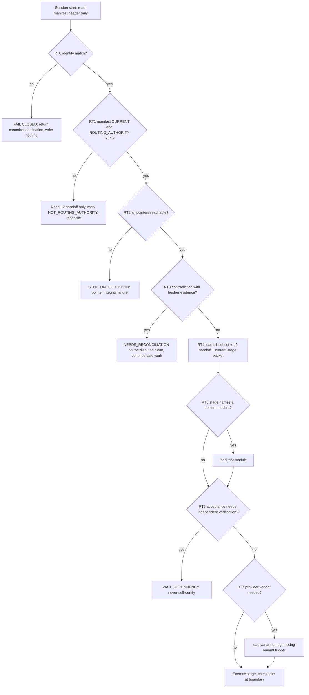

# AI Management — Prompt + Context Engineering Stage-1 Research Draft
Status: RESEARCH DRAFT / STAGING ONLY / NOT AUTHORITATIVE
Class: research / preparation / staging — no architecture ratification, no canonical mutation, no implementation authority
Prepared by: Claude cloud research session (bounded worker), 2026-09-30
Source packet: AI_Management_Claude_Cloud_Refinement_Research_Packet_Current.md (Drive ID 1hAAagOUtIDu_fYRxh2LRdZv9b8Z1Xg12i7T-YXRwcAw)
Ratification path: Management Systems Architect (design review) -> CEO / Executive Control Room (ratification) -> Owner (final authority). Nothing in this document is ratified.
Sources consumed: (filename — Drive ID — modifiedTime, from _manifest.json; "selective" = read by grep + targeted ranges, not whole-file)
- AI_Management_Claude_Cloud_Refinement_Research_Packet_Current.md — 1hAAagOUtIDu_fYRxh2LRdZv9b8Z1Xg12i7T-YXRwcAw — 2026-09-30T21:28:54.801Z
- AI_Global_Brain.md — 1tWUmmcM9KeL8IdZCSaUOdhkWbDCrUnDcGRp9vdsRW2A — 2026-09-30T03:39:25.734Z
- AI_Management_Brain.md — 1wCIkKj2yeA0P5Xk3akwtK_ppM3A8IIpd2eBEH5Fsfjw — 2026-09-30T21:54:35.407Z
- AI_Management_Current_Structure.md — 1zJJNqrie8v7Z_M3HnTxZiz-NwH3wLp4jCJdPQlKUJCk — 2026-09-30T02:51:28.914Z
- AI_Management_Systems_Architecture_Current.md — 1xTQdDWb1lJnYsY16o2q55uETGu0NgJmfqtX_LsYLW2w — 2026-09-30T03:40:34.989Z
- AI_Management_Chief_of_Staff_Handoff_Current.txt — 1HaZ-sUTpnwkjaqCc_Ff6MIBUKPhJlr0QTgW_kZjORZk — 2026-09-30T22:20:47.712Z
- AI_Project_Management_Interface_Standard.md — 1zJK8lOqA_8_gOQrCeC91n5w5WzYBL49O — 2026-09-30T03:39:06.232Z
- AI_Management_Prompt_Context_Engineering_Stage0_Requirements.md — 1k_SDMgoJcIZoyUBI_ViTT-9cRGOC-_vNwhnqZw1bonA — 2026-09-30T16:34:49.931Z
- AI_Management_Prompt_Context_Engineering_Stage0_Design_Brief.md — 1J4uTBiniEdfcTqft0kPoQTW8Fuk2QSN1iZ-aEm0ahxI — 2026-09-30T16:41:04.815Z
- AI_Management_CEO_OPS_010_Relay_Tactical_Checkpoint_Packet_Current.md — 1s8l4Dhq9k44dqkKZLKCaMRNLiGzZX9FkNRhdMWtbzL8 — 2026-09-30T18:20:18.015Z
- AI_Management_CEO_OPS_011_New_Claude_Agent_Relay_Recovery_Activation_Packet_Current.md — 1DTYm6Hs-T-_F_QefDj758yINTBXbHfofRpSTvOhFi04 — 2026-09-30T19:03:28.130Z
- AI_Management_CEO_OPS_012_ULTUSB_Claude_Orchestrator_Resume_Packet_Current.md — 12mqCOU5cAmo2m6e1EF66tmdSoML2ZMNIt5wH9bBzb_g — 2026-09-30T20:05:00.439Z
- AI_Management_AgentRelay_Claude_Integration_Prompt.md — 123f4_2jyCpqgl7PcuMsY_be6AABXFvpRZmQNnnLYTIg — 2026-09-27T22:13:50.736Z
- AI_Management_Executive_Operations_From_CEO_Current.md — 1cdBgoZUFMMWMm6FWaUd8e0oMPXHPGqkxOiVa3XAdDiw — 2026-09-30T21:55:19.399Z (selective: CEO-OPS-010/011/012/013)
- AI_Management_Executive_Operations_To_CEO_Current.md — 17AWl_oe1NNipQvjMY18W9U3QtG5fmbwlHjMqClVmtww — 2026-09-30T22:14:39.459Z (selective: Response-To CEO-OPS-009/010/011/012/013)
- AI_Management_Chief_of_Staff_Launch_Prompt.md — 1PlPfeOvn1iFuuJvB1s9uoRufhOdbIU6D-1X8RQXF_xw — 2026-09-30T04:12:34.171Z (read in full; cited in §7.2 for the Chief's executable-packet rendering rule; otherwise nothing material beyond AI_Management_Brain.md § "Owner Activation Destination Contract")
- AI_Management_Executive_Operations_Delivery_Assurance_Launch_Prompt.md — 1gk4VN_TeqixNe_ZoMlSkXKcZIBCGx3qhurS9-wWktPw — 2026-09-30T03:17:34.094Z
- AI_Management_Chief_of_Staff_To_CEO_Current.md — 1HGHbYPW5_0AtSpvHepTXgxCiQ1RvOxnpmdQ0zAsTZrU — 2026-09-30T21:43:12.885Z (selective: COS-CEO-N-021/022/023/024/025/026)
- AI_Management_Chief_of_Staff_From_CEO_Current.md — 1ARJTI8TrABlw1rx8ru7BUiUOkyzgoxh1fPcxt_Rntk0 — 2026-09-30T21:54:47.770Z (selective: CEO-COS-029/031/032/033)
- AI_Management_Systems_Architect_To_CEO_Current.md — 1n1_wzeUhw5eTGX8yUuiIyALm3YcxEf9t8ndeN4mcjvw — 2026-09-30T03:41:58.087Z (selective: retention/compaction and anti-bloat sections)
- AI_Management_Systems_Architect_From_CEO_Current.md — 1Md1r2fo3gR-so1Gt5l0wnqx-t0cyP8hpbDhcpSwMvzA — 2026-09-30T21:55:06.223Z (selective: MSA-CEO-018)
- AI_Management_Systems_Architect_Handoff_Current.txt — 1ONtkY1dMG6Pfwygb6DUw3Bh72n1amVJhLxMtyO_qwUM — 2026-09-30T03:40:37.192Z
- AI_Management_Systems_Architect_Launch_Prompt.md — 1iHe3_Y4Ve0R0JE8lR1Wx3CXQNfqe76dV0EG8x4DM8BI — 2026-09-26T21:11:56.774Z
- AI_Management_Executive_Delivery_Current.md — 1i1qZ3XcXqo8zSRLIi9Qw7lzccMw2KxZxoO3CkzQyO14 — 2026-09-30T22:14:16.642Z
- AI_Management_Executive_Operations_Handoff_Current.txt — 13DZQlcAEwI1ao6EsG1fnnCpGb0tInMs1MNIi38hzAXo — 2026-09-30T22:14:20.032Z
- AI_Management_Handoff_Current.txt — 1olnjdY_qUyy7tMO4ePL_7BUyvtVM4n2t7amsnQgQSrQ — 2026-09-30T21:56:18.175Z
- AI_Management_ULTUSB_DA_PRODUCT003_CORRECT_001_Packet_Current.md — 18vjWanL0bB-AqHT7LiEXsfzF_leDcIB9m-6Dc0Xs7hw — 2026-09-30T20:50:14.602Z
- AI_Management_ULTUSB_DA_NOIDLE_BIOS_001_Activation_Packet_Current.md — 1AFMyhrwlOoFe7oDK2oV_CUk9tidEFgxJRqJlIQdwrAI — 2026-09-30T22:12:43.953Z
- AI_Management_Portfolio_Capacity_Current.md — 1_o-Z73ArN825Nn057eQErtt9vVI6L9c-qqklVMuJHlg — 2026-09-28T18:13:04.932Z (selective: ULTUSB / Relay capacity independence)
- AI_Management_Project_Instructions.txt — 1rrCxnPIyAZptmVkz_ij-WJPFibOzdIzL — 2026-09-26T19:58:04.001Z
- AI_Management_Owner_Notifications_Current.md — 16NCkG3VyyPGdtlGhLwxvYyWR_THJLslk — 2026-09-26T20:03:08.024Z (selective: MGMT-NOTIF-001)
- AI_Ecosystem_Project_Registry.md — 1gPZQ7tfJf92EiyOBLDw0H0H6YF8VGJX-TKWv09eNdnQ — 2026-09-29T14:35:11.226Z (selective: § "Agent Relay"; consumed during verification fixes, see U4)
- _manifest.json and _folder_inventory.json — local provenance files produced by the mirroring step (no Drive ID); used only for Drive IDs, modifiedTime, character/paragraph counts, and folder membership.

Access note: the research packet was consumed from the mirrored plain-text copy whose manifest entry carries the exact Drive ID named in the Owner's request (1hAAagOUtIDu_fYRxh2LRdZv9b8Z1Xg12i7T-YXRwcAw). No Google Drive tool was called from this session, per the workflow's source rules. This is recorded again under "Source gaps and uncertainty".

Terminology used in this document (expanded on first use, repeated here for a reader arriving cold): PCE = Prompt + Context Engineering (the shared specialist function under discussion); EODA = Executive Operations & Delivery Assurance (the Management role that owns delivery/activation truth and exact packets); MSA = Management Systems Architect; CoS = Chief of Staff / Owner Briefing; PM = Project Manager / Control Room; IV = independent verification; L0..L5 = the six context layers proposed under Checklist Item #6 (L0 router, L1 always-read core, L2 current state, L3 conditional modules, L4 deep evidence, L5 archive); AUTO_CONTINUE / REVIEW_REQUIRED / WAIT_DEPENDENCY / STOP_ON_EXCEPTION = the four Stage 0 gate classes.

Identifier prefixes (each list uses its own prefix so cross-references are unambiguous): E = evidence item (§2.1); OC = over-compression item (§2.2); M (in §3.1) = MAY item; T = trigger class (§3.4); P/G = packaging/gate items (§3.5); CP = context-preservation item (§3.6); RM = reference-model item (§3.7); PC = pilot candidate (§3.8); RT = router rule (§4.3); AC / RR / WD / SX = gate criteria (§5); S = named rotation signal (§6.1); QD = CANDIDATE quantitative default (§6.2); AP = anti-pattern (§7.3); X = external reference (§9); M (in §10.1) = pilot measurement; Q = Architect design question (§11); U / G / D = unresolved question / source gap / disagreement; RAT = ratification item.

Status vocabulary used for every design statement in this document:
- RATIFIED — already in AI_Global_Brain.md, AI_Management_Brain.md, AI_Management_Current_Structure.md, AI_Management_Systems_Architecture_Current.md, or AI_Project_Management_Interface_Standard.md.
- ACCEPTED_IN_PRINCIPLE — an Owner disposition on the 8-item checklist recorded in the Chief handoff, not yet turned into a ratified standard.
- OWNER_APPROVED_REQUIREMENT — content of the Stage 0 Requirements Brief, which is marked "OWNER-APPROVED REQUIREMENTS" but is explicitly "not an implementation directive" and whose routing is on HOLD.
- PROPOSED — an Architect/Chief/EODA proposal that exists in a mailbox or handoff but is not ratified.
- CANDIDATE — this document's own suggestion. Carries no authority.
- NEEDS_RECONCILIATION — two sources that conflict; both are quoted and neither is resolved here.

---


> **Reconciliation notice (added 2026-10-01 after the cross-draft consistency pass; see the staged appendix AI_Management_Refinement_Cross_Draft_Consistency_Report.md, topics T1–T26). The five workstream drafts were written independently. The items below record where this draft's wording, numbers or labels differ from a sibling draft and how the difference is to be read. Judgement disagreements are preserved, not resolved; factual notes state both methods; label corrections apply the FRAME discipline (RATIFIED = in Global Brain / Management Brain / Current Structure / Interface Standard or a recorded CEO disposition; ACCEPTED_IN_PRINCIPLE = recorded Owner checklist disposition; PROPOSED = Architect/Chief proposal; CANDIDATE = this research's own suggestion). Nothing in this notice changes any canonical file.**
>
> - T8-c (label correction): § 11 Q2 option C labels the proactive sweep 'ACCEPTED_IN_PRINCIPLE under the intake gap'. Read PROPOSED. Source check: the Chief handoff section 'ARCHITECTURE GAP — CANONICAL MANAGEMENT INTAKE' carries an 'Owner observation:' line and a 'Requirement for Item #8' list but no Owner disposition line; Drafts B (Diagram 1 INTAKE/TRIGREG rows) and E (EFF-012, R-14) label it PROPOSED.
> - T8-f (label equivalence): this draft's OWNER_APPROVED_REQUIREMENT label for the Stage 0 requirements content is the same thing as ACCEPTED_IN_PRINCIPLE-class content with execution and routing on HOLD; the Stage 0 design proposals remain PROPOSED.
> - T16 (wording): where § 4.4 and § 11 Q8 say the Architect 'should pick' or 'should choose' one layer vocabulary, read as a conditional proposal ('one option is for the Architect to pick one vocabulary at Item #8 A3'); this draft makes no directive to any role. Register RAT-001.
> - T6 (cross-reference): RAT-3's four detector options correspond to Draft A § 5.1 (six), B R6 (three), E § 7.5 (three); merged as register RAT-017.
> - T7 (cross-reference): § 4.4's four Owner-accepted layer vocabularies are addressed by Drafts A § 2.1 and C § 7.1 as a CANDIDATE unification; B Diagram 7 gap 4 agrees with this draft that the question is open. Register RAT-001.
> - T19 (disagreement preserved): QW3 is conditioned by Draft C (Unresolved question 17) on confirming the scope of the Owner's 2026-09-30 read-only instruction.

## READ FIRST — one-page router for this document

What this is: research INPUT for the Management Systems Architect's eventual Stage-1 design of the shared Prompt + Context Engineering (PCE) function. What it is not: not MGMT-PCE-001-STAGE1, not a Stage-1 design, not a routing action. COS-CEO-N-023 remains HOLD / DO NOT DELIVER and the Stage 0 Design Brief's Owner disposition "HOLD STAGE 1 ROUTING" governs (§1.1–1.3). Nothing here is ratified; schemas, thresholds and templates are CANDIDATE unless tagged.

Decisions surfaced (one line each; options and consequences in the ratification table):
- RAT-1 Owner: keep or lift the routing hold; may this go to the Architect before Item #8? (§1.3)
- RAT-2 Architect/CEO: where PCE sits — §11 Q1 options A–D.
- RAT-3 Architect/CEO: who detects PCE triggers — §11 Q2 options A–D.
- RAT-4 Owner/CEO: do Claude cloud sessions count as "ChatGPT-side curation"? — §11 Q3.
- RAT-5 Architect: adopt, trim, or reject the manifest and stage-packet schemas (§4.1–4.2).
- RAT-6 Architect/PM/CEO: where a lane manifest lives — §4.4 options a–d.
- RAT-7 Architect/CEO/PM: gate semantics AC / RR / SX (§5) — adopt, trim, or replace.
- RAT-8 Architect/CEO/Owner: pilot-measure the UNVERIFIED thresholds QD1–QD10 (§6.2), or adopt none.
- RAT-9 CEO/Owner: rotation activation contract — §11 Q7 options a–c.
- RAT-10 Architect/CEO: independent evaluation approach — §11 Q4 options A–D.
- RAT-11 CEO/Relay authority/Owner: may a Relay pilot proceed before a Relay PM / Control Room exists? (U4)
- RAT-12 Architect: canonical layer vocabulary — §11 Q8 (four vocabularies, D3).
- RAT-13 Architect/PMs: confirm a Claude recovery handoff is a "restart-state surface" under the ratified contract (U5).
- RAT-14 Chief/CEO: disposition of the old Integration Prompt and MGMT-NOTIF-001 (U11, D10).
- RAT-15 Chief/Owner: which success-criteria list is canonical — ten or nine (D4).

Architect design questions, options only, nothing picked (§11): Q1 placement; Q2 trigger ownership; Q3 cloud sessions as curation; Q4 evaluation independence; Q5 relation to Efficiency and Trigger Assurance; Q6 globalization; Q7 in-lane rotation versus the full packet cycle; Q8 layer vocabulary.

Reader map. Architect: §3 traceability, §4 manifest/router, §5 gates, §6 thresholds, §7 templates, §11. CEO: §1, §11 Q1/Q5/Q7, ratification table. Owner: §1.3, RAT-1, RAT-4, RAT-9. Everyone: "Disagreements preserved" (D1–D12) before acting on any one quotation.

---

## 1. Authority frame — what this document is and is not

### 1.1 The hold that governs this work

The Stage 0 Design Brief ends with: "Owner disposition: HOLD STAGE 1 ROUTING until the full Management architecture/efficiency checklist is completed and Item 8 architecture re-review reconciles the combined design." [Source: AI_Management_Prompt_Context_Engineering_Stage0_Design_Brief.md § "12. Stage 1 expected output" (final paragraph)]. The Chief handoff restates the same hold in its checklist: "4. PROMPT EXPERT ROLE/FUNCTION -> PROMPT + CONTEXT ENGINEERING ... State: DESIGN ADVANCED / EXECUTION HOLD ... COS-CEO-N-023 is HOLD / DO NOT DELIVER until checklist + Item 8 are complete." [Source: AI_Management_Chief_of_Staff_Handoff_Current.txt § "ORIGINAL ARCHITECTURE / EFFICIENCY REVIEW CHECKLIST", item 4] and again under its own heading: "PROMPT + CONTEXT ENGINEERING HOLD — Stage 0 brief is captured input only. COS-CEO-N-023 is explicitly HOLD / DO NOT DELIVER. Do not activate CEO/Architect for #4 until Items 5-7 are reviewed and Item 8 performs the combined architecture re-review." [Source: AI_Management_Chief_of_Staff_Handoff_Current.txt § "PROMPT + CONTEXT ENGINEERING HOLD"].

The COS-CEO-N-023 item itself, which would have commissioned Stage 1, is recorded twice in the Chief's To-CEO mailbox and both copies are marked "HOLD / DO NOT DELIVER", followed by a "SEQUENCING HOLD — OWNER CORRECTION" block: "Do not activate or process COS-CEO-N-023 yet. The Owner requires completion of the full 8-item Management architecture/efficiency review before implementation routing. Prompt + Context Engineering Stage 0 remains a durable design input only." [Source: AI_Management_Chief_of_Staff_To_CEO_Current.md § "COS-CEO-N-023 SEQUENCING HOLD — OWNER CORRECTION"]. Every later executive item re-affirms it (for example "COS-CEO-N-023 remains HOLD" in CEO-COS-031, CEO-COS-032, CEO-COS-033, CEO-OPS-011, CEO-OPS-012, and the Executive Delivery Current) [Source: AI_Management_Chief_of_Staff_From_CEO_Current.md § "CEO-COS-031", "CEO-COS-032", "CEO-COS-033"; AI_Management_Executive_Operations_From_CEO_Current.md § "CEO-OPS-011", "CEO-OPS-012"; AI_Management_Executive_Delivery_Current.md § "COS-CEO-N-023"].

### 1.2 What authorizes this document

The later research packet (modified 2026-09-30T21:28:54Z, which post-dates the Design Brief's 16:41Z hold) authorizes a narrower thing: "D. PROMPT + CONTEXT ENGINEERING PREP — draft the minimum Stage-1 research/design packet for the shared Prompt+Context Engineering capability; include manifest/router design, stage-specific packets, safe AUTO_CONTINUE criteria, checkpoint/rotation thresholds, and pointer-first resume patterns; use Agent Relay as a future pilot example but do NOT modify Relay." under the banner "Class: RESEARCH / PREP / STAGING ONLY. Authority: no architecture ratification, no canonical Management rewrites, no project implementation authority." [Source: AI_Management_Claude_Cloud_Refinement_Research_Packet_Current.md § "D. PROMPT + CONTEXT ENGINEERING PREP" and header]. The Chief handoff separates the Owner's proposal from the Chief's assessment. Owner: "Owner proposes using expiring Claude cloud-session credit for research/prep supporting Management architecture refinements, including expert/reference docs and flowcharts." Chief: "Chief assessment: strong candidate. Treat cloud sessions as bounded research/documentation workers, not architecture authority. Suitable outputs: ... prompt/context-engineering research packets ... Prefer read-only/reference input plus staging outputs; CEO/Architect/PM retain ratification and canonical-write authority." [Source: AI_Management_Chief_of_Staff_Handoff_Current.txt § "CLAUDE CLOUD CREDIT — MANAGEMENT REFINEMENT USE CASE"]. The extension from the Owner's examples (expert/reference docs and flowcharts) to "prompt/context-engineering research packets" is therefore the Chief's assessment, not an Owner statement, and the research packet itself was Chief-authored and surfaced directly as an Owner action: "Chief immediately prepared two independent safe lanes: 1. Management refinement cloud-research packet created ... Research/prep only: role/expert corpus, flowcharts, modularization audit, Prompt+Context Stage-1 research, efficiency opportunities. No canonical writes or architecture ratification." [Source: AI_Management_Chief_of_Staff_Handoff_Current.txt § "NO-IDLE CORRECTION / PARALLEL WORK LAUNCHED"]. Owner intent for the PCE Stage-1 research item specifically is evidenced only by the Owner's launch of the packet into this session, not by any recorded Owner statement (D1, U10).

### 1.3 The tension, stated plainly (NEEDS_RECONCILIATION preserved, not resolved)

An Owner disposition and a Chief-authored, Owner-launched packet coexist:
- Design Brief (16:41Z) — Owner disposition: HOLD STAGE 1 ROUTING until Item 8.
- Research Packet (21:28Z) — Chief-authored, launched by the Owner into this cloud session: authorize Stage-1 RESEARCH/PREP only. It is not an Owner disposition of equal standing to the hold (§1.2).

This document treats them as compatible only under a strict reading: research/prep INPUT is permitted; Stage-1 DESIGN and Stage-1 ROUTING are not. Concretely:
- This document is not MGMT-PCE-001-STAGE1 and must not be filed, cited, or answered as a Response-To: MGMT-PCE-001-STAGE1. That stable ID belongs to the Architect's eventual Stage 1 output [Source: AI_Management_Prompt_Context_Engineering_Stage0_Requirements.md § "Stage 1 stop condition"].
- This document does not commission, activate, or deliver COS-CEO-N-023, and nothing in it should be read as evidence that the hold is lifted.
- The Architect remains free to disregard, re-derive, or contradict anything here. The Stage 0 brief assigns the structural questions to the Architect, not to a research worker [Source: AI_Management_Prompt_Context_Engineering_Stage0_Requirements.md § "Stage 1 — Systems Architect Design"].
- If the Architect/CEO/Owner judge that even research/prep should have waited for Item 8, the correct disposition is to archive this document as evidence, not to treat it as a design that must be acted on.

### 1.4 Stage 1 "MUST NOT" items — applied to this document as well

The Stage 0 Requirements say Stage 1 MUST NOT: "implement the specialist; modify Relay/ULTUSB execution; create a permanent role; globalize a standard; launch a pilot; bundle later implementation stages into one execution packet." [Source: AI_Management_Prompt_Context_Engineering_Stage0_Requirements.md § "Stage 1 MUST NOT"]. The Design Brief's list adds "rewrite project prompts globally ... redesign Relay; change ULTUSB authority/product policy; create a giant all-in-one implementation plan that later stages automatically execute." [Source: AI_Management_Prompt_Context_Engineering_Stage0_Design_Brief.md § "11. Explicit non-goals for Stage 1"]. This document complies as follows: it names no new role; it writes to no Relay, ULTUSB, GO10, Management brain, Current, launch-prompt, or mailbox file; it proposes schemas and templates as CANDIDATES only; it reads no project-level documents (the Agent Relay recovery handoff and issue register are referenced by name from Management sources only, never opened); it sequences nothing; and its "quick wins" section proposes only things that could be done by the owning role within already-ratified authority, and still only as proposals.

### 1.5 Cross-project write firewall and research scope

The Global Brain permits exactly this kind of reading: "A chat or Project may read another project's authoritative files for research, comparison, refinement, recovery, or proposal development. It must not create, edit, delete, move, or otherwise mutate another project's authoritative state ..." [Source: AI_Global_Brain.md § "Cross-project write firewall"]. The workflow further narrowed scope to Management-folder sources only; project-level artifacts (Agent Relay, ULTUSB, GO10, LifeAutomation) were deliberately not mirrored and were not read. Where this document mentions "AgentRelay_Claude_Recovery_Handoff_Current.md" (Drive ID 1f1xk9lDGlQRMeHxbBJtgKydh5d0scS0H) or "AgentRelay_Issue_Register_Current.md", the knowledge comes from Management mailboxes and packets that cite them [Source: AI_Management_CEO_OPS_011_New_Claude_Agent_Relay_Recovery_Activation_Packet_Current.md § "Start here"; AI_Management_CEO_OPS_010_Relay_Tactical_Checkpoint_Packet_Current.md item 8], not from the files themselves.

---

## 2. Problem statement with evidence

The Stage 0 Requirements frame two opposite failure modes and insist that the design solve both: over-loading ("a continuation packet causes a worker to reread large brains, handoffs, issue registers, architecture files, and historical state all at once") and over-compression ("over-compression can erase project intent, decision rationale, professional-user assumptions, authority boundaries, or important evidence") [Source: AI_Management_Prompt_Context_Engineering_Stage0_Requirements.md § "CORE PROBLEM"]. Every incident and measurement the Management sources actually record is listed below, in the order it occurred where that order is recoverable. Each line says what the source states and what it does not state.

### 2.1 Over-loading / exhaustion incidents (the motivating failure mode)

E1. ULTUSB Claude Orchestrator: prompt too long, compaction failed, session limit hit within about two minutes.
"ULTUSB — Claude Orchestrator received the current post-QA continuation prompt. Within about two minutes, Claude displayed: 'Prompt is too long · automatic compaction failed' and 'You've hit your session limit · resets 8am (America/Los_Angeles).' This proves the current Claude continuation/session context is too heavy for reliable compaction. It does not by itself prove the single prompt consumed the whole usage allowance." [Source: AI_Management_Chief_of_Staff_To_CEO_Current.md § "COS-CEO-N-021", "Fresh Owner evidence"]. The Chief's own caveat is preserved: the evidence proves a compaction/prompt-size failure, not a quota-accounting mechanism.

E2. Two separate Claude sessions exhausted within roughly five minutes of Management-generated prompts.
"Owner reports essentially no Claude usage other than the two Management-generated Claude continuation activations. Both separate Claude sessions exhausted their available usage window within roughly five minutes of those prompts. ... Treat this as STRONG OPERATIONAL EVIDENCE that current continuation/context design is consuming Claude quota catastrophically, while remaining agnostic about Anthropic's undisclosed exact quota-accounting mechanism." [Source: AI_Management_Chief_of_Staff_To_CEO_Current.md § "COS-CEO-N-021 — OWNER EVIDENCE ADDENDUM / PROMPT OWNERSHIP FAILURE — 2026-09-30"]. The same addendum reclassifies the cause as an architecture-use failure: "Chief has nevertheless been directly generating large worker continuation prompts. This is an architecture-use failure / role-bypass condition, not merely a prompt-writing quality issue." [same source]. The Agent Relay maintenance lane's session-limit hit is independently recorded as operational state: "Agent Relay Claude maintenance has reached its session limit and is WAIT_TRIGGER for the 2026-09-29 22:00 PT reset." [Source: AI_Management_Current_Structure.md § "Management Reliability Contract v1 — RATIFIED 2026-09-29", "Current operational note"].

E3. Very short usable window before exhaustion (Owner priority correction).
"Current Relay Claude continuation cannot simply remain P0 execution-first because the recent Claude session demonstrated severe context/usage failure risk, including a very short usable window before session-limit exhaustion. Continuing a large existing Claude conversation risks wasting the present reset/window before Relay capacity is restored." [Source: AI_Management_Chief_of_Staff_Handoff_Current.txt § "PRIORITY CORRECTION — CLAUDE USAGE PROTECTION PRECEDES FURTHER HEAVY RELAY WORK"]. No duration is given for the window; "very short" is the only measurement.

E4. Relay Codex continuation consumed about 105k tokens in about 1 minute 49 seconds before quota exhaustion.
"Even if Relay dispatches fresh provider processes, per-run context can still be very large: a measured Relay Codex continuation consumed about 105k tokens in ~1m49s before quota exhaustion. So context/usage protection is needed regardless of whether conversation continuity exists." [Source: AI_Management_Chief_of_Staff_Handoff_Current.txt § "RELAY CONTEXT-LIFECYCLE QUESTION / ARCHITECTURE FOLLOW-UP"]. This is the only quantitative token measurement in the Management sources. Note it concerns a Codex (OpenAI) provider run dispatched by Relay, not a Claude chat; it is evidence that the problem is provider-general, exactly as the Stage 0 brief anticipates ("The design must generalize beyond Claude where evidence supports it") [Source: AI_Management_Prompt_Context_Engineering_Stage0_Requirements.md § "PURPOSE"]. The audit of per-adapter context behaviour is logged as AR-ISS-010, "POST-P0 verification", and has not been performed [Source: AI_Management_Chief_of_Staff_Handoff_Current.txt § "ULTUSB PM CONCURRENCY RESULT / RELAY CONTEXT TODO"].

E5. Chief handoff bloat: ~49k characters at compaction, archive verified at ~51,968 characters / 578 paragraphs, and the current file is again far above threshold.
"Prior Chief CURRENT handoff had grown to ~49k document characters, violating Reliability Contract targets. Ratified target: CURRENT <=12k chars, mandatory compaction above 15k, fail-visible above 25k. Archive created before compaction: AI_Management_Chief_of_Staff_Handoff_ARCHIVE_2026-09-30_PreChecklist5Compact.txt, Drive ID 1DUm89HYeValdx2zLt7afa6T3ByxNA2oirHak998nAzs" [Source: AI_Management_Chief_of_Staff_Handoff_Current.txt § "CHECKLIST #5 — CURRENT QUESTION", "Immediate evidence"]; "Verified preserved copy: ~51,968 document characters / 578 paragraphs at readback." [same file § "CHECKLIST #5 — OWNER CONTEXT-PRESERVATION GUARD"]. The mirror manifest measures the current Chief handoff, as of 2026-09-30T22:20:47Z, at 71,454 clean characters and 693 paragraphs [Source: _manifest.json entry for AI_Management_Chief_of_Staff_Handoff_Current.txt], which is above the ratified hard fail-visible threshold of ">25,000 characters, >300 paragraphs" [Source: AI_Global_Brain.md § "Management Reliability Contract v1 — global reliability deltas (ratified 2026-09-29)" > "Compact CURRENT / fail-visible stale state"]. This is a Management-side instance of the same failure mode PCE is meant to address: a restart surface growing until it threatens the reader's context rather than protecting it. The handoff itself recorded the generalizable lesson: "merely storing the right information is insufficient if current phase/gate state is not enforced at consequential-action time." [Source: AI_Management_Chief_of_Staff_Handoff_Current.txt § "CHECKLIST #5 — CURRENT QUESTION"].

E6. Heredoc write failure requiring an extra Owner hop.
"AgentRelay_To_Management_Current.md still lacks the required Response-To: MGMT-AR-MAINT-001 checkpoint publication. The Claude lane explicitly reports its earlier write attempt failed due a shell heredoc quoting error. Therefore CEO-OPS-010 is PARTIAL / CHECKPOINT_REACHED_BUT_PUBLICATION_INCOMPLETE ... Next Owner action: in the existing Claude chat Relay Orchestrator, instruct it to publish only the missing Response-To: MGMT-AR-MAINT-001 using the tactical handoff as source, via a file-write tool rather than heredoc, then stop." [Source: AI_Management_Chief_of_Staff_Handoff_Current.txt § "CHECKPOINT RECONCILIATION — CEO-OPS-010 PARTIAL COMPLETION"]. The cost of this failure was an additional Owner-carried activation into a session that was supposed to have stopped, which is precisely the "Owner must not become a routine continue button" failure the Stage 0 brief targets [Source: AI_Management_Prompt_Context_Engineering_Stage0_Requirements.md § "LARGE-WORK PACKAGING MODEL"].

E7. The "read everything" Integration Prompt versus the pointer-first CEO-OPS-011 packet (a before/after pair that already exists in the sources).
The older prompt instructs the Claude worker to read, before any work: Global Brain, Interface Standard, the Relay Issue Register, Relay Executive Status, Relay To-Management, Relay From-Management, then "current consumer evidence relevant to open Relay issues" for GO10 (four surfaces) and LifeAutomation (four surfaces), and "Also read the current Agent Relay repository/runtime/handoff/source available to you", followed by a Phase 1 full reconciliation of the issue register [Source: AI_Management_AgentRelay_Claude_Integration_Prompt.md § "Read first" and § "Phase 1 — Drive catch-up and delta"]. By the mirror's count that prompt is 6,633 characters [Source: _manifest.json], but the material it orders read is unbounded. The CEO-OPS-011 packet, by contrast, is 1,945 characters [Source: _manifest.json] and says: "Read AgentRelay_Claude_Recovery_Handoff_Current.md first. Drive ID: 1f1xk9lDGlQRMeHxbBJtgKydh5d0scS0H ... Do not reload broad Relay/Management history; follow only secondary pointers the recovery handoff says are needed." [Source: AI_Management_CEO_OPS_011_New_Claude_Agent_Relay_Recovery_Activation_Packet_Current.md § "Start here"]. The CEO directive that produced it required the packet to "read only explicitly necessary secondary pointers; not reload broad Relay/Management history" and "checkpoint/rotate again before context/usage growth becomes unsafe" [Source: AI_Management_Executive_Operations_From_CEO_Current.md § "CEO-OPS-011", item 4]. The Owner approved this as the "interim pointer-first Claude resumption standard: concise activation, one canonical current handoff/resume entry point, preserve completed work, and do not reread a broad document stack unless the handoff directs it." [Source: AI_Management_Chief_of_Staff_To_CEO_Current.md § "COS-CEO-N-021 — OWNER ADDENDUM / ITEM 1 DISPOSITION — 2026-09-30"]. What the sources do not record is a measured outcome: there is no token or duration figure for the CEO-OPS-011 session's startup, only that it was sent (SENT_EVENT, Opus 5.5, xhigh effort, Ultracode off) and later produced recovery reports [Source: AI_Management_Chief_of_Staff_Handoff_Current.txt § "SENT_EVENT — CEO-OPS-011" and § "RELAY RUN-5 OWNER SCOPE CALL — PENDING OWNER SEND"]. A before/after measurement therefore remains to be done in a pilot; see section 10.

E8. Owner correction that the tactical prompt was issued too fast and without the Delivery chain.
"Owner questioned whether the proposed tactical checkpoint prompt should be durably checked/approved before sending. Disposition: YES. The Chief moved too quickly from design agreement to an executable Owner packet. Because the prompt would alter behavior of an already-running Relay/Claude lane, it must be treated as an execution packet." [Source: AI_Management_Chief_of_Staff_Handoff_Current.txt § "PROCESS CORRECTION — TACTICAL CLAUDE RECOVERY PROMPT"]. This is evidence that packet construction has an authority chain (Chief records -> CEO validates -> EODA verifies live state/destination/duplicates -> durable storage with stable ID -> Owner sends only the final packet) and that PCE research must respect that chain rather than invent a parallel one. Note for D12: the research packet that authorizes this document was itself Chief-created and surfaced directly as an Owner action (§1.2; Chief handoff § "NO-IDLE CORRECTION / PARALLEL WORK LAUNCHED") with no recorded CEO -> EODA pass, whereas the three ULTUSB cloud research activations were EODA-revalidated under CEO-OPS-013 ("revalidates exactly three cloud research packages") [Source: AI_Management_Executive_Delivery_Current.md § "AUTHORITY"]. Whether a research-only cloud packet is an "execution packet" in the sense of this correction is not settled by the sources.

E9. Unlabeled platform/destination caused an Owner preference correction.
"Owner preference: future activation instructions should explicitly name the platform as well as the chat title. CEO-OPS-010 destination is the existing Claude chat titled Relay Orchestrator." [Source: AI_Management_Chief_of_Staff_Handoff_Current.txt § "DONE_EVENT — CEO-OPS-010 DELIVERY VERIFICATION COMPLETE"], generalized the same day: "whenever Chief renders or relays a prompt intended for a coding agent, explicitly include a recommended model and reasoning/effort setting. Also name the target platform/app and exact chat/session destination." [same file § "OWNER WORKFLOW PREFERENCE — CODING AGENT PROMPTS"]. The misroute of MGMT-ULTUSB-NOIDLE-001 to the GO10 PM chat is the consequential form of the same failure class: "Owner accidentally sent MGMT-ULTUSB-NOIDLE-001 to GO10 Project Manager. Evidence shows GO10 PM crossed authority boundary and wrote the response into ULTUSB_To_Management_Current.md" [same file § "ROUTING INCIDENT + ULTUSB MEDIA STATE — 2026-09-30"], now governed by the ratified cross-project PM identity gate [Source: AI_Management_Brain.md § "Cross-project PM identity gate — ratified 2026-09-30"].

E10. Cloud-session setup friction: no private Drive access assumed; repository required.
"Claude Code cloud setup correction: cloud sessions require a GitHub repository ... Do not assume private Google Drive connector access inside the remote cloud session; mirror the bounded research packet and required source docs into the dedicated repo before substantive research." [Source: AI_Management_Chief_of_Staff_Handoff_Current.txt § "ROUTING INCIDENT + ULTUSB MEDIA STATE — 2026-09-30", final paragraph]. This matters to PCE because "pointer-first" presumes the pointer can be dereferenced in the target environment; a packet design must therefore carry an environment/access precondition (see section 7.2).

### 2.2 The opposite failure mode: over-compression erasing intent

OC1. ULTUSB professional-toolkit guard.
"ULTUSB is a professional technician/sysadmin toolkit. Prompt/context compression must preserve legitimate professional-use intent and the Owner-reserved authority over capability exclusions/removals and new safety-oriented restrictions. A fresh agent must not reinterpret the project as a consumer-safe toy due to missing context." [Source: AI_Management_Prompt_Context_Engineering_Stage0_Requirements.md § "CONTEXT-PRESERVATION REQUIREMENTS", "ULTUSB-specific guard for any future pilot"]. The same guard appears as a core responsibility: "preserve legitimate professional/project capability rather than manufacturing extra restrictions from missing context" [Source: AI_Management_Prompt_Context_Engineering_Stage0_Design_Brief.md § "3. Core responsibilities"] and as a MAY NOT: "silently remove project capability or product intent; create new project safety/capability restrictions without the owning authority" [Source: AI_Management_Prompt_Context_Engineering_Stage0_Requirements.md § "FUNCTION BOUNDARY", "It may NOT"]. Live packets already carry this guard in prohibition form: "NO final tool/capability exclusion without Owner approval. NO new safety restriction beyond Owner-approved controls without Owner approval." [Source: AI_Management_CEO_OPS_012_ULTUSB_Claude_Orchestrator_Resume_Packet_Current.md § "Hard prohibitions"].

OC2. Owner's Item #5 preservation guard (Management-side).
"Compact CURRENT working state, not durable memory/history. Do not broadly delete prior reasoning, Owner context, decision rationale, unresolved alternatives, or historical evidence merely because it is no longer always-read. Deeper context must remain retrievable through a flowchart/router when a current decision requires it." [Source: AI_Management_Chief_of_Staff_Handoff_Current.txt § "CHECKLIST #5 — OWNER CONTEXT-PRESERVATION GUARD"]; and "Compact does NOT mean forgetful." [same file § "CHECKLIST #6 — PROPOSED MODULAR / CONDITIONAL DOCUMENTATION ARCHITECTURE", design principle].

OC3. The Stage 0 preservation list (nine items).
"Compression/rotation must preserve: Owner intent; material decision rationale; unresolved disagreements; domain/professional-user assumptions; authority boundaries; completed-work evidence; exact source/evidence pointers; restart point; important project capability assumptions." [Source: AI_Management_Prompt_Context_Engineering_Stage0_Requirements.md § "CONTEXT-PRESERVATION REQUIREMENTS"].

OC4. Ratified compaction rules already require preservation.
"Archive unique historical evidence before compaction; preserve the same CURRENT file ID where practical." [Source: AI_Global_Brain.md § "Compact CURRENT / fail-visible stale state"]; "Resolved mailbox traffic may leave CURRENT view only after stable ID, disposition, Response-To linkage when applicable, final outcome, material evidence reference, and any live follow-up/trigger are preserved." [Source: AI_Global_Brain.md § "Management artifact lifecycle and hygiene — ratified 2026-09-26"].

OC5. A near-miss worth recording: the Relay recovery handoff's completeness could not be verified by Management.
The CEO-OPS-010 checkpoint reconciliation confirms the recovery handoff "records HEAD f750da3, local suite 1425 passed / 1 xfailed, LabPC verifier preparation, and exact next action" [Source: AI_Management_Chief_of_Staff_Handoff_Current.txt § "CHECKPOINT RECONCILIATION — CEO-OPS-010 PARTIAL COMPLETION"], but no Management source records a check that the nine preservation items were present in it (for example, unresolved disagreements or professional-user assumptions). That gap is not a defect in the handoff — it may be complete — but it shows there is currently no evaluation step for the over-compression failure mode. The research packet's own existence (research into a function to design such checks) is the only mitigation in the record.

### 2.3 What the evidence does and does not establish

Established by the sources: prompts that order a broad reread cause compaction failure and rapid quota exhaustion on at least two separate Claude sessions and one Relay-dispatched Codex run; Management's own restart surface exhibits the same growth failure; packet construction outside the EODA chain and unlabeled destinations create extra Owner hops and one consequential misroute; the pointer-first packet pattern has been built, verified, and sent at least four times (CEO-OPS-010/011/012 and the ULTUSB PRODUCT003 correction), and built and verified for three further ULTUSB cloud research activations that remain READY_FOR_CHIEF_RENDERING / OWNER_ACTION — verified, not sent — as of Executive Delivery Current 2026-09-30 ("Only genuine remaining work from this chain is Owner delivery of the three validated cloud research activations") [Source: AI_Management_Executive_Delivery_Current.md §§ "VALID ULTUSB NO-IDLE ACTIVATIONS", "CHIEF FEED"].

Not established by the sources: any provider's context-window size or quota-accounting rule; the startup token cost of a pointer-first session versus a broad one; whether Relay persists provider-native conversation IDs between dispatches ("UNCERTAIN" per the Frontier comparison cited in the Chief handoff) [Source: AI_Management_Chief_of_Staff_Handoff_Current.txt § "RELAY CONTEXT-LIFECYCLE QUESTION / ARCHITECTURE FOLLOW-UP"]; and whether any compacted handoff to date lost intent (no evaluation exists).

---

## 3. Requirements traceability

Every requirement below is quoted or closely paraphrased from the two Stage 0 documents. The "Where this document prepares research" column points to a section of this draft; "NOT COVERED — for Architect" means the item is a structural decision reserved to Stage 1 and this draft deliberately does not pre-empt it (it may list options under section 11). Status of the requirement itself is OWNER_APPROVED_REQUIREMENT unless noted; no row implies that any preparation here is ratified.

### 3.1 Function boundary — MAY [Source: AI_Management_Prompt_Context_Engineering_Stage0_Requirements.md § "FUNCTION BOUNDARY", "may"]

| # | Requirement (quoted) | Where this document prepares research |
|---|---|---|
| M1 | "design activation/resume packets" | §7.2 Launch Packet template; §7.1 Recovery Handoff template; anti-patterns §7.3 |
| M2 | "partition large directives into bounded execution stages" | §4.2 Stage Packet schema; §4.1 manifest with stage IDs |
| M3 | "design progressive-disclosure context routers" | §4.3 router decision inputs and decision table; §4.4 relation to L0–L5 |
| M4 | "minimize duplicate context" | §7.3 anti-pattern "broad reread lists"; §4.4 "write once / reference many" mapping; §10.1 M4 (duplication diff between packet and recipient handoff) as the CANDIDATE measurement; no acceptance-evidence class for duplication is proposed in §5.1 |
| M5 | "create restart-safe handoff structures" | §7.1 Recovery Handoff template (10 CEO-OPS-010 fields + 9 preservation items) |
| M6 | "adapt packet/context strategy by provider/model" | §8 provider/model adaptation notes (what is known vs unknown) |
| M7 | "define acceptance criteria and gate classes" | §5 gate classes, acceptance-evidence classes, STOP_ON_EXCEPTION criteria |
| M8 | "evaluate prompt/context failure evidence" | §2 problem statement (E1–E10, OC1–OC5) is the current failure-evidence inventory; §10.1 pilot measurements |
| M9 | "maintain its own routed reference corpus and lessons learned" | §9 external reference candidates (seed list only); the corpus itself is Workstream A's deliverable (AI_Management_Role_Reference_Corpus_Draft.md), not this document |
| M10 | "recommend project-local context architecture changes through proper authority" | §10.4 what must remain project-local; §1.5 firewall; no recommendation is made to any project here |

### 3.2 Function boundary — MAY NOT [same source, "It may NOT"]

| # | Requirement (quoted) | How this document complies / where discussed |
|---|---|---|
| N1 | "become project manager or implementation authority" | §1.4; §10.5 explicit non-modification statement |
| N2 | "change project priorities on its own" | No priority is set anywhere; P-ordering is quoted from the Chief handoff as PROPOSED only (§10, §11) |
| N3 | "alter Owner authority" | §1; every template carries an authority block that is copied from the source packet, never invented |
| N4 | "silently remove project capability or product intent" | §2.2 OC1; §5.1 AC-3 "no capability/intent removal" is a mandatory acceptance check in the CANDIDATE AUTO_CONTINUE criteria |
| N5 | "create new project safety/capability restrictions without the owning authority" | §5.2 REVIEW_REQUIRED trigger "new restriction"; §7.1 preservation field "capability assumptions" |
| N6 | "globalize a pilot before evidence and ratification" | §10 is design notes only; §11 Q6 lists globalization as an Architect/CEO decision |
| N7 | "decide another role's substantive domain outcome merely because it packages the prompt" | §11 Q1/Q2 placement and trigger ownership left open; §7.2 template separates "packet author" from "authority of record" |

### 3.3 Progressive-disclosure model, layers 1–6 [Source: AI_Management_Prompt_Context_Engineering_Stage0_Requirements.md § "PROGRESSIVE-DISCLOSURE MODEL"]

| Layer | Requirement (quoted) | Where prepared | Relation to Checklist #6 L0–L5 (PROPOSED/ACCEPTED_IN_PRINCIPLE) |
|---|---|---|---|
| 1 | "SMALL ALWAYS-READ CORE — Mission, authority, non-negotiable principles, provider-specific invariants, router pointer." | §4.4 | Maps to L1 (always-read core/constitution) plus the L0 pointer. NEEDS_RECONCILIATION: Stage 0 puts "router pointer" inside layer 1; Checklist #6 makes the router its own L0 layer (see §4.4) |
| 2 | "COMPACT CURRENT HANDOFF — Current objective, material decisions/rationale, completed work/replay guards, runtime/repo state, blockers, evidence pointers, exact next action, stop condition." | §7.1 | Maps to L2 |
| 3 | "CONTEXT ROUTER / FLOWCHART — Task/state/risk triggers that select only relevant modules." | §4.3 | Maps to L0 in Checklist #6 |
| 4 | "BRANCH-SPECIFIC MODULES — Detailed context loaded only when the current work requires it." | §4.2 (stage packets are one kind of module), §4.4 | Maps to L3 |
| 5 | "DEEP SOURCE / EVIDENCE POINTERS — Authoritative material retrieved only when needed." | §4.4, §7.1 field 8 | Maps to L4; L5 archive has no Stage 0 counterpart (gap noted in §4.4) |
| 6 | "CHATGPT-SIDE CURATION — ChatGPT project specialists, not scarce external agents, periodically move stale cycle material out of the small current set ..." | §11 Q3 (whether Claude cloud sessions count as ChatGPT-side curation); §6.4 | Design Brief §5 Claude-specific rules restate this: "Claude usage should not be spent maintaining its own context architecture." |

### 3.4 Trigger-complete design and trigger classes [Source: Requirements § "TRIGGER-COMPLETE DESIGN"; Design Brief § "6. Trigger-complete design requirement"]

| Item | Requirement (quoted) | Where prepared |
|---|---|---|
| T-def | Design Brief: a recurring responsibility is incomplete unless it defines "event triggers; state/freshness triggers; cadence safety net where useful; owner of trigger detection; execution target; dedup/suppression; close/reset condition; Owner-friction rule." | PARTIALLY COVERED. §6.1 lists the named signals without an event-vs-state classification; the eight-field table below fills only source-supported cells; owner of detection is OPEN (§11 Q2); the remaining fields are NOT COVERED — for Architect (Item #8 A4) |
| T1 | "prompt-length/compaction/session failure" | §6.1 S1; §5.4 STOP_ON_EXCEPTION "compaction warning" |
| T2 | "activation/resume packet exceeds a defined size or complexity threshold" | §6.2 CANDIDATE packet-size defaults (UNVERIFIED) |
| T3 | "repeated worker misunderstanding or contradictory execution" | §5.4 "contradiction", "repeated NO_PROGRESS" |
| T4 | "materially growing always-read context" | §6.1 S3; §6.2 CANDIDATE growth thresholds |
| T5 | "new provider/model introduction" | §8.3 |
| T6 | "high provider usage with low useful progress" | §6.1 S2; §6.2 CANDIDATE usage-per-progress metric (UNVERIFIED) |
| T7 | "repeated Owner prompt repair" | §2.1 E6/E8/E9 as the evidence class; §6.1 S4 |
| T8 | "adoption/change of a context-router architecture" | NOT COVERED — for Architect (Item #8 A2/A4); §11 Q5 discusses only how PCE relates to Efficiency / Trigger Assurance, not this trigger |
| T9 | "stale/freshness threshold for critical worker lanes" (Req.) / "periodic safety-net review for critical/high-volume lanes" (Brief) | §6.3 maximum-age safety net (CANDIDATE) |
| T-TA | "These triggers should register with the future central Management Trigger Assurance model. The specialist must not be the only component responsible for noticing its own triggers." | §11 Q2 and Q5 — NOT COVERED — for Architect (Trigger Assurance does not yet exist as a ratified component) |

Trigger-complete fields per trigger class — only source-supported cells are filled; every other cell is NOT COVERED — for Architect (Item #8 A4). The event/state classification is a CANDIDATE reading of the trigger text; no source classifies the triggers. The Owner-friction rule that applies to every row is the Design Brief's "Owner sees only genuine approval/decision gates." [Source: AI_Management_Prompt_Context_Engineering_Stage0_Design_Brief.md § "9.", execution discipline].

| Trigger | Event or state (CANDIDATE reading) | Cadence safety net | Owner of detection | Execution target | Dedup / suppression | Close / reset |
|---|---|---|---|---|---|---|
| T1 compaction / session failure | Event (a warning or limit message; §6.1 S1) | — | OPEN — §11 Q2 | The PCE function (placement OPEN — §11 Q1) | Only where the trigger arrives as a delivery event: SENT_EVENT handling must "suppress duplicate resend prompts" (RATIFIED) [AI_Global_Brain.md § "SENT_EVENT / DONE_EVENT"] | NOT COVERED |
| T2 oversized activation/resume packet | State (size/complexity against a threshold; §6.2 QD1, UNVERIFIED) | — | OPEN — §11 Q2 (EODA sees every packet before READY_FOR_CHIEF_RENDERING) | same | NOT COVERED | NOT COVERED |
| T3 repeated misunderstanding / contradiction | Event, counted (§5.4 SX-1, SX-4) | — | OPEN — §11 Q2 | same | NOT COVERED | NOT COVERED |
| T4 growing always-read context | State (§6.1 S3) | — | OPEN — §11 Q2 (the Architect's INV-CURRENT covers Management CURRENT size only) | same | NOT COVERED | NOT COVERED |
| T5 new provider / model | Event (§6.1 S5) | — | OPEN — §11 Q2 | same | NOT COVERED | NOT COVERED |
| T6 high usage / low progress | State ratio (§6.2 QD10, UNVERIFIED; often unobservable) | — | OPEN — §11 Q2 | same | NOT COVERED | NOT COVERED |
| T7 repeated Owner prompt repair | Event, counted (§2.1 E6/E8/E9; §6.1 S4) | — | OPEN — §11 Q2 (Chief SENT/DONE records already capture the events) | same | NOT COVERED | NOT COVERED |
| T8 adoption / change of router architecture | Event | — | OPEN — §11 Q2 | same | NOT COVERED | NOT COVERED |
| T9 critical-lane freshness / periodic review | Cadence net (the one trigger class that is itself a safety net; §6.3) | Required by the Brief "where useful"; number OPEN (§6.2 QD9, UNVERIFIED) | OPEN — §11 Q2 | same | NOT COVERED | NOT COVERED |

### 3.5 Large-work packaging model and gate classes [Source: Requirements § "LARGE-WORK PACKAGING MODEL"; Design Brief § "4. Required large-work packaging model"]

| Item | Requirement (quoted) | Where prepared |
|---|---|---|
| P1 | "one small master task manifest/router" with fields "stage ID; objective; dependency; acceptance condition; gate class; pointer to current-stage packet; minimal status/evidence pointer" | §4.1 schema uses exactly these seven fields plus CANDIDATE provenance/freshness fields, clearly separated |
| P2 | "stage-specific packets loaded only when reached" / "Detailed future-stage instructions must remain behind pointers and should not be loaded until reached." | §4.2 Stage Packet schema; §4.3 router rule RT1 |
| P3 | "explicit dependencies and acceptance criteria" | §4.1 fields 3–4; §5.1 acceptance-evidence classes |
| P4 | "durable checkpoint evidence" | §5.1 AC-1; §6.4 rotation procedure step 2 |
| P5 | "automatic progression by default" / "Default behavior is AUTO_CONTINUE. The Owner must not become the routine 'continue' button." | §5.1 |
| G1–G4 | AUTO_CONTINUE / REVIEW_REQUIRED / WAIT_DEPENDENCY / STOP_ON_EXCEPTION — defined in both documents with a wording variance (Requirements: "proceed automatically after acceptance evidence"; Design Brief: "checkpoint and proceed automatically once acceptance criteria pass"; both quoted in the §5 intro; D11) | §5.1–§5.4, each with grounded vs CANDIDATE marking |

### 3.6 Context-preservation requirements [Source: Requirements § "CONTEXT-PRESERVATION REQUIREMENTS"]

| Item | Requirement (quoted) | Where prepared |
|---|---|---|
| CP1–CP9 | "Owner intent; material decision rationale; unresolved disagreements; domain/professional-user assumptions; authority boundaries; completed-work evidence; exact source/evidence pointers; restart point; important project capability assumptions" | §7.1 Recovery Handoff template merges these with the CEO-OPS-010 ten fields; §5.1 AC-3 makes "preservation checklist present" a CANDIDATE acceptance class |
| CP-ULTUSB | ULTUSB professional-toolkit guard (quoted in §2.2 OC1) | §10.3 ULTUSB second-candidate guard; §7.1 field "capability assumptions" |

### 3.7 Reference / learning model [Source: Requirements § "REFERENCE / LEARNING MODEL"; Design Brief § "7. Reference/expertise model"]

| Item | Requirement (quoted) | Where prepared |
|---|---|---|
| RM1 | "ROLE CORE -> KNOWLEDGE ROUTER -> DOMAIN MODULE -> DEEP SOURCE/EVIDENCE" | §9 provides a seed list of external sources with relevance lines only; the corpus structure itself belongs to Workstream A (Role Reference Corpus draft) |
| RM2 | "Learning waves should be triggered by incidents, repeated corrections, provider/model changes, material new responsibilities, stale knowledge, or targeted state-of-the-art refresh needs." | §2 is the incident inventory such a wave would consume; NOT COVERED further |
| RM3 | "Corpus updates should preserve provenance, date/version, authority/confidence, contradictions where material, freshness trigger, and source type." | §9 table carries URL verification status, date where known, and a one-line relevance; it does not carry authority/confidence scoring (gap) |
| RM4 | "Routine corpus changes may be autonomous; changes that alter governing principles, authority interpretation, or high-consequence decision rubrics require external review." | NOT COVERED — for Architect (this is a governance rule, not research) |

### 3.8 Pilot candidates [Source: Requirements § "PILOT CANDIDATE"; Design Brief § "Stage 3 — Pilot Build"]

| Item | Requirement (quoted) | Where prepared |
|---|---|---|
| PC1 | "First preferred pilot: Agent Relay Claude continuation/resume workflow" with four reasons | §10 design notes only; §4.1 illustrative manifest uses the Relay recovery lane as a HYPOTHETICAL |
| PC2 | "Second candidate after Relay evidence: ULTUSB Claude Orchestrator, preserving ULTUSB PM and Owner authority." | §10.3 |

### 3.9 Success criteria 1–10 [Source: Requirements § "SUCCESS CRITERIA"; the Design Brief § "10." lists nine — NEEDS_RECONCILIATION, see D4 and RAT-15]

| # | Criterion (quoted) | Where a measurement is proposed |
|---|---|---|
| 1 | "materially smaller startup/resume context" | §10.1 M1 (startup tokens / characters read before first productive action) |
| 2 | "no loss of unique Owner/project intent" | §10.1 M2 (preservation checklist audit against CP1–CP9, independent reader) |
| 3 | "improved fresh-session restart reliability" | §10.1 M3 (restart success rate; count of Owner hops per restart) |
| 4 | "fewer repeated instructions and contradictions" | §10.1 M4 (duplication count against recipient handoff; contradiction count) |
| 5 | "fewer Owner corrections/interventions" | §10.1 M5 (Owner correction events per lane-day, from Chief SENT/DONE records) |
| 6 | "no reduction in legitimate professional/project capability" | §10.1 M6 (capability-assumption diff; ULTUSB guard) |
| 7 | "provider/model-specific adaptation rather than one style forced everywhere" | §8; §10.1 M7 (per-provider packet variant exists and was used) |
| 8 | "measurable reduction in wasted scarce-provider usage where observable" | §10.1 M8 (tokens or usage-meter delta per useful checkpoint; the 105k/1m49s figure is the only baseline datum) |
| 9 | "no excessive bureaucracy or unnecessary review gates" | §10.1 M9 (REVIEW_REQUIRED stops that produced no change; false-positive STOP_ON_EXCEPTION rate) |
| 10 | "durable restartability after every bounded work stage" | §10.1 M10 (every stage ends with a durable checkpoint artifact; audit of the manifest) |

### 3.10 Execution discipline [Source: Requirements § "EXECUTION DISCIPLINE"; Design Brief § "9. ... Execution discipline"]

| Item | Requirement (quoted) | Where prepared / compliance |
|---|---|---|
| X1 | "One stage per directive." | §4.2 stage packet = one directive; this document itself is one research stage |
| X2 | "Each stage writes durable output before the next begins." | §6.4 rotation step 2; §5.1 AC-1 |
| X3 | "Next stage consumes the prior stage artifact rather than the entire historical conversation." | §4.3 router rule RT2; §7.2 read-first field |
| X4 | "Unresolved items carry forward explicitly." | §4.1 CANDIDATE field "carry_forward"; closing sections of this document |
| X5 | "No stage silently expands scope." | §5.2 REVIEW_REQUIRED "scope expansion"; §5.4 BYPASS_SUSPECTED |
| X6 | "Automatic continuation may occur inside an authorized implementation stage where gate class is AUTO_CONTINUE." | §5.1 |
| X7 | "Cross-stage ratification gates remain explicit." | §4.1 gate class per stage; §1.3 |
| X8 | "Chief tracks Owner-facing progression. Delivery Assurance tracks passive-chat delivery/consumption where applicable. Future Trigger Assurance tracks recurring follow-up." | §11 Q1/Q2/Q5 — the role assignments are left to the Architect; this document only records what is already ratified for Chief and EODA |

### 3.11 Stage 1 required outputs [Source: Requirements § "Stage 1 — Systems Architect Design", "Required output"; Design Brief § "9. Stage 1"]

| Architect output required | This document's contribution (input only) |
|---|---|
| "placement of the shared function" | §11 Q1 options with evidence — NOT decided |
| "authority and ownership boundaries" | §1, §3.2, §5.2; NOT decided |
| "interface with Chief, CEO, Delivery Assurance, PMs, Trigger Assurance, and projects" | §4.4 (how a manifest relates to existing mailboxes without becoming a fourth one); §11 Q1–Q5 |
| "artifact model for master manifests, stage packets, routers, handoffs, evaluations" | §4.1, §4.2, §4.3, §7.1, §7.2 as CANDIDATE schemas; evaluations in §10.1 |
| "trigger integration" | §6.1, §11 Q2/Q5 — NOT decided |
| "pilot architecture" | §10 design notes — NOT a pilot design |
| "failure/rollback rules" | §5.4 STOP_ON_EXCEPTION; §6.4 rotation; rollback semantics NOT COVERED — for Architect |
| "what must remain project-local" | §10.4 |
| "minimum independent-evaluation approach" | §10.1 M2 independent reader; §11 Q4 evaluation independence — NOT decided |
| "implementation stages after architecture approval" | NOT COVERED — for Architect (sequencing is reserved to CEO Stage 2) |

---

## 4. Master manifest / router design research

Everything in this section is CANDIDATE unless a sentence is explicitly tagged otherwise. The purpose is to give the Architect a concrete, falsifiable starting shape, derived from artifacts that already exist, so Stage 1 can accept, cut, or replace it rather than start from a blank page.

### 4.1 MASTER TASK MANIFEST — minimal schema

The Design Brief fixes the manifest's content: "The master manifest contains only: stage ID; objective; dependency; acceptance condition; gate class; pointer to current-stage packet; minimal status/evidence pointer. Detailed future-stage instructions must remain behind pointers and should not be loaded until reached." [Source: AI_Management_Prompt_Context_Engineering_Stage0_Design_Brief.md § "4. Required large-work packaging model"] (OWNER_APPROVED_REQUIREMENT). Those seven fields are the per-stage row. Everything else below is a CANDIDATE header. Each field mirrors a field that ratified rules require of Management operational CURRENT surfaces; whether a lane manifest is such a surface, or should inherit these fields from the lane's handoff, is open (§6.2 QD2 note, U5, RAT-6, RAT-13). No header field is a requirement until the Architect classifies the artifact.

Per-stage row (exactly the seven Stage 0 fields; OWNER_APPROVED_REQUIREMENT):

| Field | Meaning | Allowed values / constraint |
|---|---|---|
| stage_id | Stable, never reused inside the manifest | `<LANE-ID>-S<n>` recommended so correlation to the lane's stable directive ID is mechanical |
| objective | One sentence; what "done" looks like for this stage | No instructions here — instructions live in the stage packet |
| dependency | Which stage_id(s) or external condition must be satisfied first | stage_id list, or an external condition stated exactly (for WAIT_DEPENDENCY) |
| acceptance_condition | The evidence that lets the gate open | Must be a checkable artifact or observation, not an adjective (see §5.1 acceptance-evidence classes) |
| gate_class | Behaviour at the end of this stage | AUTO_CONTINUE / REVIEW_REQUIRED / WAIT_DEPENDENCY / STOP_ON_EXCEPTION |
| packet_pointer | Exactly one pointer to the stage packet | Drive ID or exact path; the packet is loaded only when the stage is reached |
| status_evidence_pointer | Minimal: current status word plus one pointer to the durable evidence | status in {NOT_STARTED, IN_FLIGHT, CHECKPOINTED, ACCEPTED, FAILED, WAITING, SUPERSEDED}; one pointer |

CANDIDATE manifest header (provenance / freshness / binding). Each field names the rule it mirrors; the mirroring is this document's reading, not a compliance finding, and the Architect may decide the manifest should instead inherit these fields from the lane's handoff, or drop them.

| Field | Rule mirrored (CANDIDATE reading) |
|---|---|
| manifest_id | Stable IDs are required on every actionable Management item [Source: AI_Project_Management_Interface_Standard.md § "3. <Project>_From_Management_Current.md", "Every actionable incoming item must have: a stable ID"] |
| authority_of_record | The originating directive stable ID(s) and binding constraints (for Relay: MGMT-AR-MAINT-001, CEO-AR-001, OWNER-AR-IV-LABPC-001, OWNER-AR-SCHED-OBS-001). Direct worker execution is legitimate "only when delegated authority is evidenced by an originating authority, stable task/directive/ticket, bounded scope, and expected return/acceptance path" [Source: AI_Global_Brain.md § "Established-path routing-bypass guard"] |
| writer_owner | Every module needs "an authoritative writer/owner and freshness rule" [Source: AI_Management_Chief_of_Staff_Handoff_Current.txt § "CHECKLIST #6 ... Reliability rules", rule 2 MODULE OWNERSHIP] (ACCEPTED_IN_PRINCIPLE). Who this is for a PCE manifest is an open decision (§11 Q1) |
| AS_OF / FRESHNESS_STATE / ROUTING_AUTHORITY | Operational CURRENT surfaces "must expose AS_OF, FRESHNESS_STATE = CURRENT \| STALE \| NEEDS_RECONCILIATION, ROUTING_AUTHORITY = YES \| LIMITED \| NO, and evidence/source pointers" [Source: AI_Management_Brain.md § "Management Reliability Contract v1 — ratified 2026-09-29", "Freshness and precedence are claim-specific"] |
| destination_binding | platform/app + exact canonical chat/session name + NEW-vs-EXISTING, per the Owner Activation Destination Contract ("use the exact known destination chat name, not only a role description") [Source: AI_Global_Brain.md § "Owner Activation Destination Contract"] and the Owner preference to name the platform [Source: AI_Management_Chief_of_Staff_Handoff_Current.txt § "OWNER WORKFLOW PREFERENCE — CODING AGENT PROMPTS"] |
| provider_model_effort | PM-selected model + effort, "Do not default to Opus" [Source: AI_Management_Executive_Operations_From_CEO_Current.md § "CEO-OPS-012", item 7] |
| current_stage | The single stage_id a fresh session should load; this is the router's only output for the lane |
| carry_forward | "Unresolved items carry forward explicitly." [Source: AI_Management_Prompt_Context_Engineering_Stage0_Requirements.md § "EXECUTION DISCIPLINE"] |
| rotation_count / last_checkpoint_pointer | Replay-prevention evidence: CURRENT must keep "minimal replay-prevention evidence" [Source: AI_Global_Brain.md § "Compact CURRENT / fail-visible stale state"] |
| archive_pointer | Where superseded manifest versions/stage packets go, so compaction is not deletion [Source: AI_Management_Chief_of_Staff_Handoff_Current.txt § "CHECKLIST #5 — OWNER CONTEXT-PRESERVATION GUARD"] |

Size: CANDIDATE target for the whole manifest is "small enough to be read in full on every resume"; the only ratified numeric anchor is the CURRENT target (<= 12,000 characters / <= 150 paragraphs) and that is for a richer surface, so a manifest should be well below it. No number is proposed here beyond "below the L2 handoff"; see §6.2 for the UNVERIFIED packet-size candidates.

Filled example — ILLUSTRATIVE, NOT A DIRECTIVE. This reconstructs the Agent Relay recovery lane purely from Management-side mailboxes and the Chief handoff; no Relay file was read, no Relay authority is exercised, and nothing here instructs any session. Stage statuses are as the Chief handoff recorded them on 2026-09-30 and may already be stale. One known discrepancy is carried, not resolved: CEO-OPS-011 named commit f750da3, while the run-5 verdict is recorded against ffc2985 and no Management source records the transition (G12).

```
MANIFEST (illustrative)
manifest_id:             MGMT-AR-MAINT-001-MANIFEST (hypothetical name)
authority_of_record:     MGMT-AR-MAINT-001; CEO-AR-001; OWNER-AR-IV-LABPC-001; OWNER-AR-SCHED-OBS-001
                         [per CEO-OPS-011 packet "Preserve ..." block]
writer_owner:            OPEN DECISION (see §11 Q1); today the recovery handoff is written by the
                         Claude lane and verified by EODA
AS_OF:                   2026-09-30 (Chief handoff "RELAY RUN-5 ..." and "ULTUSB PRODUCT003 DELIVERY READY" blocks)
FRESHNESS_STATE:         STALE for routing — this is a research illustration
ROUTING_AUTHORITY:       NO
destination_binding:     platform Claude app; EXISTING chat "Agent Relay recovery verification"
                         (name as rendered in Chief handoff § "RELAY RUN-5 OWNER SCOPE CALL"); NOT the old
                         "Relay Orchestrator" chat, which is stopped historical context [CEO-OPS-011]
provider_model_effort:   Opus 5.5 / High; Ultracode off; "Do not switch model mid-repair unless the session
                         itself hits a capacity/context trigger" [Chief handoff § "RELAY RUN-5 ..."]
current_stage:           S3
carry_forward:           AR-ISS-010 (adapter context-lifecycle audit, POST-P0); AR-ISS-011 (master auto-reload /
                         verification-before-deploy coupling); COS-CEO-N-023 HOLD
rotation_count:          1 (old Relay Orchestrator -> new recovery session via CEO-OPS-010/011)
last_checkpoint_pointer: AgentRelay_Claude_Recovery_Handoff_Current.md, Drive ID 1f1xk9lDGlQRMeHxbBJtgKydh5d0scS0H
archive_pointer:         old "Relay Orchestrator" conversation retained as historical context [CEO-OPS-010]

stage_id | objective                                   | dependency        | acceptance_condition                                  | gate_class        | packet_pointer        | status_evidence_pointer
S1       | Corrected independent verification of        | none              | Durable verifier identity/session evidence recording  | STOP_ON_EXCEPTION | CEO-OPS-011 packet    | FAILED (run 5, findings J–N), recorded against
         | f750da3 on LabPC (the commit CEO-OPS-011     |                   | PASS or FAIL                                          |                   | (1DTYm6Hs-...)        | ffc2985 not f750da3 -> Recovery handoff;
         | named)                                       |                   |                                                       |                   |                       | NEEDS_RECONCILIATION on commit (G12)
S2       | Repair proven defects J–N on a branch; fix   | S1 = FAILED       | Local branch suite green; clone kept read-only;       | AUTO_CONTINUE     | (would be a stage     | CHECKPOINTED: branch maint-001-r2 tip 07995f6;
         | 6 env test failures via temp/runtime dir     |                   | regressions added                                     |                   | packet; none exists   | "local branch suite is green"
         |                                              |                   |                                                       |                   | as a separate file)   |
S3       | One bounded independent run using second    | S2 CHECKPOINTED;  | Independent verdict recorded with verifier identity    | WAIT_DEPENDENCY   | (none exists)         | WAITING: first verifier account became
         | LabPC verifier identity; master untouched    | second identity   | evidence                                              |                   |                       | unavailable mid-run (run 6, no verdict)
         |                                              | available         |                                                       |                   |                       |
S4       | Merge to master / deploy                     | S3 = PASS         | Independent PASS recorded OR explicit Owner           | REVIEW_REQUIRED   | (none exists)         | NOT_STARTED; master changes auto-reload daemon
         |                                              |                   | deployment decision                                   |                   |                       | (AR-ISS-011)
S5       | Fuller Relay implementation/history handoff  | Relay stable      | Handoff consumed by future ChatGPT-side Relay PM      | REVIEW_REQUIRED   | (none exists)         | NOT_STARTED; deferred by Owner two-stage approval,
         | for future Relay PM / Control Room           |                   |                                                       |                   |                       | item 4
```
[Sources for every status word above: AI_Management_Chief_of_Staff_Handoff_Current.txt §§ "RELAY RUN-5 OWNER SCOPE CALL — PENDING OWNER SEND", "OWNER CLARIFICATION — RELAY RECOVERY LANE ROLE", "ULTUSB PRODUCT003 DELIVERY READY" (Relay recovery report paragraph), "P0A/P0B OWNER APPROVAL — TWO-STAGE CLAUDE HANDOFF"; AI_Management_CEO_OPS_011_New_Claude_Agent_Relay_Recovery_Activation_Packet_Current.md; AI_Management_CEO_OPS_010_Relay_Tactical_Checkpoint_Packet_Current.md.]

What the illustration shows, and what it cannot show: the lane already behaves like a staged manifest — S1 produced a FAIL (recorded against ffc2985, not the f750da3 that CEO-OPS-011 named — G12), S2 proceeded without an Owner "continue", S3 is an honest WAIT_DEPENDENCY, S4 is a genuine REVIEW_REQUIRED tied to an irreversible deploy — but none of that structure is written down as a manifest. It lives in the Claude session, the recovery handoff, and the Chief handoff, which is exactly the dispersal the Stage 0 brief wants to end. Whether writing it down would have reduced any of the Owner hops recorded in §2 is a pilot question (§10), not a conclusion.

### 4.2 STAGE PACKET — schema derived from the verified packets

The three verified packets of 2026-09-30 and the ULTUSB correction packet share a field set that is the de facto stage-packet shape. The table lists each field, which packet(s) exhibit it, and the ratified or Owner rule behind it. Status: PROPOSED by EODA practice; CANDIDATE as a schema.

| Field | Exhibited in | Rule behind it |
|---|---|---|
| Header: stable ID, Status (VERIFIED / READY_FOR_OWNER_DELIVERY) | all four | EODA stores "the final verified packet durably ... before it is surfaced for Owner delivery" [Source: AI_Management_Executive_Operations_From_CEO_Current.md § "CEO-OPS-011", item 6] |
| Platform/app + Exact destination + NEW/EXISTING flag | CEO-OPS-012 ("Platform/app: Claude. Exact destination: EXISTING chat only — ULTUSB — Claude Orchestrator. Do NOT create a new Claude chat"); CEO-OPS-011 ("Destination: NEW Claude conversation/session ... Do NOT use or reactivate the old Relay Orchestrator") | Destination Contract (RATIFIED) [AI_Global_Brain.md § "Owner Activation Destination Contract"]; Owner platform preference |
| Recommended model + effort (+ reason) | CEO-OPS-012 ("Sonnet / High"); PRODUCT003 packet gives a reason ("narrow correction/edit work and does not justify an Opus/model escalation") | CEO-OPS-012 item 7 (a CEO directive to EODA — PROPOSED, not a ratified standard); Owner surge-window preference [Source: AI_Management_Chief_of_Staff_Handoff_Current.txt § "OWNER CAPACITY / MODEL-SELECTION PREFERENCE — CLAUDE SURGE WINDOW"] |
| Correlation / lane continuity statement | CEO-OPS-011 ("This continues the same underlying MGMT-AR-MAINT-001 authority"); CEO-OPS-010 ("This is not a restart, replacement, new maintenance activation, or duplicate") | Duplicate suppression (RATIFIED: "suppress duplicate resend prompts" [AI_Global_Brain.md § "SENT_EVENT / DONE_EVENT"]; operational restatement in EODA launch prompt § "DUPLICATE SUPPRESSION") |
| Read-first: exactly one pointer with Drive ID | CEO-OPS-011; CEO-OPS-012; PRODUCT003 | Owner interim pointer-first standard ("one canonical current handoff/resume entry point") |
| Allowed secondary pointers (enumerated or delegated to the handoff) | CEO-OPS-011 ("follow only secondary pointers the recovery handoff says are needed") | CEO-OPS-011 directive item 4 |
| Prohibition on broad reread | CEO-OPS-011 ("Do not reload broad Relay/Management history") | same |
| Authority / gate preservation block | CEO-OPS-012 ("OWNER-ULTUSB-APPROVAL-001 remains binding ... No self-promotion to VERIFIED/FROZEN"); CEO-OPS-011 ("This Claude session may not self-certify it") | Routing-bypass guard; identity gate |
| Current checkpoint statement | CEO-OPS-011 ("f750da3 on master = IMPLEMENTED / TESTED / AWAITING_INDEPENDENT_VERIFICATION. It is NOT VERIFIED.") | Fail-visible state words |
| First executable objective (one) | CEO-OPS-011; CEO-OPS-012 (numbered authorized scope) | Exact resumption packet (RATIFIED) [AI_Global_Brain.md § "Exact resumption packet"] |
| Preconditions before consequential action | CEO-OPS-011 ("confirm neither relevant project has an active current_pid/current writer; regenerate the verifier prompt by direct file write; assert ...") | DO_NOT_DISTURB lane state (RATIFIED) [AI_Global_Brain.md § "One Owner-facing task is rendering only"] |
| Hard prohibitions (negative scope) | CEO-OPS-012 (ten "NO ..." lines); PRODUCT003 ("Do NOT redo: ...") | ULTUSB guard; scoped blockers |
| Capacity boundary / yield rule | CEO-OPS-012 ("If real shared-capacity contention appears, checkpoint ULTUSB cleanly and yield to Relay") | Portfolio stop/fallback conditions [Source: AI_Management_Portfolio_Capacity_Current.md § "STOP / FALLBACK CONDITIONS"] |
| Durable-state-before-next-package rule | CEO-OPS-011 ("Publish/update durable Management state before any subsequent large work package") | Execution discipline X2 |
| Rotation rule | CEO-OPS-011 ("Checkpoint/rotate again before context or usage grows unsafe") | §6 |
| Stop conditions (exhaustive list) | CEO-OPS-012 ("Stop only for: a genuine PM/Owner decision; unavailable source/access; actual capacity contention with Relay") | Global Brain stop conditions |
| Completion / acknowledgement condition (recipient-side durable evidence) | all four | Evidence-first delivery (RATIFIED) [AI_Project_Management_Interface_Standard.md § "Passive-chat limitation and evidence-first delivery"] |
| Correlation list | all four | Stable-ID / Response-To correlation (RATIFIED) [AI_Project_Management_Interface_Standard.md §§ "2.", "3."] |
| Hold statement | CEO-OPS-011 ("COS-CEO-N-023 remains HOLD") | Owner hold |

CANDIDATE additions a stage packet would need to function as a manifest stage rather than a one-off activation: `stage_id` and `manifest_pointer` (so the session knows where it is in the lane), `gate_class_on_exit`, `acceptance_evidence_to_produce` (the artifact that satisfies the manifest row), and `carry_forward_slot` (where unresolved items are written so the next stage inherits them). The PRODUCT003 packet's "Durable writeback: ... Report exact corrected files and confirm: ..." block is already an acceptance-evidence specification in prose [Source: AI_Management_ULTUSB_DA_PRODUCT003_CORRECT_001_Packet_Current.md § "Durable writeback"].

Observation (not a finding against anyone): the three CEO-OPS packets were each produced through a full Chief -> CEO -> EODA -> Owner cycle. If every stage of a five-stage lane needed that cycle, the Owner would become the continue button the Stage 0 brief forbids. The question of which stages need the full cycle and which can be pre-authorized inside one directive is the central open decision; it is recorded in §11 Q7 and not answered here.

### 4.3 Router decision inputs and decision table

Checklist #6 names the routing inputs: "task/decision class; project/role; lifecycle/state; authority/risk class; provider/model; freshness/staleness; contradiction/anomaly state; dependency/gate state." [Source: AI_Management_Chief_of_Staff_Handoff_Current.txt § "CHECKLIST #6 — PROPOSED MODULAR / CONDITIONAL DOCUMENTATION ARCHITECTURE", "Routing inputs should include"] (ACCEPTED_IN_PRINCIPLE, subject to Item #8). The Owner disposition adds a constraint on form: "Router is not a separate agent." [same file § "CHECKLIST #6 — OWNER DISPOSITION"]. The Stage 0 layer 3 definition is "Task/state/risk triggers that select only relevant modules." CANDIDATE reading: the router is a document (or a section of the manifest) that a session evaluates deterministically on startup, not a service — the Owner disposition rules out an agent and does not itself specify document form.

CANDIDATE decision table. Each row is evaluated in order; the first matching row wins; "load" means read in full; "point" means hold the pointer without reading.

| Order | Input condition | Load | Point only | Gate behaviour | Grounding |
|---|---|---|---|---|---|
| RT0 | destination_binding or authority_of_record does not match the session's own canonical project identity (project key / root / mailbox / stable ID) | nothing further | — | FAIL CLOSED; return exact canonical destination; do not write | Cross-project PM identity gate (RATIFIED) [Source: AI_Management_Brain.md § "Cross-project PM identity gate — ratified 2026-09-30"] |
| RT1 | manifest FRESHNESS_STATE != CURRENT or ROUTING_AUTHORITY != YES | L2 recovery handoff only | manifest | NOT_ROUTING_AUTHORITY; reconcile from fresher evidence before any consequential action | Fail-visible stale CURRENT (RATIFIED) [AI_Global_Brain.md § "Compact CURRENT / fail-visible stale state"] |
| RT2 | any pointer in the manifest or current stage packet cannot be dereferenced in this environment | nothing more | all | STOP_ON_EXCEPTION ("Broken/missing pointers are failures, not invitations to guess") | Checklist #6 rule 3 POINTER INTEGRITY (ACCEPTED_IN_PRINCIPLE); E10 cloud-access correction |
| RT3 | contradiction between manifest, handoff, and fresher runtime/PM/Owner evidence | the two conflicting sources only | — | NEEDS_RECONCILIATION; fail closed only for the dependent consequential action; continue independent safe work | Claim-specific precedence 1–9 (RATIFIED) [AI_Management_Brain.md § "Management Reliability Contract v1 — ratified 2026-09-29"] |
| RT4 | normal resume, current_stage known, gate_class AUTO_CONTINUE | L1 subset + L2 handoff + current stage packet (one L3 module) | all other stages; L4 evidence; L5 archive | proceed; checkpoint at stage end | Checklist #6 "Claude-specific application" ("Claude should normally receive only L1 subset + L2 execution handoff + router-selected L3 module(s)") |
| RT5 | current stage requires a domain module (its packet names one: e.g. destructive-media handling, provider/quota, firmware) | that module in addition to RT4 set | the rest | proceed | L3 definition ("Loaded only when a router condition matches") |
| RT6 | acceptance evidence for current stage is of class "independent verification" (§5.1 AC-2b) | RT4 set | — | WAIT_DEPENDENCY on verifier; never self-certify | CEO-OPS-011 "may not self-certify" |
| RT7 | provider/model differs from the one the packet was written for | provider variant module if it exists, else RT4 set | — | proceed but log "provider variant missing" as a §6.1 S5 trigger | Success criterion 7; Owner surge-window preference |
| RT8 | a question arises that the handoff says is answered by history ("why does this rule exist") | the exact archive excerpt the pointer names | the rest of L5 | proceed | Chief memory retrieval flow step 5 [Source: AI_Management_Chief_of_Staff_Handoff_Current.txt § "CHECKLIST #5 — OWNER CONTEXT-PRESERVATION GUARD", "Chief memory retrieval flow — interim"] |
| RT9 | the lane is small enough for one concise current document | that one document | — | no manifest; no router | Checklist #6 rule 10 SIMPLE-ROLE EXCEPTION; Design Brief §5 ("do not force it onto simple roles/projects") |

Compact Mermaid rendering of the same order (for later review; the table above is authoritative for this draft):



Plain-English reading: before doing anything, a fresh session checks that the packet is really addressed to it, that the manifest is fresh enough to be trusted, that every pointer it will need actually resolves, and that nothing it has just read contradicts fresher evidence. Only then does it load the minimum set (core subset, current handoff, current stage packet) and, if the stage says so, one domain module. Independent-verification stages wait rather than self-certify. The diagram adds nothing the table does not say; it is included because the research packet asks for diagrams to be reviewable elsewhere.

### 4.4 How the manifest relates to the L0–L5 layers and to existing files — and why it must not become a fourth mailbox

Layer mapping (CANDIDATE), with the Stage 0 six-layer model on the left and the Checklist #6 six-layer model on the right:

| Stage 0 layer (OWNER_APPROVED_REQUIREMENT) | Checklist #6 layer (ACCEPTED_IN_PRINCIPLE) | Artifact that plays this role for a Claude lane today | Manifest / stage-packet relation |
|---|---|---|---|
| 1 Small always-read core (incl. "router pointer") | L1 always-read core; L0 holds the router | Launch prompt / role core (for Management roles); for a Claude lane there is no separate core today — the packet carries the authority block | Manifest header `authority_of_record` is the L1 subset the lane needs; nothing more |
| 3 Context router / flowchart | L0 context manifest / router | Does not exist as a file today for any lane | The manifest IS the lane's L0 (its per-stage rows plus §4.3 rules) |
| 2 Compact current handoff | L2 current state / handoff | AgentRelay_Claude_Recovery_Handoff_Current.md (named only); ULTUSB_Claude_Orchestrator_Handoff_Current (named only); every Management `*_Handoff_Current.txt` | Manifest `last_checkpoint_pointer` points to it; the manifest never duplicates its content |
| 4 Branch-specific modules | L3 conditional domain / task modules | Stage packets (CEO-OPS-011/012, PRODUCT003); domain modules do not exist as separate files yet | Stage packet = one L3 module per stage |
| 5 Deep source / evidence pointers | L4 deep reference / evidence | Issue register, repo, logs, QA evidence (named only) | `status_evidence_pointer` and the handoff's field 8 point here |
| (no Stage 0 counterpart) | L5 archive / historical memory | Old "Relay Orchestrator" conversation; `*_ARCHIVE_*` files in 90 Archive | `archive_pointer` |
| 6 ChatGPT-side curation (an activity, not a layer) | Reliability rule 7 CONTEXT BUDGETS: "crossing threshold triggers ChatGPT-side curation, not deletion" | Not assigned to any role yet | Who curates the manifest/handoff pair is §11 Q1/Q3 |

NEEDS_RECONCILIATION (at least four Owner-accepted layer vocabularies exist; D3). First, Stage 0 places the "router pointer" inside the always-read core, while Checklist #6 makes the router a separate L0 that is itself the first thing read; both are Owner-accepted and they are compatible only if "router pointer" means "pointer to L0". Second, Stage 0 has no archive layer; Checklist #6's L5 and the Owner's Item #5 guard make archive retrievability mandatory. Third, the Design Brief's own § "5. Context architecture" uses a four-step chain, "SMALL CORE -> ROUTER / FLOWCHART -> TASK/DOMAIN MODULE -> DEEP SOURCE/EVIDENCE", with neither a compact-handoff step nor an archive step, and Checklist #3 uses "ROLE CORE -> KNOWLEDGE ROUTER -> DOMAIN MODULE -> DEEP SOURCE/EVIDENCE" for reference corpora [Source: AI_Management_Prompt_Context_Engineering_Stage0_Design_Brief.md § "5. Context architecture"; AI_Management_Chief_of_Staff_Handoff_Current.txt § "ORIGINAL ARCHITECTURE / EFFICIENCY REVIEW CHECKLIST", item 3]. One option is for the Architect to pick one layer vocabulary (conditional proposal, not a directive) for the eventual Context Architecture Standard the Chief handoff anticipates ("If Item 8 validates this architecture, create one lightweight global Context Architecture Standard") [Source: AI_Management_Chief_of_Staff_Handoff_Current.txt § "CHECKLIST #6 ...", "Potential future standard"].

Not a fourth mailbox. The Interface Standard is explicit: "Maintain exactly three files. Do not add a fourth project mailbox file." [Source: AI_Project_Management_Interface_Standard.md § "Purpose"] and, in the Contract v1 delta, "This reliability delta does not add a fourth mailbox" [same file § "Reliability Contract v1 — project-facing delta"]. It also separates the handoff from the interface: "`*_Handoff_Current.txt` preserves restart-safe working continuity for the project/chat. The Management interface preserves cross-project visibility, multi-item inbox routing, response correlation, freshness, lifecycle hygiene, and escalation. Do not merge the two roles." [same file § "Relationship to handoffs"]. A manifest is therefore constrained as follows (CANDIDATE reading of ratified rules):

- It carries no Management-originated directives. Those go in `<Project>_From_Management_Current.md` with activation classes, and only an authorized executive writer may write there [Source: AI_Project_Management_Interface_Standard.md § "3."].
- It carries no project-originated responses or escalations. Those go in `<Project>_To_Management_Current.md` with `Response-To` [same source § "2."].
- It is not a status snapshot for Management readers. That is `<Project>_Executive_Status_Current.md` [same source § "1."].
- It is not the restart handoff. The handoff stays the L2 surface with its own ratified anti-bloat contract.
- What remains for it is the one thing none of those files do: say which stage a lane is in, what opens the gate, and where the current stage's packet lives. That is an L0 router function for one lane.

Where it could live — three options, each with evidence, decision reserved to the Architect (also §11 Q1):

(a) Project-local, under the project's own durable state, written by the project's authorized lane and curated by the project PM. Precedent: ULTUSB keeps `ULTUSB_Claude_Orchestrator_Activation_Current.md` under "ULTUSB > Claude Workstreams" and packets point at it as read-first [Source: AI_Management_CEO_OPS_012_ULTUSB_Claude_Orchestrator_Resume_Packet_Current.md § "Read first"]. Consistent with "Project-local authoritative truth remains under the Project PM / Control Room" [Source: AI_Project_Management_Interface_Standard.md § "Management artifact lifecycle and hygiene"]. Risk: Management cannot see stage state without reading project files, and the firewall limits Management writes.

(b) A section inside the lane's `*_Handoff_Current` (L2), so there is one file. Consistent with "Prefer one stable current handoff per project/chat, updated in place" [Source: AI_Global_Brain.md § "Cross-surface handoffs"]. Risk: the handoff then carries future-stage pointers that the Stage 0 brief says should stay "behind pointers and should not be loaded until reached" — a pointer in L2 is still loaded as text; and it blurs the Interface Standard's "do not merge" line only if the handoff starts carrying Management traffic, which this option would not do.

(c) A Management-side (EODA-folder) packet file like the CEO-OPS packets. Precedent: all verified packets are stored under "AI Management > Executive Team > Executive Operations & Delivery Assurance" with Drive IDs [Source: AI_Management_Executive_Operations_To_CEO_Current.md § "Response-To: CEO-OPS-010", "FINAL VERIFIED EXECUTION PACKET"]. Risk: the artifact-lifecycle rule says "Completed temporary executive checklists, one-shot briefing/prompt files, and superseded transient management documents must not accumulate as permanent CURRENT state" [Source: AI_Global_Brain.md § "Management artifact lifecycle and hygiene — ratified 2026-09-26"], so a long-lived manifest in the EODA folder would need its own lifecycle rule; and it places lane-stage truth outside the project that owns the lane, which the Brain's "Project PMs retain authority over project implementation truth" cautions against [Source: AI_Management_Brain.md § "Authority hierarchy"].

A fourth possibility, deliberately listed last because it has the least support in the sources: (d) the manifest exists only transiently inside a stage packet, i.e., every packet restates the stage table. This is how CEO-OPS-010 handled "a short ordered set of bounded work packages if more than one step remains" [Source: AI_Management_CEO_OPS_010_Relay_Tactical_Checkpoint_Packet_Current.md item 9]. It avoids a new file but reintroduces duplication across packets, which Checklist #6 rule 1 ("WRITE ONCE / REFERENCE MANY") argues against.

---

## 5. Gate classes and safe AUTO_CONTINUE criteria

The four gate classes are OWNER_APPROVED_REQUIREMENT: "AUTO_CONTINUE — proceed automatically after acceptance evidence. REVIEW_REQUIRED — pause only for a real authority/consequence boundary. WAIT_DEPENDENCY — pause for an external condition. STOP_ON_EXCEPTION — continue normally unless predefined anomaly/risk/contradiction criteria fire." [Source: AI_Management_Prompt_Context_Engineering_Stage0_Requirements.md § "LARGE-WORK PACKAGING MODEL", "Gate classes"]; "Default behavior is AUTO_CONTINUE. The Owner must not become the routine 'continue' button." [Source: AI_Management_Prompt_Context_Engineering_Stage0_Design_Brief.md § "4."]. The Design Brief's own definitions differ in wording from the Requirements, and neither supersedes the other: "AUTO_CONTINUE: checkpoint and proceed automatically once acceptance criteria pass. REVIEW_REQUIRED: pause only for genuine authority/consequence boundaries. WAIT_DEPENDENCY: pause only for an external dependency/trigger. STOP_ON_EXCEPTION: normally continue, but stop when predefined anomaly/risk/contradiction criteria fire." [Source: AI_Management_Prompt_Context_Engineering_Stage0_Design_Brief.md § "4. Required large-work packaging model"]. The Brief's "checkpoint and" is load-bearing for AC-1 below; the variance is recorded as D11. What follows fills each class with concrete, checkable criteria. Each criterion is tagged RATIFIED (grounded in an already-ratified rule), OWNER (grounded in an Owner disposition or approved packet), or CANDIDATE (this document's proposal).

### 5.1 Acceptance-evidence classes that permit AUTO_CONTINUE

A stage may auto-continue to the next stage only when (CANDIDATE rule) ALL of the following are true. The list is conjunctive on purpose: AUTO_CONTINUE is the default, so the burden is on the exceptions, but each exception below is already something the ecosystem treats as a stop.

| ID | Acceptance-evidence class | Tag | Grounding |
|---|---|---|---|
| AC-1 | Durable checkpoint written and readable: the stage's durable output exists at the pointer the manifest names, and the lane's L2 handoff was updated in place (same file ID) | OWNER_APPROVED_REQUIREMENT + OWNER (packet); RATIFIED only for the same-file-ID sub-clause | "Each stage writes durable output before the next begins." [Stage0 Requirements § "EXECUTION DISCIPLINE"] (OWNER_APPROVED_REQUIREMENT); Design Brief § "4." "checkpoint and proceed" (D11); "Publish/update durable Management state before any subsequent large work package." [CEO-OPS-011 packet] (OWNER); same-ID rewrite [AI_Global_Brain.md § "Compact CURRENT / fail-visible stale state"] (RATIFIED). The nearest ratified anchor for durable-before-proceed is the handoff-mode rule "updating/creating the current handoff BEFORE composing each normal user-facing response" [AI_Global_Brain.md § "Automatic handoff mode for durable work"], which governs chat turns, not work stages |
| AC-2a | Local verification green: tests/regressions the stage itself was authorized to run pass, and the result is recorded (counts, commit) | CANDIDATE (grounded in observed practice relayed by the Chief; not an Owner disposition) | Recovery handoff recorded "local suite 1425 passed / 1 xfailed" and later "local branch suite is green" [Chief handoff §§ "CHECKPOINT RECONCILIATION — CEO-OPS-010 PARTIAL COMPLETION", "ULTUSB PRODUCT003 DELIVERY READY"] |
| AC-2b | Independent verification is NOT an AUTO_CONTINUE class: a stage whose acceptance is an independent verdict can only transition via the verifier's durable identity/session evidence, never via the lane's own claim | OWNER | "PASS: record VERIFIED only with durable verifier identity/session evidence." and "This Claude session may not self-certify it." [CEO-OPS-011 packet]; "No self-promotion to VERIFIED/FROZEN." [CEO-OPS-012 packet] |
| AC-3 | Preservation checklist present: the updated handoff carries the nine CP items (or an explicit "none" for each) and the diff against the prior handoff removes no capability assumption, Owner intent line, or unresolved disagreement without an archive pointer | CANDIDATE | Derived from Stage 0 § "CONTEXT-PRESERVATION REQUIREMENTS" and the Item #5 guard; no such check exists today (§2.2 OC5) |
| AC-4 | No contradiction detected between the stage's result, the manifest, the L2 handoff, and fresher Owner/runtime/PM evidence the stage touched | RATIFIED | "If authoritative sources conflict or freshness cannot be established, mark NEEDS_RECONCILIATION and fail closed only for consequential action depending on the disputed fact." [AI_Management_Brain.md § "Management Reliability Contract v1 — ratified 2026-09-29"] |
| AC-5 | No authority boundary crossed: identity gate passed at start; every write landed on a surface the authority_of_record permits; no foreign Current/To-Management/implementation surface was touched; correlation IDs intact | RATIFIED | Cross-project PM identity gate [AI_Management_Brain.md § "Cross-project PM identity gate — ratified 2026-09-30"]; routing-bypass guard [AI_Global_Brain.md § "Established-path routing-bypass guard"] |
| AC-6 | No destructive or irreversible action is the first action of the next stage (format/repartition/imaging/flash/overwrite/merge-to-master-that-deploys/delete) | OWNER | CEO-OPS-012 "Hard prohibitions"; "merge to master only after independent PASS or explicit Owner deployment decision, because master changes auto-reload the daemon" [Chief handoff § "RELAY RUN-5 OWNER SCOPE CALL"] |
| AC-7 | Within budget: none of the §6.1 rotation signals has fired, and the CANDIDATE §6.2 thresholds (if adopted) are not exceeded; if any has fired, the correct transition is ROTATE (checkpoint + fresh session), not continue-in-place | OWNER for the signals; CANDIDATE for numbers | "Checkpoint/rotate again before context or usage grows unsafe." [CEO-OPS-011 packet] |
| AC-8 | Next stage packet exists and is reachable (pointer integrity) and its gate_class is known | CANDIDATE | Checklist #6 rule 3 POINTER INTEGRITY; E10 (pointers that cannot be dereferenced in the target environment) |
| AC-9 | No pending Owner decision is a dependency of the next stage (the manifest's dependency field for the next stage names no OWNER_DECISION item) | RATIFIED | "If a genuine user decision is required, ask the exact decision question only after completing all independent work that does not depend on that answer." [AI_Global_Brain.md § "Mandatory continuation until a real stop condition"] |

Note on AC-7: the sources are consistent that "continue" and "rotate" are different outcomes of the same acceptance check. CEO-OPS-010 treated a safe atomic boundary as the point to stop and hand off, not to continue [Source: AI_Management_CEO_OPS_010_Relay_Tactical_Checkpoint_Packet_Current.md § "EXECUTE IN THE EXISTING RELAY ORCHESTRATOR CONVERSATION"]. A manifest therefore needs AUTO_CONTINUE to mean "proceed, in this session if budget allows, otherwise in a fresh session after a checkpoint, without asking the Owner whether to proceed". Whether the Owner's send of the rotation packet counts as "asking" is the open question in §11 Q7.

### 5.2 What forces REVIEW_REQUIRED

REVIEW_REQUIRED means a human (Owner) or an authority chat (PM, CEO) must decide before the next stage starts. The Design Brief limits it: "pause only for genuine authority/consequence boundaries" and "Owner sees only genuine approval/decision gates" [Source: AI_Management_Prompt_Context_Engineering_Stage0_Design_Brief.md §§ "4.", "9. Execution discipline"].

Grounded in ratified Global Brain stop conditions [Source: AI_Global_Brain.md § "Action-chaining / no dangling next-step rule": "A response may stop only at a genuine user decision/input requirement, a hard external dependency, a safety/authority boundary, a tool/runtime limitation, or a naturally complete endpoint." and § "Mandatory pre-send execution gate", item 7: "Only defer when the action requires missing user-specific information, explicit approval not already given, unavailable physical access, a safety-critical choice, unavailable external state, or unavailable tool capability."]:

| ID | REVIEW_REQUIRED trigger | Who decides | Tag |
|---|---|---|---|
| RR-1 | Genuine user decision / missing user-specific information | Owner | RATIFIED |
| RR-2 | Safety or authority boundary (an action the authority_of_record does not cover) | Owning authority (PM for project scope; CEO for cross-project; Owner for Owner-reserved) | RATIFIED |
| RR-3 | Safety-critical or irreversible choice (destructive media, deploy-on-master, data loss) | Owner or PM per project policy | RATIFIED + OWNER (CEO-OPS-012 prohibitions; AR-ISS-011) |
| RR-4 | Explicit approval not already given (e.g. the stage packet says "PREPARE, but do NOT execute") | Named approver | OWNER (CEO-OPS-012 item 1) |

Grounded in Stage 0 MAY-NOT boundaries [Source: AI_Management_Prompt_Context_Engineering_Stage0_Requirements.md § "FUNCTION BOUNDARY", "It may NOT"]:

| ID | REVIEW_REQUIRED trigger | Who decides | Tag |
|---|---|---|---|
| RR-5 | Capability removal or product-intent change ("silently remove project capability or product intent") | Owner (ULTUSB: Owner-reserved) / PM | OWNER_APPROVED_REQUIREMENT |
| RR-6 | New restriction ("create new project safety/capability restrictions without the owning authority") | Owning authority | OWNER_APPROVED_REQUIREMENT |
| RR-7 | Priority change ("change project priorities on its own") | CEO (cross-project) / PM (project-local sequence) | OWNER_APPROVED_REQUIREMENT |
| RR-8 | Scope expansion ("No stage silently expands scope.") | Originating authority of the directive | OWNER_APPROVED_REQUIREMENT |
| RR-9 | Globalization ("globalize a pilot before evidence and ratification") | CEO ratification | OWNER_APPROVED_REQUIREMENT |

CANDIDATE additions:

| ID | REVIEW_REQUIRED trigger | Why | Tag |
|---|---|---|---|
| RR-10 | Transition into a stage whose acceptance class is AC-2b (independent verification) when the verifier path requires a human-controlled resource (e.g. a LabPC account) | Run 6 "ended without verdict because the first LabPC verifier account became unavailable" — the lane correctly returned for an Owner decision rather than improvising [Chief handoff § "ULTUSB PRODUCT003 DELIVERY READY", Relay recovery report] | CANDIDATE (the specific case is OWNER-observed) |
| RR-11 | Model/effort escalation beyond the packet's recommendation when the escalation would consume premium capacity reserved by the Owner | Owner surge-window preference reserves "Opus/highest-effort for tasks that materially benefit from it" [Chief handoff § "OWNER CAPACITY / MODEL-SELECTION PREFERENCE — CLAUDE SURGE WINDOW"]; the Owner's own override on CEO-OPS-012 ("Opus 4.8 with Ultracode instead of the PM-recommended Sonnet / High") was treated as "an explicit Owner model/mode override, not a packet-scope change" [Chief handoff § "SENT_EVENT — CEO-OPS-012 / OWNER MODEL OVERRIDE"] — so the Owner may override, but a lane should not self-escalate | CANDIDATE |

### 5.3 WAIT_DEPENDENCY conditions

WAIT_DEPENDENCY is a pause for an external condition, and ratified rules say it must carry an exact resumption packet, not a reminder: "A dated trigger, quota/provider reset, worker/PM return, or other resumption condition must not surface as a vague reminder. When the trigger fires, evidence-first reconcile readiness and materialize the exact executable action or Owner activation packet ... If those fields are not yet known, mark NOT_READY / BLOCKED rather than presenting a send-ready reminder." [Source: AI_Global_Brain.md § "Exact resumption packet"]. EODA's launch prompt lists the fields: "WAIT_TRIGGER must include exact trigger evidence required, destination binding, current stop point, stable IDs, files to read, allowed actions, prohibited actions, and completion/return condition." [Source: AI_Management_Executive_Operations_Delivery_Assurance_Launch_Prompt.md § "EXACT RESUMPTION CONTRACT"].

Conditions observed in the sources (all OWNER/RATIFIED by provenance):

| ID | Condition | Evidence | Resume trigger |
|---|---|---|---|
| WD-1 | Provider quota / reset | "Agent Relay Claude maintenance has reached its session limit and is WAIT_TRIGGER for the 2026-09-29 22:00 PT reset." [AI_Management_Current_Structure.md § "Management Reliability Contract v1 — RATIFIED 2026-09-29"]; "If a provider is unavailable or quota-limited, record explicit WAIT_DEPENDENCY rather than repeatedly dispatching and accumulating false NO_PROGRESS." [AI_Management_AgentRelay_Claude_Integration_Prompt.md § "Provider / usage / dependency behavior"] | Dated reset, with live provider evidence outranking stale presentation |
| WD-2 | Verifier / independent resource unavailable | Run 6, first LabPC verifier account unavailable; "If the second identity is also unavailable, remain WAIT_DEPENDENCY and return for Owner decision." [Chief handoff § "ULTUSB PRODUCT003 DELIVERY READY"] | Second identity available, or Owner decision (then REVIEW_REQUIRED) |
| WD-3 | PM disposition pending | CEO-OPS-012 "Wait for and consume Response-To: CEO-ULTUSB-CAP-001 from ULTUSB PM / Control Room." [Executive Operations From-CEO § "CEO-OPS-012", item 2]; Chief: "next activation order is PM first, not Delivery" [Chief handoff § "COS-CEO-N-026 DOWNSTREAM RECONCILIATION"] | Matching Response-To appears in the project outbox |
| WD-4 | Active writer / DO_NOT_DISTURB resource | "confirm neither relevant project has an active current_pid/current writer" [CEO-OPS-011 packet]; lane state DO_NOT_DISTURB [AI_Global_Brain.md § "One Owner-facing task is rendering only"] | Writer released, evidenced by runtime state |
| WD-5 | Trusted host / capability not available | Portfolio: "LifeAutomation is independent only after an eligible trusted host lane is proven. Relay scheduling alone does not create one." [AI_Management_Portfolio_Capacity_Current.md § "CORRECTED RELAY CAPACITY INTERPRETATION"] | Host eligibility evidenced |
| WD-6 | Shared-capacity contention with a P0 lane | "If real shared-capacity contention appears, checkpoint ULTUSB cleanly and yield to Relay." [CEO-OPS-012 packet § "Capacity boundary"] | P0 lane completes or releases capacity; CEO/PM sequencing |

CANDIDATE clarifications: (i) WAIT_DEPENDENCY must name the owner of trigger detection, because "Do not rely on passive chats noticing themselves" [Source: AI_Management_Prompt_Context_Engineering_Stage0_Design_Brief.md § "8. Trigger Assurance dependency"] — today that is EODA for delivery-class triggers and nobody for session-class triggers (gap, §11 Q2); (ii) a WAIT_DEPENDENCY stage should still allow SAFE_PREWORK_ALLOWED and SAFE_PARALLEL_WORK_ALLOWED to be stated, per the scoped-blocker contract (RATIFIED) [Source: AI_Global_Brain.md § "Scoped blockers"].

### 5.4 STOP_ON_EXCEPTION anomaly criteria

A STOP_ON_EXCEPTION stage proceeds unless one of the predefined anomalies fires; when one fires the lane checkpoints and stops (not "pauses and asks"). Each criterion below is tagged.

| ID | Anomaly | Tag | Grounding | Required behaviour on fire |
|---|---|---|---|---|
| SX-1 | Contradiction between the packet/manifest and fresher authoritative evidence that could change a consequential action | RATIFIED | Claim-specific precedence and NEEDS_RECONCILIATION [AI_Management_Brain.md § "Management Reliability Contract v1 — ratified 2026-09-29"] | Checkpoint; mark NEEDS_RECONCILIATION on the claim; continue only independent safe work |
| SX-2 | BYPASS_SUSPECTED: the lane finds itself about to execute without evidenced originating authority / stable ID / bounded scope / return path | RATIFIED | [AI_Global_Brain.md § "Established-path routing-bypass guard"] | Block consequential writes on the suspect path; allow read-only evidence gathering; route back |
| SX-3 | Identity-gate mismatch discovered mid-stage (e.g. a pointer resolves into a foreign project's authoritative surface) | RATIFIED | [AI_Management_Brain.md § "Cross-project PM identity gate — ratified 2026-09-30"]; incident: GO10 PM wrote into ULTUSB_To_Management [Chief handoff § "ROUTING INCIDENT ..."] | FAIL CLOSED; do not write; classify any already-written output NON_AUTHORITATIVE |
| SX-4 | Repeated NO_PROGRESS: the same step re-attempted without state change | OWNER | "answered read-only work remaining runnable and being redispatched until NO_PROGRESS" [Integration Prompt § "Phase 2"]; Portfolio stop condition "repeated redispatch or false NO_PROGRESS" [AI_Management_Portfolio_Capacity_Current.md § "STOP / FALLBACK CONDITIONS"] | Checkpoint with the failure evidence; do not loop |
| SX-5 | Provider anomaly: quota/reset contention or "ping-pong", false availability truth, provider death mid-run | OWNER | "provider quota/reset contention or ping-pong" [same Portfolio section]; "probe is host-blind and runs remote executable path locally, producing exit 127 / false availability truth" [Chief handoff § "CLAUDE / CAPACITY STATE", Agent Relay] | Record WAIT_DEPENDENCY with live evidence rather than retrying |
| SX-6 | Compaction warning, abnormal rapid usage exhaustion, large-context growth, repeated rehydration burden | OWNER | "Any Claude compaction warning, abnormal rapid usage exhaustion, large-context growth, or repeated rehydration burden immediately triggers another safe checkpoint/fresh-session rotation rather than continuing until hard failure." [Chief handoff § "P0C — ESTABLISH RELAY CHATGPT-SIDE PM / CONTROL ROOM", "Trigger:" paragraph] | ROTATE per §6.4 |
| SX-7 | Acceptance failure: verification FAIL or regression red | OWNER | "FAIL: fix only proven defects, then re-run independent verification." [CEO-OPS-011 packet] | Transition to a repair stage with narrowed scope; never widen scope on failure (RR-8) |
| SX-8 | Durable-write failure (the checkpoint or Response-To publication did not land) | CANDIDATE | E6 heredoc failure left CEO-OPS-010 "PARTIAL / CHECKPOINT_REACHED_BUT_PUBLICATION_INCOMPLETE" [Chief handoff § "CHECKPOINT RECONCILIATION — CEO-OPS-010 PARTIAL COMPLETION"] | Retry with a file-write tool; if still failing, STOP and report; never claim the write succeeded ("Never claim an upload succeeded unless it actually did." [AI_Global_Brain.md § "Cross-surface handoffs"]) |
| SX-9 | Capacity contention with a higher-priority lane | OWNER | CEO-OPS-012 yield rule | Checkpoint cleanly; yield; record WAIT_DEPENDENCY WD-6 |
| SX-10 | Stage packet instructs an action in the hard-prohibition list | OWNER | CEO-OPS-012 "Hard prohibitions"; PRODUCT003 "Do NOT redo" | STOP; report the conflict; do not reinterpret |

Where the four classes meet the ratified lane states: AUTO_CONTINUE corresponds to a lane that stays DELEGATED_IN_FLIGHT across stage boundaries; REVIEW_REQUIRED produces OWNER_ACTION (or a PM/CEO item in the proper mailbox); WAIT_DEPENDENCY produces WAIT_DEPENDENCY or WAIT_TRIGGER; STOP_ON_EXCEPTION produces BLOCKED_SCOPE with the three scoped-blocker fields, or DO_NOT_DISTURB when the exception is an active resource. The lane-state vocabulary is RATIFIED [Source: AI_Global_Brain.md § "One Owner-facing task is rendering only"]; the correspondence is CANDIDATE.

---

## 6. Checkpoint / rotation thresholds research

### 6.1 Signals the sources already name (no number attached by any source)

| ID | Signal | Source quote |
|---|---|---|
| S1 | Compaction warning / "Prompt is too long · automatic compaction failed" | E1 [Chief To-CEO § "COS-CEO-N-021"]; "Any Claude compaction warning ... immediately triggers another safe checkpoint/fresh-session rotation" [Chief handoff § "P0C ...", "Trigger:"] |
| S2 | Abnormal rapid usage exhaustion / "abnormal rapid usage burn" | same; COS-CEO-N-024 proposed packet requirement "Checkpoint/rotate again on compaction warning, abnormal rapid usage burn, or dangerous context growth." [Chief To-CEO § "COS-CEO-N-024", "Proposed tactical packet requirements"] |
| S3 | Large-context growth / "dangerous context growth" / "materially growing always-read context" | same; Stage 0 trigger class T4 |
| S4 | Repeated rehydration burden / repeated Owner prompt repair | Chief handoff "Trigger:" paragraph; Stage 0 trigger T7 |
| S5 | New provider/model, or packet written for a different provider | Stage 0 T5; §4.3 RT7 |
| S6 | High provider usage with low useful progress | Stage 0 T6; the only datum is E4 (105k tokens / ~1m49s, Codex) |
| S7 | Natural safe atomic boundary reached | "At the next natural safe checkpoint, the Relay Claude lane should leave/update a compact restart handoff" [Chief handoff § "P0 — RESTORE RELAY CAPACITY ...", "Claude-window preservation rule"]; CEO-OPS-010 "Finish only the current safe atomic step, then stop" |
| S8 | Handoff-mode warning in the Global Brain | "If context compression or missing-history risk becomes apparent, warn the user that a fresh chat using the current handoff may be advisable; do not depend on such a warning for continuity." [AI_Global_Brain.md § "Handoff mode", item 7] (RATIFIED, and notably says do not depend on the warning) |

Owner questions that bound the design space, recorded verbatim because they are the acceptance test for any threshold proposal: "Assess whether the handoff should replace long conversation history as durable workstream memory, what update cadence minimizes quota/tool overhead without risking stale recovery state, and whether rotation should be milestone/context-triggered with a periodic maximum-age safety net. Do not assume that rewriting a handoff every turn is free; tool usage itself can affect usage limits. Prefer a bounded pilot/eval before globalizing a fixed refresh cadence." [Source: AI_Management_Chief_of_Staff_To_CEO_Current.md § "COS-CEO-N-021 — OWNER ADDENDUM / ITEM 1 DISPOSITION — 2026-09-30"]. Item 1B is recorded as approved: "compact Claude-maintained handoff + deliberate fresh-session rotation pilot is approved, with preservation of material project context/decision rationale/evidence pointers as a hard requirement." [same file § "COS-CEO-N-022", "Owner-approved context"].

The only ratified numbers anywhere in the sources are for documents, not sessions: CURRENT target <= 12,000 characters and <= 150 paragraphs; mandatory compaction at > 15,000 characters, > 200 paragraphs, > 2 successor/reset blocks, > 20 resolved items inline, > 25% closed paragraphs, or a known contradiction; hard fail-visible at > 25,000 characters or > 300 paragraphs [Source: AI_Global_Brain.md § "Compact CURRENT / fail-visible stale state"]; mailbox containment at > 40,000 characters, > 50 closed items, or > 60% resolved entries [Source: AI_Management_Systems_Architect_To_CEO_Current.md § "CURRENT mailbox containment" (within the MSA-CEO-015 proposal, which CEO ratified "without modification" per AI_Management_Current_Structure.md § "Management Reliability Contract v1 — RATIFIED 2026-09-29")]; Owner Brief stale after 4 hours; Chief CURRENT stale for consequential routing after 24 hours; Delivery READY/IN_FLIGHT stale after 24 hours without reconciliation [Source: AI_Management_Brain.md § "Management Reliability Contract v1 — ratified 2026-09-29"].

### 6.2 CANDIDATE quantitative defaults — every number UNVERIFIED, requires pilot measurement

No source gives a context-window size, a quota figure, or a startup-token figure for any provider, and this document does not assert one. The numbers below are starting points for a pilot to confirm or discard. For each: the proposed default, why that order of magnitude, and the measurement that would validate or refute it.

| ID | Quantity | CANDIDATE default (UNVERIFIED) | Why this order of magnitude | Validating measurement in the pilot |
|---|---|---|---|---|
| QD1 | Launch packet size | soft <= 3,000 characters; hard <= 5,000 | The three verified packets measure 1,945 (CEO-OPS-011), 3,092 (CEO-OPS-012), 4,928 (PRODUCT003) clean chars [_manifest.json]; the old broad prompt is 6,633 chars but orders unbounded reads | Record packet chars vs. (a) tokens consumed before first productive tool action, (b) count of misunderstandings/contradictions in the first stage. Accept QD1 if larger packets do not reduce (b) |
| QD2 | Recovery handoff (L2) size | inherit the ratified CURRENT contract: target <= 12,000 chars / <= 150 paragraphs; compact > 15,000; fail-visible > 25,000 | A Claude lane handoff is a "*_Handoff_Current"-class restart surface; the ratified rule says "Operational CURRENT / restart-state surfaces must remain compact" and the Owner Item #5 case shows what happens otherwise (E5) | Measure handoff size at each checkpoint; correlate with restart success and startup tokens. Note: the ratified rule states its own scope — "These rules apply across Management and project chats unless a more specific explicit current instruction narrows them." [AI_Global_Brain.md § "Management Reliability Contract v1 — global reliability deltas (ratified 2026-09-29)"] — so the thresholds already reach project restart surfaces; what remains open is (a) whether a Claude recovery handoff is an "operational CURRENT / restart-state surface" in the rule's sense and (b) PM next-touch adoption, which the Current Structure routes "through the global/interface standard and normal next-touch PM activation" [AI_Management_Current_Structure.md § "Management Reliability Contract v1 — RATIFIED 2026-09-29", "Migration policy"] (U5, RAT-13) |
| QD3 | Startup read budget (all files read before first productive action) | <= 40,000 characters total (manifest + L1 subset + L2 + one stage packet) | Sum of QD1 + QD2 + a small core; roughly 10k tokens at ~4 chars/token, which is small against E4's 105k-token burn | Instrument: log every file read (chars) before the first write/tool action; compare against E4-class failures. The only way to validate "materially smaller startup/resume context" (success criterion 1) |
| QD4 | Context-window fraction at which to checkpoint / rotate | checkpoint when the session's own usage indicator (if any) shows >= 60%; mandatory rotation before 80% | No provider number is cited in the sources; Claude Code's documentation states that auto-compact runs as the context approaches its limit and that the threshold is configurable (VERIFIED_URL, §9 X6) — the point is to rotate before the provider's own compaction, which E1 shows can fail | Record the indicator value at each checkpoint and at any compaction warning; if warnings occur below 80%, lower the number |
| QD5 | Tool-call count per stage before a forced checkpoint | 25 tool calls | No source; chosen because E6 shows one failed durable write can strand a checkpoint, so checkpoints must be frequent enough that a lost stage is cheap | Count tool calls per stage; measure rework after a forced rotation; raise or lower |
| QD6 | Elapsed time as a trigger | do NOT use time as a primary trigger | E4: 105k tokens in ~1m49s shows time is a poor proxy for consumption; the Owner's 24-hour reconciliation rule is about delivery state, not session health | Confirm by plotting tokens vs. elapsed time per stage; if correlation is weak (expected), drop QD6 |
| QD7 | Stages per session before mandatory rotation | 1 stage per session by default; up to 3 consecutive AUTO_CONTINUE stages only if QD3/QD4 remain within budget | "One stage per directive." is OWNER_APPROVED; the Chief plan allows "default AUTO_CONTINUE across safe Relay-local stages, but checkpoint between them so another session can resume cheaply" [Chief handoff § "P0A — EMERGENCY CLAUDE EXECUTION HYGIENE / SAFE CHECKPOINT"] | Measure restart cost (tokens to resume) vs. in-session continuation cost; the Owner's stated preference for pilot evidence before a fixed cadence applies |
| QD8 | Handoff update cadence | at every stage boundary; at every STOP signal (SX-*); never per turn | Owner: "Do not assume that rewriting a handoff every turn is free; tool usage itself can affect usage limits." | Count handoff writes per stage and tokens spent on them; compare with stale-recovery incidents |
| QD9 | Maximum-age safety net for an in-flight lane without a checkpoint | 24 hours (reuse the ratified Delivery READY/IN_FLIGHT reconciliation age) | Reusing an existing number avoids a new cadence; the Owner explicitly asked whether a maximum-age net is warranted | Count lanes that exceed 24h in flight without checkpoint and what it cost to recover them |
| QD10 | Usage-per-progress anomaly (S6) | flag when a stage consumes more than 2x its previous stage's usage with no acceptance evidence produced | E4 is the single datum; a ratio avoids needing provider numbers | Requires a usage reading per stage (UI usage meter or API usage fields); if no reading is observable, QD10 is not measurable and must be dropped for that provider |

Two warnings the Architect should keep attached to any adopted number. First, "separate chats/control planes do not prove separate provider quota" [Source: AI_Management_Portfolio_Capacity_Current.md § "ULTUSB", "Capacity consequence"], so a per-session threshold does not protect a shared entitlement; thresholds for concurrent lanes must consider the shared pool, which only CEO/Portfolio sequencing can see. Second, the Stage 0 brief requires "provider/model-specific adaptation rather than one style forced everywhere" (success criterion 7), so QD1–QD10 are at most Claude-chat defaults; Relay-dispatched Codex runs (E4) and cloud sessions (E10) may need different numbers.

### 6.3 Maximum-age safety net — the Owner's question, left open with evidence

The Owner asked "whether rotation should be milestone/context-triggered with a periodic maximum-age safety net" [COS-CEO-N-021 Owner addendum]. Evidence for milestone/context triggering: every rotation in the record was milestone-driven (CEO-OPS-010 at "nearest safe atomic boundary"; the ULTUSB "safe-checkpoint stop directive" [Chief To-CEO § "COS-CEO-N-022 UPDATE"]) and both exhaustion incidents (E1, E2) happened within minutes, far too fast for any age-based net to help. Evidence for an age-based net: WAIT_TRIGGER lanes already use dated triggers (22:00 PT reset; 08:00 PT reset) and the Architect safety-net cadence (7/30 days) is ratified precisely because "Architect chats are passive" [Source: AI_Management_Brain.md § "Management Reliability Contract v1 — ratified 2026-09-29", "Architect periodic safety net"]. The two are not in conflict: milestone triggers protect against fast failure; an age net protects against a stalled lane nobody noticed. The Design Brief requires both ("event triggers; state/freshness triggers; cadence safety net where useful") [Source: AI_Management_Prompt_Context_Engineering_Stage0_Design_Brief.md § "6."]. Who owns detection of the age net is §11 Q2.

### 6.4 Rotation procedure — as it already exists in CEO-OPS-010/011, generalized

The sequence below is a generalization of what actually happened between CEO-OPS-010 and CEO-OPS-011 on 2026-09-30. Steps tagged OWNER/RATIFIED happened and are grounded; steps tagged CANDIDATE generalize. Nothing here instructs any session.

1. Reach a safe atomic boundary (OWNER). "Finish only the current safe atomic step, then stop substantial further work in this conversation." [CEO-OPS-010 packet]. Do not start a new sub-task once a §6.1 signal has fired.
2. Write the compact recovery handoff, in place, pointer-first (OWNER). The ten CEO-OPS-010 fields (§7.1) plus the nine preservation items (CANDIDATE addition). "Keep it small and pointer-first." [CEO-OPS-010 packet].
3. Publish the checkpoint state to the lane's Management-visible surface with Response-To (OWNER). "publish a concise MGMT-AR-MAINT-001 checkpoint update in AgentRelay_To_Management_Current.md stating: checkpoint reached; compact recovery handoff file/path; current maintenance state; whether the next Relay step is READY, WAIT_DEPENDENCY, or otherwise blocked; exact next trigger/action." [CEO-OPS-010 packet]. Use a file-write tool, not a shell heredoc (CANDIDATE generalization of the Chief's E6 instruction to the Owner; same tag as in §7.2).
4. Stop; preserve the old conversation as historical context (OWNER). "Preserve the original Relay Orchestrator conversation as historical context." [CEO-OPS-010 packet]; "Do NOT use or reactivate the old Relay Orchestrator conversation." [CEO-OPS-011 packet]. The old session is L5, not deleted.
5. Management reconciles the checkpoint (RATIFIED chain). Chief records DONE_EVENT; evidence-first check that the handoff exists and the Response-To landed; if not, the missing durable write is "already within the approved ... packet scope. No new CEO/Delivery approval is required to finish this one durable write." [Chief handoff § "CHECKPOINT RECONCILIATION — CEO-OPS-010 PARTIAL COMPLETION"] (OWNER).
6. Build the fresh-session launch packet through the authority chain (OWNER — the Owner's process correction, E8; RATIFIED only for the ownership line "Delivery Assurance owns the evidence-backed activation packet; Chief of Staff owns Owner-facing rendering." [AI_Management_Brain.md § "Owner Activation Destination Contract — ratified 2026-09-27"]): Chief raises the stage (COS-CEO-N-025) -> CEO authorizes (CEO-COS-031) -> EODA verifies live state, duplicates, destination binding, and stores the packet durably with its stable ID (CEO-OPS-011) -> Chief renders "PASTE INTO: <platform> -> <exact chat>" with model + effort [Chief handoff §§ "CHECKPOINT COMPLETE / NEXT EXECUTION STAGE PREPARED", "CEO-OPS-011 DELIVERY VERIFICATION COMPLETE"; AI_Management_Chief_of_Staff_From_CEO_Current.md § "CEO-COS-031"].
7. Owner sends once; SENT_EVENT binds destination + stable IDs; duplicate resend suppressed; No-Idle rescan (RATIFIED) [AI_Global_Brain.md § "SENT_EVENT / DONE_EVENT"].
8. Fresh session reads the recovery handoff first and follows only the pointers it names (OWNER) [CEO-OPS-011 packet "Start here"]. §4.3 router rules RT0–RT3 run before any work (CANDIDATE).
9. Fresh session works one stage, writes durable state before any further large package, and checkpoints/rotates again on any §6.1 signal (OWNER) [CEO-OPS-011 packet].

```mermaid
flowchart LR
  A[Signal fires or safe boundary reached] --> B[1 Finish atomic step only]
  B --> C[2 Rewrite compact recovery handoff in place]
  C --> D[3 Publish checkpoint Response-To via file-write tool]
  D --> E[4 Stop, old chat kept as L5 history]
  E --> F[5 Chief DONE_EVENT, evidence-first check handoff + Response-To]
  F --> G{Both landed?}
  G -- no --> G1[Finish the missing durable write in scope, no new approval]
  G1 --> F
  G -- yes --> H[6 Chief to CEO to EODA build and store launch packet]
  H --> I[Chief renders PASTE INTO platform + chat + model + effort]
  I --> J[7 Owner sends once, SENT_EVENT, No-Idle rescan]
  J --> K["8 Fresh session: read handoff first, router RT0-RT3"]
  K --> L[9 One stage, durable state, rotate on next signal]
```



Plain-English reading: rotation is not "start over". It is: stop at a clean edge, write the small handoff, tell Management where you stopped, leave the old chat alone, let Management verify and package the restart, let the Owner send one packet, and have the new session begin from the handoff rather than from history. The loop at steps 5-6 exists because E6 showed the hand-back can be incomplete.

Open question carried to §11 Q7: steps 5–7 are the full Owner-carried activation chain. For a lane whose next stage is AUTO_CONTINUE and whose authority_of_record is unchanged, the Stage 0 brief implies the rotation should not need a new CEO decision; but the Owner's process correction (E8) says a packet that alters a running lane "must be treated as an execution packet". Whether a pre-verified rotation packet template, stored once per lane, satisfies both is for the Architect and CEO.

---

## 7. Pointer-first resume patterns

### 7.1 RECOVERY HANDOFF template — the ten CEO-OPS-010 fields plus the Stage 0 preservation list

Provenance of the fields. The ten numbered fields are quoted from the verified CEO-OPS-010 packet [Source: AI_Management_CEO_OPS_010_Relay_Tactical_Checkpoint_Packet_Current.md items 1–10] (OWNER: Owner-approved and EODA-verified execution packet). The header fields are RATIFIED for every operational CURRENT surface [Source: AI_Management_Brain.md § "Management Reliability Contract v1 — ratified 2026-09-29": "include STATUS, AS_OF, FRESHNESS_STATE, ROUTING_AUTHORITY, authority/source pointers ..."]. The four appended fields (11–14) are the Stage 0 preservation items that the ten fields do not already carry [Source: AI_Management_Prompt_Context_Engineering_Stage0_Requirements.md § "CONTEXT-PRESERVATION REQUIREMENTS"] and are CANDIDATE as fields; the Global Brain's generic handoff list ("purpose/scope, durable decisions, current state, completed work, important IDs/paths/commits/configuration, unresolved problems/blockers, last important command/result when relevant, workflow/routing rules, and exact next actions") [Source: AI_Global_Brain.md § "Handoff mode", item 2] is RATIFIED and is fully covered by the union.

```
<LANE>_Claude_Recovery_Handoff_Current.md            (one file per lane; rewrite in place; same Drive ID)

HEADER (RATIFIED fields)
STATUS:              <lane state word: DELEGATED_IN_FLIGHT | WAIT_DEPENDENCY | WAIT_TRIGGER | BLOCKED_SCOPE | ...>
AS_OF:               <date time + zone>
FRESHNESS_STATE:     CURRENT | STALE | NEEDS_RECONCILIATION
ROUTING_AUTHORITY:   YES | LIMITED | NO           (NO means: inform reconciliation only; do not act from this file)
LANE / STABLE IDS:   <directive IDs this handoff serves>
SIZE GUARD:          <chars / paragraphs at last write>   (CANDIDATE; see §6.2 QD2)

1. CURRENT OBJECTIVE AND EXACT REMAINING AUTHORIZED WORK
   "Current objective and the exact remaining authorized <lane> work." Nothing outside the authority_of_record.

2. COMPLETED-WORK / REPLAY GUARDS
   "so a fresh session does not redo completed implementation, tests, setup, or verification."
   One line per completed item: what, evidence pointer, date.

3. REPOSITORY STATE NEEDED TO RESUME
   "path, branch, HEAD, working-tree state, and any material uncommitted/committed checkpoint."

4. RUNTIME / SESSION STATE NEEDED TO RESUME
   "daemon/active-session identity and whether any writer/job must not be disturbed."  -> DO_NOT_DISTURB flags here.

5. PROVIDER TRUTH NEEDED TO RESUME
   "only evidence-backed eligibility/quota/occupancy/capability facts. Do not treat AVAILABLE labels alone as capacity proof."

6. UNRESOLVED BLOCKERS / DEPENDENCIES
   Each with BLOCKED_ACTIONS / SAFE_PREWORK_ALLOWED / SAFE_PARALLEL_WORK_ALLOWED / unblock condition / clearing authority (RATIFIED scoped-blocker fields).

7. AUTHORITY AND INDEPENDENT-VERIFICATION CONSTRAINTS
   Stable IDs of the binding directives and Owner reservations (e.g. CEO-AR-001, OWNER-AR-IV-LABPC-001, OWNER-AR-SCHED-OBS-001 for Relay).
   Explicit: what this lane may NOT self-certify.

8. EXACT EVIDENCE / FILE POINTERS
   Named files with Drive IDs or exact paths; e.g. the lane's issue register and To_Management outbox. Pointers only; no copied content.

9. NEXT EXECUTABLE ACTION (or a short ordered set of bounded work packages)
   Exactly one first action, with its preconditions. If more than one step remains, an ordered list with the gate class of each.

10. CHECKPOINT / STOP CONDITION FOR THE CURRENT CONVERSATION
   When this session must stop and rotate (the §6.1 signals plus the stage boundary).

11. OWNER INTENT (CANDIDATE; Stage 0 CP1)
   The Owner's stated purpose for this lane in one or two sentences, with the source pointer. Never paraphrase away a stated preference.

12. MATERIAL DECISION RATIONALE (CANDIDATE; Stage 0 CP2)
   Why the current approach was chosen over alternatives; pointer to the decision record (mailbox item, Owner message, PM response).

13. UNRESOLVED DISAGREEMENTS (CANDIDATE; Stage 0 CP3)
   Positions that differ and have not been reconciled; who holds each; what evidence would settle it. Mark NEEDS_RECONCILIATION; never delete to make the file shorter.

14. DOMAIN / PROFESSIONAL-USER AND CAPABILITY ASSUMPTIONS (CANDIDATE; Stage 0 CP4 + CP9)
   What the product is for and who uses it; which capabilities are intentionally present; which exclusions/restrictions are Owner-reserved decisions. (For ULTUSB: the professional technician/sysadmin toolkit guard, verbatim.)

ARCHIVE POINTER
   Where the previous version of this handoff and any superseded detail went (90 Archive file + Drive ID). Compaction without this pointer violates the Item #5 guard.
```

Cross-check against the Owner's own list for the Relay lane: "current objective; completed work; rationale/decisions; exact evidence; current repo/runtime identifiers; unresolved blockers; remaining authorized work; next executable action; stop condition" [Source: AI_Management_Chief_of_Staff_Handoff_Current.txt § "P0 — RESTORE RELAY CAPACITY / TRUSTWORTHY EXECUTION", "Claude-window preservation rule"] — every item maps to fields 1, 2, 12, 8, 3/4, 6, 1, 9, 10. The COS-CEO-N-024 proposed requirement list adds "Exclude broad historical narrative, future product ideas, and unrelated Management redesign." [Source: AI_Management_Chief_of_Staff_To_CEO_Current.md § "COS-CEO-N-024", "Proposed tactical packet requirements"], which is the negative rule for the whole template: nothing in it is narrative.

What the template deliberately does not contain: Management directives (those are inbox traffic); project status for Management readers (Executive Status); the manifest's stage table (the handoff points to the manifest, or the manifest points to the handoff — one direction only, decided by §11 Q1).

### 7.2 LAUNCH PACKET template — derived from CEO-OPS-011, with the Owner's destination/model requirements

Each field names the packet it is taken from. Fields marked CANDIDATE are additions justified by an incident in §2.

```
<STABLE-ID> — <LANE> <STAGE> ACTIVATION PACKET
Status: VERIFIED / READY_FOR_OWNER_DELIVERY              [EODA writes this; Chief renders it]       (OWNER: all four 2026-09-30 packets)

PASTE INTO: <platform/app> -> <NEW | EXISTING> chat "<exact canonical chat title>"               (RATIFIED Destination Contract; OWNER platform preference)
Do NOT <reactivate the old chat | create a second lane>.                                           (CEO-OPS-011 / CEO-OPS-012)
Recommended model: <model>   Recommended effort: <level>   Orchestration mode: <e.g. Ultracode on/off>   Reason: <one line>   (CEO-OPS-012 item 7; Chief "MODEL CHOICE FOR CEO-OPS-011")

Lane continuity: This continues the same underlying <directive ID> authority. It is NOT a restart, replacement, new activation, or duplicate.   (CEO-OPS-010/011)
Preserve: <binding stable IDs and Owner reservations, verbatim>.                                    (CEO-OPS-011 "Preserve ...")

READ FIRST (exactly one):
  <LANE>_Claude_Recovery_Handoff_Current.md — Drive ID <id>                                        (CEO-OPS-011 "Start here")
Then follow only the secondary pointers that file names for the current stage. Do not reload broad <project>/Management history.   (CEO-OPS-011)
Environment precondition (CANDIDATE, from E10): <how the read-first pointer is reachable in this environment: Drive connector | repo mirror path | attached file>. If it is not reachable, STOP and report; do not reconstruct from memory.

CURRENT CHECKPOINT: <commit/artifact> = <fail-visible status words, e.g. IMPLEMENTED / TESTED / AWAITING_INDEPENDENT_VERIFICATION>. It is NOT <VERIFIED | FROZEN>. This session may not self-certify it.   (CEO-OPS-011)

FIRST EXECUTABLE OBJECTIVE (exactly one): <objective>.                                             (CEO-OPS-011)
Before <the consequential step>:
  - <precondition 1, e.g. confirm no active current_pid/current writer>
  - <precondition 2, e.g. regenerate X by direct file write; assert it contains A and not B>          (CEO-OPS-011)
On PASS: <what to record and what evidence>.   On FAIL: fix only proven defects, then re-run.      (CEO-OPS-011)

AUTHORIZED SCOPE (bounded, numbered):                                                               (CEO-OPS-012)
  1. ...
HARD PROHIBITIONS (exhaustive, each "NO ..."):                                                      (CEO-OPS-012; PRODUCT003 "Do NOT redo")
  - NO ...
Capacity boundary: <P0 lane name> remains P0. If real shared-capacity contention appears, checkpoint cleanly and yield.   (CEO-OPS-012)

DURABLE STATE RULE: Publish/update durable <project>/Management state before any subsequent large work package.   (CEO-OPS-011)
ROTATION RULE: Checkpoint/rotate again before context or usage grows unsafe (compaction warning, abnormal usage burn, large-context growth, repeated rehydration).   (CEO-OPS-011; Chief handoff trigger paragraph)
Write durable files with a file-write tool, not a shell heredoc. (CANDIDATE, from E6)

STOP ONLY FOR: a genuine PM/Owner decision; unavailable source/access; actual capacity contention; <lane-specific>.   (CEO-OPS-012)
HOLDS: COS-CEO-N-023 remains HOLD. <other holds>                                                   (all packets)

COMPLETION / ACKNOWLEDGEMENT CONDITION:
  Recipient-side durable evidence must show <destination> consumed <stable IDs> and updated <handoff/status/Response-To>. Delivery then suppresses further prompts.   (CEO-OPS-012; RATIFIED evidence-first delivery)

CORRELATION: <stable IDs>                                                                           (all packets)
```

Owner rendering requirements that sit outside the packet text but govern how it is shown: render in a copy-friendly block ("render it in a copy-friendly writing block/copy box by default rather than plain prose/blockquote") [Source: AI_Management_Chief_of_Staff_Handoff_Current.txt § "OWNER UX PREFERENCE — COPYABLE PROMPTS"]; put "PASTE INTO: <exact canonical chat name>" immediately adjacent to and preferably above the prompt [Source: AI_Global_Brain.md § "Owner Activation Destination Contract"]; one Owner-facing task at a time as a rendering rule only [Source: AI_Global_Brain.md § "One Owner-facing task is rendering only"]; and the Chief's own launch prompt requires that "When Owner action is required, render one complete executable packet with: PASTE INTO: <exact canonical destination chat> - exact Drive mailbox/file; - exact stable directive ID(s); - exact prompt/action; - acknowledgement/completion condition; - current evidence that it is still required. A vague reminder such as 'resume X' or 'Claude is available' is not an executable packet." [Source: AI_Management_Chief_of_Staff_Launch_Prompt.md § "EXACT NEXT ACTION"] (a role launch prompt; the ratified basis is the Destination Contract above).

Who writes which part (placement of PCE within it is §11 Q1): the EODA/Chief split is RATIFIED — "Delivery Assurance owns the evidence-backed activation packet; Chief of Staff owns Owner-facing rendering." [Source: AI_Management_Brain.md § "Owner Activation Destination Contract — ratified 2026-09-27"]. The Chief summarizes EODA's launch-prompt ownership as "exact activation/continuation packets", "READY_FOR_CHIEF_RENDERING packet completeness", and "exact resumption contracts" [Source: AI_Management_Chief_of_Staff_To_CEO_Current.md § "COS-CEO-N-021 — OWNER EVIDENCE ADDENDUM"]; the underlying launch-prompt contract carries the first phrase verbatim ("Delivery Assurance owns only reconciled derived delivery/readiness/in-flight truth and exact activation/continuation packets") and the headings "OWNER ACTIVATION PACKET CONTRACT" and "EXACT RESUMPTION CONTRACT" [Source: AI_Management_Executive_Operations_Delivery_Assurance_Launch_Prompt.md §§ "OWNER ACTIVATION PACKET CONTRACT", "EXACT RESUMPTION CONTRACT", "AUTHORITY"] — a role launch prompt, not a ratification-tier source. PM-selected model + effort is a CEO directive to EODA (PROPOSED, not a standard): "Include PM-selected model + effort in the packet." [Source: AI_Management_Executive_Operations_From_CEO_Current.md § "CEO-OPS-012", item 7].

### 7.3 Anti-patterns observed in the sources

Each row names the pattern, the evidence, and the rule it violates. None is an accusation; each is a recorded event or a recorded instruction against it.

| ID | Anti-pattern | Evidence | Rule it conflicts with |
|---|---|---|---|
| AP-1 | Broad reread list at startup ("read these 6 + 8 + repo, then reconcile the whole register before any work") | AI_Management_AgentRelay_Claude_Integration_Prompt.md §§ "Read first", "Phase 1" | Owner interim pointer-first standard; Stage 0 "CORE PROBLEM" |
| AP-2 | Publishing a durable checkpoint via a shell heredoc | E6: "earlier write attempt failed due a shell heredoc quoting error" | CEO-OPS-010 completion condition (publication is part of the checkpoint); Global Brain "Never claim an upload succeeded unless it actually did" |
| AP-3 | Destination given as role or title only; platform not named | E9: Owner preference to name platform; Destination Contract: "use the exact known destination chat name, not only a role description" | RATIFIED Destination Contract |
| AP-4 | Restarting or duplicating a lane instead of resuming it | "This is not a restart, replacement, new maintenance activation, or duplicate." [CEO-OPS-010]; "Never recreate a delivered GO10 recovery activation or any other superseded packet from stale state." [EODA launch prompt § "DUPLICATE SUPPRESSION"] | RATIFIED duplicate suppression ("suppress duplicate resend prompts" [AI_Global_Brain.md § "SENT_EVENT / DONE_EVENT"]); SENT_EVENT binding |
| AP-5 | A rendering role authoring long worker prompts directly | "Chief has nevertheless been directly generating large worker continuation prompts. This is an architecture-use failure / role-bypass condition" [Chief To-CEO § "COS-CEO-N-021 — OWNER EVIDENCE ADDENDUM"] | EODA packet ownership (RATIFIED) [AI_Management_Brain.md § "Owner Activation Destination Contract — ratified 2026-09-27"] |
| AP-6 | Resending the same oversized prompt after a quota reset | "Do not resend the same long ULTUSB prompt after the 08:00 reset." [same source, "Immediate containment"] | Exact resumption packet (RATIFIED) [AI_Global_Brain.md § "Exact resumption packet"]: a reset must produce a reconciled packet, not a replay |
| AP-7 | Treating an AVAILABLE label as capacity proof | CEO-OPS-010 field 5; Relay probe "exit 127 / false availability truth" [Chief handoff § "CLAUDE / CAPACITY STATE"] | Claim-specific precedence: fresh runtime evidence outranks presentation |
| AP-8 | Bundling later stages or the Management redesign into an execution packet | "Do not pull in COS-CEO-N-023 or broader Management redesign work." [CEO-OPS-010]; Stage 0 MUST NOT "bundle later implementation stages into one execution packet" | OWNER_APPROVED_REQUIREMENT |
| AP-9 | Treating a Drive write as execution | "A Drive write is durable routing state, not proof that a separate ChatGPT chat consumed the message." [AI_Project_Management_Interface_Standard.md § "Passive-chat limitation and evidence-first delivery"] | RATIFIED |
| AP-10 | Self-certifying verification or promoting state words (VERIFIED / FROZEN) | CEO-OPS-011; CEO-OPS-012 "No self-promotion to VERIFIED/FROZEN." | OWNER packets; CEO-AR-001 (named, not read) |
| AP-11 | Switching model mid-repair without a trigger | "Do not switch model mid-repair unless the session itself hits a capacity/context trigger." [Chief handoff § "RELAY RUN-5 OWNER SCOPE CALL"] | OWNER (Chief recommendation accepted in practice) |
| AP-12 | Deleting history to achieve compactness | Owner Item #5 guard: "Do not broadly delete prior reasoning, Owner context, decision rationale, unresolved alternatives, or historical evidence merely because it is no longer always-read." | ACCEPTED_IN_PRINCIPLE; RATIFIED archive-before-compaction ("Archive unique historical evidence before compaction" [AI_Global_Brain.md § "Compact CURRENT / fail-visible stale state"]) |
| AP-13 | A pointer that cannot be dereferenced in the target environment (e.g. a Drive path given to a cloud session without connector access) | E10 cloud setup correction | Checklist #6 rule 3 POINTER INTEGRITY (ACCEPTED_IN_PRINCIPLE); CANDIDATE environment-precondition field |
| AP-14 | Continuing in a saturated conversation instead of rotating | "use a compact resume packet rather than attempting another huge continuation in an already-saturated conversation" [Chief To-CEO § "COS-CEO-N-021 — OWNER EVIDENCE ADDENDUM", item 4] | OWNER |
| AP-15 | Spending scarce execution capacity on designing the context system itself | "Do not consume scarce Claude merely to design Management while Relay needs Claude for Relay-specific maintenance." [Chief handoff § "CRITICAL SEQUENCING RULE"]; Design Brief §5 "Claude usage should not be spent maintaining its own context architecture." | OWNER (and a tension with this very document, recorded in §11 Q3) |

---

## 8. Provider / model adaptation notes

### 8.1 What the sources say

Owner preferences (OWNER, dated 2026-09-30 unless noted):
- Every coding-agent packet must carry a recommended model and reasoning/effort setting, the target platform/app, and the exact chat/session destination [Source: AI_Management_Chief_of_Staff_Handoff_Current.txt § "OWNER WORKFLOW PREFERENCE — CODING AGENT PROMPTS"].
- The temporary higher-tier Claude plan "includes usable capacity across Fable and other available Claude models, not only Opus ... reserve Opus/highest-effort for tasks that materially benefit from it; use Fable/Sonnet/other available models for bounded verification, straightforward coding, parallel subwork, or lower-complexity tasks ... The screenshot confirms current selectable models include Opus 5.5, Fable 5.1, Sonnet 5.5, Haiku 4.5, and older variants." [same file § "OWNER CAPACITY / MODEL-SELECTION PREFERENCE — CLAUDE SURGE WINDOW"].
- The plan upgrade is temporary: "treat this as a temporary scarce-provider surge window, not a permanent architecture assumption. Preserve lightweight/pointer-first Claude discipline despite higher quota." [same file § "OWNER CAPACITY UPDATE / CEO-OPS-011 ROUTING"]. A separate $250 cloud-session credit expires "11:59 PM PST, November 4, 2026" [same file § "OWNER CAPACITY OPPORTUNITY — CLAUDE CLOUD CREDITS"].

CEO/PM allocation rubric (PROPOSED by CEO as directive text to EODA; applied by ULTUSB PM): "normal bounded coding/scripting or packet preparation: Sonnet Medium/High preferred; Fable for bounded parallel coding/evidence where PM deems adequate; Haiku-class for low-risk mechanical evidence/indexing support; Opus/highest effort only for genuinely complex architecture/boot/firmware/debugging where justified." [Source: AI_Management_Executive_Operations_From_CEO_Current.md § "CEO-OPS-012", item 7]. A parallel, differently worded rubric appears in CEO-COS-032 ("Sonnet preferred for normal coding/scripting; Fable may be used for bounded parallel coding/evidence work where PM judges it sufficient ... Use Haiku-class capacity for low-risk evidence/indexing/formatting support where appropriate ... Reserve Opus/highest effort for genuinely hard architecture, boot-chain/firmware ambiguity, or proven complex debugging that lower tiers cannot resolve efficiently.") [Source: AI_Management_Chief_of_Staff_From_CEO_Current.md § "CEO-COS-032", "Capacity disposition"].

Recorded model/mode choices and their rationales:
- CEO-OPS-011 fresh Relay recovery session: "use Claude Opus 5.5, but NOT Ultracode for the initial bounded recovery/IV step. Prefer Extra/xhigh effort ... Ultracode auto-orchestrates dynamic workflows for substantive tasks, which is unnecessary for this narrow pointer-first verification task and can fan out work/context/usage." [Source: AI_Management_Chief_of_Staff_Handoff_Current.txt § "MODEL CHOICE FOR CEO-OPS-011 FRESH CLAUDE RECOVERY SESSION"]; sent as "Claude Opus 5.5, Extra/xhigh effort, Ultracode off" [same file § "SENT_EVENT — CEO-OPS-011"].
- Relay run-5 repair: "keep existing Claude app -> Agent Relay recovery verification chat on Opus 5.5 / High; Ultracode off." [same file § "RELAY RUN-5 OWNER SCOPE CALL"].
- CEO-OPS-012 ULTUSB resume: PM selected "Sonnet / High"; the Owner sent it with "Opus 4.8 with Ultracode instead of the PM-recommended Sonnet / High. Treat this as an explicit Owner model/mode override, not a packet-scope change." [same file §§ "ULTUSB PM CONCURRENCY RESULT / RELAY CONTEXT TODO", "SENT_EVENT — CEO-OPS-012 / OWNER MODEL OVERRIDE"].
- ULTUSB PRODUCT003 correction (sent): "Model: Sonnet" [Source: AI_Management_Chief_of_Staff_Handoff_Current.txt § "ULTUSB PRODUCT003 DELIVERY READY"]; the three ULTUSB cloud research activations (verified; READY_FOR_CHIEF_RENDERING / OWNER_ACTION; not yet sent as of 2026-09-30): Sonnet / High (BIOS, Drivers), Sonnet / Medium (Builder UX) [Source: AI_Management_Executive_Delivery_Current.md § "VALID ULTUSB NO-IDLE ACTIVATIONS"].
- This Management research cloud session: "Default Cloud Environment + Fable 5.1 + Ultracode remains the planned setting." [Source: AI_Management_Chief_of_Staff_Handoff_Current.txt § "ROUTING INCIDENT + ULTUSB MEDIA STATE — 2026-09-30", final paragraph].

Provider-general evidence: Relay dispatches Codex as well as Claude, and the only quantitative burn figure is a Codex run (E4). The Portfolio Planner's rule that "separate chats/control planes do not prove separate provider quota" and that lanes "are independent ORCHESTRATION lanes, not automatically independent RESOURCE lanes" [Source: AI_Management_Portfolio_Capacity_Current.md § "ULTUSB" and § "CORRECTED RELAY CAPACITY INTERPRETATION"] means per-lane thresholds cannot by themselves protect a shared entitlement.

### 8.2 What is unknown (and must not be asserted)

- Any provider's context-window size, compaction algorithm, or quota-accounting rule as it applies to the Claude app chats where E1/E2 occurred. The Chief explicitly stayed "agnostic about Anthropic's undisclosed exact quota-accounting mechanism" [Source: AI_Management_Chief_of_Staff_To_CEO_Current.md § "COS-CEO-N-021 — OWNER EVIDENCE ADDENDUM"]. External documentation (§9) describes compaction, context editing, and caching for the API and for Claude Code; whether and how those apply to the consumer chat surface is not stated in any source consumed here, and this document does not infer it.
- Whether Relay persists provider-native conversation IDs across dispatches: "UNCERTAIN ... do not claim either that Relay always starts fresh or that it definitely maintains long-lived provider conversations." [Source: AI_Management_Chief_of_Staff_Handoff_Current.txt § "RELAY CONTEXT-LIFECYCLE QUESTION / ARCHITECTURE FOLLOW-UP"]. The audit is AR-ISS-010, POST-P0, not started.
- Whether Ultracode increases usage. The CEO-OPS-011 rationale asserts it "can fan out work/context/usage"; no measurement exists. The Owner's CEO-OPS-012 override (Ultracode on) and this session's planned setting (Ultracode on) are two uninstrumented data points.
- Whether effort level (Medium / High / xhigh) changes usage materially. Asserted by allocation rubrics; not measured.
- Whether tool calls count against usage limits, as the Owner suspects ("tool usage itself can affect usage limits"). Not measured.
- Whether Fable 5.1 and Sonnet 5.5 behave differently from Opus under the same packet. Success criterion 7 presumes provider/model differences matter; no comparison exists.

### 8.3 CANDIDATE adaptation axes for packet variants (no numbers)

A packet variant would be selected on these axes; the Architect may collapse or extend them:
1. Surface: Claude app chat (E1/E2 locus) vs Claude Code cloud session (E10 locus; needs a repository, no Drive connector assumed) vs Relay-dispatched CLI run (E4 locus; Codex or Claude adapter).
2. Model tier and effort, per the PM rubric; the packet records the recommendation and any Owner override separately so evaluation can attribute outcomes.
3. Orchestration mode (Ultracode on/off or equivalent), recorded as a variable, not a default.
4. Access substrate for pointers: Drive connector, repo mirror, attached files. The read-first pointer must be expressed in the form the surface can dereference (AP-13).
5. Durable-write mechanism available: file-write tool vs shell; heredoc risk flagged (AP-2).
6. Verification path: in-session local tests vs independent verifier identity; the latter can never be self-certified (AC-2b).
7. Shared-entitlement awareness: whether the lane shares a quota pool with a P0 lane; if so, the yield rule (WD-6) is mandatory in the packet.

External features that may become relevant once the surface is known (all VERIFIED_URL in §9, none asserted to apply to the chat UI): prompt caching (prefix caching with up to four explicit breakpoints and a minimum cacheable size that varies by model) rewards a stable, identical prefix — which is an argument for a small, stable L1 core that never changes between turns; server-side compaction and context editing (tool-result clearing) exist for API/SDK use with configurable thresholds; Claude Code auto-compacts near the context limit with a configurable threshold; the memory tool and the "effective harnesses" pattern (initializer session, progress file, feature checklist, end-of-session update) are a published pattern that closely resembles the recovery-handoff rotation in §6.4. None of this changes the Management-side design; it is listed so the Architect knows where provider documentation already overlaps the proposed artifacts.

---

## 9. External reference candidates

Bounded search: 10 web searches of the 15 permitted; 14 URL fetches to verify. Label semantics: VERIFIED_URL = the page was fetched from this session on 2026-09-30/10-01 and its title confirmed; UNVERIFIED_CANDIDATE = surfaced by search but not fetchable from this environment (arxiv.org is blocked by the session's egress proxy) or not fetched. One relevance line each. Dates are as shown on the page where available. These are candidates for the PCE reference corpus (Workstream A owns corpus structure); no authority or confidence score is assigned here.

| # | Reference | Status | Relevance to PCE (one line) |
|---|---|---|---|
| X1 | Anthropic, "Effective context engineering for AI agents", https://www.anthropic.com/engineering/effective-context-engineering-for-ai-agents (published 2025-09-29) | VERIFIED_URL | Names the problem the Stage 0 brief describes (context as a managed, finite "attention budget"; "context rot") and gives three long-horizon techniques — compaction, structured note-taking, sub-agent isolation — that map to §6.4 rotation, §7.1 handoff, and §4.3 stage isolation. |
| X2 | Anthropic Claude Platform Docs, "Prompt caching", https://platform.claude.com/docs/en/build-with-claude/prompt-caching | VERIFIED_URL | Prefix caching with up to 4 explicit breakpoints, model-dependent minimum cacheable size (512 tokens for most models per the page), 5-minute default TTL; argues for a stable, unchanging L1 core at the front of every packet. API-side; applicability to the app chat UI not stated. |
| X3 | Anthropic Claude Platform Docs, "Context editing", https://platform.claude.com/docs/en/build-with-claude/context-editing | VERIFIED_URL | Server-side tool-result clearing and thinking-block clearing by threshold; shows the provider already distinguishes "clear re-fetchable results" from "summarize history", which parallels L4 pointers vs L2 compaction. |
| X4 | Anthropic Claude Platform Docs, "Compaction overview" and "Compaction at a token threshold", https://platform.claude.com/docs/en/build-with-claude/compaction and https://platform.claude.com/docs/en/build-with-claude/compaction-threshold | VERIFIED_URL | Server-side summarization on demand or at a threshold (page states default trigger 150,000 input tokens, minimum 50,000); supports a custom summarization prompt and "pause after compaction" to re-insert material — a provider-side analogue of the §7.1 preservation list. API-side. |
| X5 | Anthropic Claude Platform Docs, "Memory tool", https://platform.claude.com/docs/en/agents-and-tools/tool-use/memory-tool | VERIFIED_URL | Client-side `/memories` directory; the auto-injected protocol ("ASSUME INTERRUPTION: Your context window might be reset at any moment, so you risk losing any progress that is not recorded") and the "multisession software development pattern" (initializer session, progress log, feature checklist, end-of-session update) are the closest published analogue to the recovery-handoff rotation. |
| X6 | Claude Code Docs, "Explore the context window", https://code.claude.com/docs/en/context-window | VERIFIED_URL | Interactive view of what loads at startup (system prompt, auto-memory capped at first 200 lines / 25 KB, deferred tool schemas) and how auto-compact approaches the limit; relevant to QD3/QD4 as the only provider page that itemizes startup cost. Applies to Claude Code, not the app chat. |
| X7 | Anthropic, "How we built our multi-agent research system", https://www.anthropic.com/engineering/built-multi-agent-research-system | VERIFIED_URL | Lead/subagent pattern where each subagent returns a condensed summary and the lead "can spawn fresh subagents with clean contexts while maintaining continuity through careful handoffs" and retrieves stored plans from memory — direct precedent for stage isolation and for the Design Brief's layer 6 curation split. |
| X8 | Anthropic, "Equipping agents for the real world with Agent Skills", https://www.anthropic.com/engineering/equipping-agents-for-the-real-world-with-agent-skills | VERIFIED_URL | Progressive disclosure as implemented in Skills: only name + description loaded at startup, full SKILL.md on activation, bundled files on demand — the same three-tier shape as L0 router -> L3 module -> L4 evidence. |
| X9 | Anthropic, "Effective harnesses for long-running agents", https://www.anthropic.com/engineering/effective-harnesses-for-long-running-agents (published 2025-11-26) | VERIFIED_URL | Two-agent harness (initializer, then incremental coder) with a feature list marked pass/fail, a progress file, and git commits bridging sessions; "get its bearings" steps at every session start correspond to §4.3 RT0–RT4. |
| X10 | Claude Cookbook, "Context engineering: memory, compaction, and tool clearing", https://platform.claude.com/cookbook/tool-use-context-engineering-context-engineering-tools | VERIFIED_URL | Worked notebook combining the three techniques; useful as a concrete evaluation harness idea for §10.1 M1/M8 measurements. |
| X11 | Anthropic Claude Platform Docs, "Prompting best practices" (the long-context tips URL now resolves here), https://platform.claude.com/docs/en/build-with-claude/prompt-engineering/claude-prompting-best-practices | VERIFIED_URL (redirect from .../long-context-tips observed) | Model-specific guidance and long-context placement advice (long inputs before the query; XML structuring; quote-grounding); relevant to how a stage packet orders its read-first material. |
| X12 | Packer et al., "MemGPT: Towards LLMs as Operating Systems", arXiv:2310.08560 | UNVERIFIED_CANDIDATE (arxiv.org blocked from this environment; title/ID from search results only) | Canonical statement of the two-tier memory idea (main context as RAM, external storage paged in/out) that underlies L2 vs L4/L5; the "interrupt" notion parallels STOP_ON_EXCEPTION. |
| X13 | "From Human Memory to AI Memory: A Survey on Memory Mechanisms in the Era of LLMs", arXiv:2504.15965 | UNVERIFIED_CANDIDATE (arxiv.org blocked) | Survey-level map of memory types and operations (write, store, retrieve, forget); a vocabulary source for the preservation checklist's "what must survive compaction". |
| X14 | "Memory for Autonomous LLM Agents: Mechanisms, Evaluation, and Emerging Frontiers", arXiv:2603.07670 (surfaced by search) | UNVERIFIED_CANDIDATE (arxiv.org blocked) | Reported to cover evaluation of agent memory 2022–early 2026; relevant to §10.1 and §11 Q4 (how to evaluate whether a handoff preserved intent). |
| X15 | "Always-On Agents: A Survey of Persistent Memory, State, and Governance in LLM Agents", arXiv:2606.30306 (surfaced by search) | UNVERIFIED_CANDIDATE (arxiv.org blocked) | Reported to address governance of persistent state — the writer-ownership and trigger-assurance questions in §11 Q1/Q2. |

Deliberately excluded: secondary blog/tutorial pages surfaced by the searches (they restate X1–X11 and carry no independent authority). Cautions: X2–X6 and X10–X11 describe API, SDK, or Claude Code behaviour; the incidents in §2 occurred in Claude app chats and in Relay-dispatched provider runs, and no source consumed here establishes that the same mechanisms or numbers apply there. The Stage 0 reference model requires provenance, date/version, authority/confidence, contradictions, freshness trigger, and source type for corpus entries [Source: AI_Management_Prompt_Context_Engineering_Stage0_Design_Brief.md § "7. Reference/expertise model"]; this table supplies provenance, status, and relevance only — the remaining fields are for the corpus owner.

---

## 10. Agent Relay as future pilot — DESIGN NOTES ONLY

Statement of non-modification: nothing in this section instructs, schedules, or alters any Agent Relay session, file, repository, daemon, scheduled task, provider configuration, or Management mailbox item. No Relay-owned file was read. Agent Relay is named here only because the Owner-approved Stage 0 documents name it as the "First preferred pilot" [Source: AI_Management_Prompt_Context_Engineering_Stage0_Requirements.md § "PILOT CANDIDATE"] and because the research packet says "use Agent Relay as a future pilot example but do NOT modify Relay" [Source: AI_Management_Claude_Cloud_Refinement_Research_Packet_Current.md § "D."]. A pilot would be Stage 3, after Architect Stage 1 design and CEO Stage 2 ratification [Source: AI_Management_Prompt_Context_Engineering_Stage0_Requirements.md § "STAGED IMPLEMENTATION CONTRACT"]; the Chief's proposed plan places it at P3, "after P0/P1 stabilize" [Source: AI_Management_Chief_of_Staff_Handoff_Current.txt § "P3 — PROMPT + CONTEXT ENGINEERING PILOT"] (PROPOSED, not ratified).

### 10.1 What the pilot would measure — one measurement per Stage 0 success criterion

The Chief's plan already lists the measurement families: "measure startup size, omitted requirements, restart success, Owner corrections, and scarce-provider usage." [same source]. The table maps each of the ten Requirements criteria (the Design Brief lists nine — D4, RAT-15) to a measurement, its baseline source, and what would make it observable.

| M | Criterion | Measurement | Baseline available today | Observability requirement |
|---|---|---|---|---|
| M1 | smaller startup/resume context | Characters (and tokens where the surface reports them) read before the first productive tool action; count of files opened | The old Integration Prompt's unbounded read list vs the 1,945-char CEO-OPS-011 packet; no token figures | Session must log reads; or Owner captures the usage meter at first action |
| M2 | no loss of unique Owner/project intent | Independent reader checks the post-rotation handoff against CP1–CP9 and against the prior handoff/archive; count of lost or altered items | None (OC5) | A reader other than the lane that wrote the handoff (see §11 Q4) |
| M3 | fresh-session restart reliability | Restarts that reach the first executable objective without an Owner repair hop; Owner hops per restart | CEO-OPS-010 needed one extra hop (E6); CEO-OPS-011 produced a verdict (run-5 FAIL, recorded against ffc2985 rather than the f750da3 the packet named — G12) | Chief SENT/DONE records already capture hops |
| M4 | fewer repeated instructions and contradictions | Duplicated lines between packet and recipient handoff; contradictions flagged as NEEDS_RECONCILIATION per stage | None | Simple text diff plus the lane's own flags |
| M5 | fewer Owner corrections/interventions | Owner corrections per lane-day (E8, E9-class events) | 2026-09-30 Chief handoff records at least four Owner corrections affecting packets (process correction, platform naming, copyable prompts, model preference) | Chief handoff already records them |
| M6 | no reduction in legitimate capability | Capability-assumption diff (field 14) across rotations; zero unapproved exclusions/restrictions | ULTUSB guard text exists; no diff exists | Field 14 must exist first |
| M7 | provider/model-specific adaptation | A packet variant per surface/model exists and the one used is recorded with any Owner override | Three model allocations and one override are recorded (§8.1) | Packet header fields |
| M8 | reduced wasted scarce-provider usage | Usage per accepted checkpoint; time-to-exhaustion after a packet | E4: ~105k tokens / ~1m49s (Codex); E1/E2: exhaustion within ~2–5 minutes | Needs a usage reading per stage; if unobservable on a surface, M8 is reported as "not observable" rather than estimated |
| M9 | no excessive bureaucracy | REVIEW_REQUIRED stops that produced no change; STOP_ON_EXCEPTION fires later judged false positive; Owner "continue"-type sends | The full Chief->CEO->EODA->Owner cycle ran three times in one day for one lane | Count from mailboxes |
| M10 | durable restartability after every stage | Every stage end has a handoff rewrite + Response-To publication, verified by EODA | CEO-OPS-010 satisfied it after one retry | Manifest status_evidence_pointer per stage |

### 10.2 Which existing Relay artifacts would be inputs (named only, not read)

- AgentRelay_Claude_Recovery_Handoff_Current.md, Drive ID 1f1xk9lDGlQRMeHxbBJtgKydh5d0scS0H — "the compact pointer-first recovery source" [Source: AI_Management_Executive_Operations_From_CEO_Current.md § "CEO-OPS-011"]. Input as the existing L2 and the baseline for M2.
- AgentRelay_Issue_Register_Current.md — named as an evidence pointer in CEO-OPS-010 field 8 and as the home of AR-ISS-010 (adapter context-lifecycle audit) and AR-ISS-011 (master auto-reload coupling) [Source: AI_Management_Chief_of_Staff_Handoff_Current.txt §§ "ULTUSB PM CONCURRENCY RESULT / RELAY CONTEXT TODO", "RELAY RUN-5 OWNER SCOPE CALL"]. Input as L4 evidence.
- AgentRelay_To_Management_Current.md — carries the Response-To: MGMT-AR-MAINT-001 checkpoint publication [Source: AI_Management_Chief_of_Staff_Handoff_Current.txt § "CHECKPOINT COMPLETE / NEXT EXECUTION STAGE PREPARED"]. Input for M10.
- The stopped "Relay Orchestrator" Claude conversation — retained "as a richer historical/context source" [Source: AI_Management_Chief_of_Staff_Handoff_Current.txt § "P0A/P0B OWNER APPROVAL — TWO-STAGE CLAUDE HANDOFF", item 3]. L5; input for M2's archive check only.
- The Management-side packets CEO-OPS-010/011 and their EODA verification responses — the before/after pair for M1/M3.

Whether any of these may be read by a pilot, and by whom, is governed by Relay project authority once a Relay PM / Control Room exists (P1/P0C in the Chief plan: "create/confirm a ChatGPT-side Agent Relay Project Manager / Control Room" [Source: AI_Management_Chief_of_Staff_Handoff_Current.txt § "P1 — ESTABLISH AGENT RELAY PROJECT MANAGEMENT / CONTROL ORGANIZATION"]). Today the Project Registry states the fact directly: "Agent Relay — Authority: PM / Control Room NOT YET ESTABLISHED" (Registry "Updated: 2026-09-26") [Source: AI_Ecosystem_Project_Registry.md § "Agent Relay"], and the Chief handoff still lists establishing one as a goal; AR-MGMT-001 "still identifies the lack of a synthesized authoritative Current Structure and established PM/Control Room as a real risk" [same Chief handoff source]. A pilot without a Relay PM would have no project authority to accept it — the fact is settled (U4); whether a pilot may proceed anyway is RAT-11, not a recommendation here.

### 10.3 The ULTUSB second-candidate guard

ULTUSB is "a candidate second test after Relay stabilization" [Source: AI_Management_Prompt_Context_Engineering_Stage0_Design_Brief.md § "Stage 3 — Pilot Build"]. Any ULTUSB pilot inherits, verbatim, the Stage 0 guard quoted in §2.2 OC1, plus the live constraints the ULTUSB packets already carry: OWNER-ULTUSB-APPROVAL-001 binding; Independent QA as verification authority and return path; PM / Control Room retaining architecture, sequencing, and acceptance authority; no destructive media work; "NO final tool/capability exclusion without Owner approval. NO new safety restriction beyond Owner-approved controls without Owner approval." [Source: AI_Management_CEO_OPS_012_ULTUSB_Claude_Orchestrator_Resume_Packet_Current.md §§ "Authority and gate preservation", "Hard prohibitions"]. The identity-gate incident (MGMT-ULTUSB-NOIDLE-001 processed by GO10 PM) is a mandatory negative test for any ULTUSB-touching packet: "including the GO10->ULTUSB incident as a required negative test" [Source: AI_Management_Handoff_Current.txt § "DOWNSTREAM"]. M6 (capability diff) is the pilot's primary ULTUSB-specific measurement.

### 10.4 What must remain project-local

RATIFIED boundaries that a pilot cannot cross:
- Implementation truth, repository, runtime, configuration, backlog sequence, verification, acceptance, and staffing stay with the project PM [Source: AI_Management_Brain.md § "Project-PM-owned decisions"].
- The three-file Management interface is unchanged; no fourth mailbox [Source: AI_Project_Management_Interface_Standard.md § "Purpose"].
- Project-local instruction edits remain PM-owned "unless the project authority explicitly delegates that write" [same file § "Receiving-project operating contract"].
- Cross-project work requires explicit delegation naming "source authority; target project; bounded scope; permitted target surfaces/actions; return/acceptance path" [Source: AI_Management_Brain.md § "Cross-project PM identity gate — ratified 2026-09-30"].
- Relay-specific: independent-verification constraints (CEO-AR-001, OWNER-AR-IV-LABPC-001, OWNER-AR-SCHED-OBS-001, named only) and "no blanket pause on unrelated safe Relay work" [Source: AI_Management_Chief_of_Staff_Handoff_Current.txt § "CLAUDE / CAPACITY STATE", Agent Relay].

CANDIDATE reading for the pilot artifacts: the lane's recovery handoff and (if adopted) its manifest are project-local L2/L0 artifacts owned by the project's authority; what Management may hold is the Delivery-side packet, the SENT/DONE ledger, and the measurements. This matches the Design Brief's "what must not be centralized" output requirement [Source: AI_Management_Prompt_Context_Engineering_Stage0_Design_Brief.md § "Stage 1 — Systems Architect Design"] but is for the Architect to confirm.

### 10.5 Explicit statement

Nothing in Agent Relay is to be modified by this research. This document creates no Relay directive, no Relay stable ID, no Relay packet, and no Relay measurement instrumentation. If a future Stage 3 pilot is ratified, its instrumentation must be designed by the Architect and accepted by the Relay authority of record.

---

## 11. Stage-1 open design decisions for the Architect — options and evidence, no selection

Each question lists the options the sources support and the evidence for each. This document does not pick. Where an option would require CEO or Owner ratification beyond Architect design, that is noted.

### Q1. Placement of the PCE function and ownership of its artifacts (manifest, stage packets, router)

- Option A — Under the Systems Architect as a specialist capability, with EODA operationally owning packet delivery. Evidence: the Chief asked exactly this: "Determine whether the proposed Prompt & Context Engineering function should sit under Systems Architect as a specialist capability while Delivery Assurance operationally owns packet delivery." [Source: AI_Management_Chief_of_Staff_To_CEO_Current.md § "COS-CEO-N-021 — OWNER EVIDENCE ADDENDUM", item 6]; the Architect already owns "management-system architecture, interface design, structural audits, routing patterns" [Source: AI_Management_Brain.md § "Management systems architecture"] and is authorized to patch the global Interface Standard [Source: AI_Management_Current_Structure.md § "Ratified management-message standards — 2026-09-26"]. Risk: "Do not create a broad executive role merely because all four use the word 'efficiency'" [same COS-CEO-N-021 source, item 7] and the Architect is a passive chat on a 7/30-day cadence.
- Option B — Inside EODA, since EODA already owns the evidence-backed activation packet (RATIFIED) [Source: AI_Management_Brain.md § "Owner Activation Destination Contract — ratified 2026-09-27"], is assigned "exact activation/continuation packets" and exact resumption contracts by its launch prompt (role launch prompt, not ratification-tier; §7.2), and produced all four verified packets. Risk: EODA's boundary is "Operational assurance only. Does not ... redesign management architecture" [Source: AI_Management_Current_Structure.md § "Executive team — Executive Operations & Delivery Assurance", "Authority boundary"]; designing routers/manifests is architecture.
- Option C — A bounded shared specialist function/pilot with no permanent home, "a specialist service, not a new executive authority" [Source: AI_Management_Prompt_Context_Engineering_Stage0_Requirements.md § "PURPOSE"], serving Management and PMs "on trigger" [Source: AI_Management_Prompt_Context_Engineering_Stage0_Design_Brief.md § "2."]. Evidence for: the ratified rule "No additional executive staff role should be created without a demonstrated durable responsibility that is not already owned by one of these functions." [Source: AI_Management_Brain.md § "Executive team v1 baseline — 2026-09-26"]. Risk: a function with no owner has no one to detect its triggers (Q2).
- Option D — Merge with the future Efficiency / System Optimization function. Evidence: the Chief listed this ("merge with a broader Efficiency function") [Source: AI_Management_Chief_of_Staff_To_CEO_Current.md § "COS-CEO-N-021", item D] and the Owner accepted #7 in principle with a proactive-scan requirement [Source: AI_Management_Chief_of_Staff_Handoff_Current.txt § "CHECKLIST #7 — OWNER DISPOSITION / PROACTIVE SCAN REQUIREMENT"]. Risk: same source warns against conflating "architecture quality; prompt/context efficiency; delivery operations; provider/quota efficiency".
- Artifact ownership sub-question: who writes the manifest's status fields when a Claude lane completes a stage? Design Brief §5 says "Claude maintains concise execution-state/handoff evidence only" and ChatGPT-side functions "own organization of Claude's Drive-maintained short-term material" — so Claude could write status_evidence_pointer and a ChatGPT-side role could curate the rest, but no source assigns this. Requires Architect design; the Item #8 review's section A5 ("role/function placement and what should NOT become a new role") is where the Chief plan expects it [Source: AI_Management_Chief_of_Staff_Handoff_Current.txt § "C. SYSTEMS ARCHITECT ITEM 8 REVIEW"].

### Q2. Trigger ownership — who detects the PCE triggers (T1–T9) when no Trigger Assurance component exists yet

- Option A — EODA detects delivery-adjacent triggers (oversized packet, repeated Owner repair, compaction/session failure reported via SENT/DONE events), since it already runs bounded invariant checks on those events (RATIFIED: "Executive Operations & Delivery Assurance performs bounded live contradiction/invariant checks across Owner events, recipient state, Chief rendering, completion evidence, stale derived CURRENT state, blocker scope, and independent lanes." [Source: AI_Management_Brain.md § "Management Reliability Contract v1 — ratified 2026-09-29", "Independent checking"]; operational detail in AI_Management_Executive_Operations_Delivery_Assurance_Launch_Prompt.md § "BOUNDED LIVE INVARIANT CHECKS"). Evidence against sufficiency: EODA cannot see session-internal signals (context growth) and is itself passive.
- Option B — The Architect's 7/30-day safety-net audit absorbs "material startup-context growth" and "adoption/change of routed context architecture" as structural checks (INV-CURRENT already covers CURRENT size) [Source: AI_Management_Systems_Architecture_Current.md § "ARCHITECT SAFETY-NET CADENCE — RATIFIED"]. Evidence against: a weekly cadence cannot catch E1/E2-class failures that complete in minutes.
- Option C — The Chief's proactive inbox/trigger sweep (ACCEPTED_IN_PRINCIPLE under the intake gap: "Inbox sweep must be proactive, not Owner-prompted ... recurring lightweight sweep on a semi-regular cadence as a safety net; missed-sweep timestamps must be catch-up detectable") [Source: AI_Management_Chief_of_Staff_Handoff_Current.txt § "ARCHITECTURE GAP — CANONICAL MANAGEMENT INTAKE / CHIEF INBOX SWEEP", item 8]. Evidence against: the same section says this "should be reconciled with Trigger Assurance and Efficiency/System Optimization rather than implemented as a separate duplicate subsystem."
- Option D — Defer all PCE triggers to the "future central Management Trigger Assurance model" [Source: AI_Management_Prompt_Context_Engineering_Stage0_Requirements.md § "TRIGGER-COMPLETE DESIGN"], which does not yet exist; the Chief plan puts a "central Trigger Assurance registry/watchdog model" in P2 [Source: AI_Management_Chief_of_Staff_Handoff_Current.txt § "P2 — MANAGEMENT MINIMUM RELIABILITY FOUNDATION"]. Evidence against: the Design Brief forbids relying on the specialist alone but also forbids waiting: "The Prompt + Context Engineering specialist must not be the sole detector of its own trigger."
- Constraint common to all options: "External Claude/Codex/cloud scheduled jobs may execute work but must not be the sole authoritative clock when provider occupancy/quota can skip runs." [Source: AI_Management_Prompt_Context_Engineering_Stage0_Design_Brief.md § "8."]. Requires Architect design; the Item #8 section A4 ("canonical intake/trigger/watchdog architecture") is the designated place.

### Q3. Whether Claude cloud sessions count as "ChatGPT-side curation"

- The Stage 0 text: "CHATGPT-SIDE CURATION — ChatGPT project specialists, not scarce external agents, periodically move stale cycle material out of the small current set and into routed modules/archive" and "Claude usage should not be spent maintaining its own context architecture." [Source: AI_Management_Prompt_Context_Engineering_Stage0_Requirements.md § "PROGRESSIVE-DISCLOSURE MODEL", layer 6; Design Brief § "5."]. Read literally, a Claude cloud session is a "scarce external agent" and should not curate.
- The Owner's later disposition: cloud credit is expiring, is separate from the plan quota ("Credits apply automatically to cloud sessions before regular plan usage"), and the Owner proposed using it "for research/prep supporting Management architecture refinements"; the Chief assessed cloud sessions as "bounded research/documentation workers, not architecture authority" [Source: AI_Management_Chief_of_Staff_Handoff_Current.txt §§ "OWNER CAPACITY OPPORTUNITY — CLAUDE CLOUD CREDITS", "CLAUDE CLOUD CREDIT — MANAGEMENT REFINEMENT USE CASE"]. Read this way, a cloud session with non-scarce credit doing staging work is not the scarce-agent case the brief guarded against.
- Evidence that the distinction matters operationally: this very document is a Claude session producing context-architecture research — permitted by the packet, in tension with the Design Brief's §5 if read strictly (AP-15). The Architect should decide whether "ChatGPT-side" means the ChatGPT product specifically, or "any non-scarce, non-executing curation capacity", and whether the answer changes when the cloud credit expires (2026-11-04). This is also an Owner-intent question; CEO/Owner ratification likely needed.

### Q4. Evaluation independence — who checks that a compacted handoff preserved intent (M2)

- Option A — EODA, extending its bounded invariant checks with a preservation check (CP1–CP9). Evidence: EODA already performs "bounded live contradiction/invariant checks" (RATIFIED) [Source: AI_Management_Brain.md § "Management Reliability Contract v1 — ratified 2026-09-29", "Independent checking"; AI_Management_Current_Structure.md § "Management Reliability Contract v1 — RATIFIED 2026-09-29"] and verified the CEO-OPS-010 handoff's existence. Against: EODA checked existence and checkpoint fields, not preservation (OC5), and its boundary excludes architecture judgement.
- Option B — The Architect, as "structurally independent compliance audits of the Management system" (RATIFIED) [Source: AI_Management_Brain.md § "Management Reliability Contract v1 — ratified 2026-09-29", "Independent checking"]. Against: cadence (7/30 days) and the Architect "remains read-only outside Architect-owned state".
- Option C — The project PM / Control Room, since intent and capability assumptions are project truth. Evidence: "Project PM / Control Room = project implementation truth and final acceptance" [Source: AI_Management_Systems_Architecture_Current.md § "AUTHORITY"]. Against: Relay has no PM yet (10.2).
- Option D — A fresh, separate model session reading only the handoff and the archive diff (the Stage 0 "independent challenge" in Stage 4: "Before/after evidence and independent challenge"). Against: it spends provider capacity on evaluation, and "No new Auditor role is authorized unless this two-layer model later proves insufficient and CEO separately ratifies one." (RATIFIED) [Source: AI_Management_Brain.md § "Management Reliability Contract v1 — ratified 2026-09-29", "Independent checking"; AI_Management_Current_Structure.md § "Management Reliability Contract v1 — RATIFIED 2026-09-29"] applies if it became durable.
- Constraint: Stage 0 requires "minimum independent-evaluation approach" as a Stage 1 output; the Chief's role-qualification principle applies ("authority determines who may decide; qualification determines whose judgment should inform the decision") [Source: AI_Management_Chief_of_Staff_Handoff_Current.txt § "ORIGINAL ARCHITECTURE / EFFICIENCY REVIEW CHECKLIST", item 2].

### Q5. How PCE relates to Efficiency / System Optimization and to Trigger Assurance

- The Owner's #7 disposition requires event triggers, a regular broad scan, deep-dive triggers, change-rate-aware cadence, and trigger assurance [Source: AI_Management_Chief_of_Staff_Handoff_Current.txt § "CHECKLIST #7 — OWNER DISPOSITION / PROACTIVE SCAN REQUIREMENT"]. PCE's triggers T1–T9 are a subset of "known waste signals such as context-budget violations, repeated rework, duplicate jobs, routing loops, provider misuse, failed/skipped work, repeated Owner intervention" named there. Evidence for folding PCE triggers into the Efficiency scan: one scan, no duplicate subsystem (intake-gap design implication). Evidence against: the Chief's warning not to merge four different "efficiency" meanings; and PCE's output is design (packets, routers), while Efficiency's output is "recommend structural changes to Architect/CEO/PM authorities rather than self-restructuring" [Source: AI_Management_Chief_of_Staff_Handoff_Current.txt § "P5 — EFFICIENCY / SYSTEM OPTIMIZATION FUNCTION"].
- The Item #8 review section A2 is explicitly "overlap/consolidation analysis of Trigger Assurance, Chief/Delivery, Context Architecture, Prompt+Context, Efficiency" [Source: AI_Management_Chief_of_Staff_Handoff_Current.txt § "C. SYSTEMS ARCHITECT ITEM 8 REVIEW"]; this question therefore belongs to Item #8 before Stage 1, which is the Owner's stated reason for the hold.

### Q6. Whether and when any of this becomes a global standard

- The Chief anticipates "one lightweight global Context Architecture Standard defining the layer semantics and invariants while allowing each project/role to choose its own module topology" only "If Item 8 validates this architecture" [Source: AI_Management_Chief_of_Staff_Handoff_Current.txt § "CHECKLIST #6 ...", "Potential future standard"]. Stage 0 forbids globalizing in Stage 1 and defers it to Stage 6 "Only after repeated evidence" [Source: AI_Management_Prompt_Context_Engineering_Stage0_Requirements.md § "Stage 6"]. Mandatory cross-project standards "require CEO review or ratification before they become mandatory" (RATIFIED) [Source: AI_Management_Brain.md § "Management systems architecture"]. Decision: CEO, after pilots; Architect designs the standard's shape only.

### Q7. Whether an in-lane rotation (same authority, AUTO_CONTINUE next stage) requires the full Chief -> CEO -> EODA -> Owner packet cycle

- Evidence that it does: "Because the prompt would alter behavior of an already-running Relay/Claude lane, it must be treated as an execution packet." and the six-step minimum chain [Source: AI_Management_Chief_of_Staff_Handoff_Current.txt § "PROCESS CORRECTION — TACTICAL CLAUDE RECOVERY PROMPT"]; every Owner-carried activation must be EODA-verified and Chief-rendered (RATIFIED) [Source: AI_Management_Brain.md § "Owner Activation Destination Contract — ratified 2026-09-27"].
- Evidence that it should not, at least not every time: "The Owner must not become a routine 'continue' button."; "Automatic continuation may occur inside an authorized implementation stage where gate class is AUTO_CONTINUE."; "No Owner 'continue' between ordinary substeps." [Source: AI_Management_Prompt_Context_Engineering_Stage0_Requirements.md §§ "LARGE-WORK PACKAGING MODEL", "EXECUTION DISCIPLINE"; AI_Management_Chief_of_Staff_Handoff_Current.txt § "E. IMPLEMENTATION"].
- The mechanical fact that constrains both: on the Claude app surface, a fresh session can only be started by the Owner, and "Drive mailboxes are durable routing surfaces only; they do not wake separate ChatGPT chats" (RATIFIED) [Source: AI_Management_Current_Structure.md § "Passive inbox execution model — 2026-09-26"]. Rotation therefore always costs at least one Owner send unless the lane runs on a surface that can start its own successor (Relay-dispatched runs, cloud sessions with routines) — which reintroduces the trigger-clock caveat in Q2. Options for the Architect: (a) pre-verified per-lane rotation packet template stored once, re-validated by EODA on each SENT_EVENT; (b) full cycle every time; (c) surface-dependent rule. CEO ratification needed because it changes the activation contract.

### Q8. Which layer vocabulary is canonical (Stage 0 six layers vs Checklist #6 L0–L5 vs the two four-step chains)

- At least four Owner-accepted vocabularies exist (D3): the Requirements' six layers (router pointer inside the core; no archive); Checklist #6's L0–L5 (router as its own L0; L5 archive); the Design Brief § "5." four-step chain "SMALL CORE -> ROUTER / FLOWCHART -> TASK/DOMAIN MODULE -> DEEP SOURCE/EVIDENCE" (no compact-handoff step, no archive); and Checklist #3's "ROLE CORE -> KNOWLEDGE ROUTER -> DOMAIN MODULE -> DEEP SOURCE/EVIDENCE" for reference corpora. They differ on where the router lives, whether the compact handoff is a layer, and whether archive is a layer (§4.4). One option is for the Architect to choose one before any artifact names a layer (conditional proposal, not a directive). No CEO decision needed beyond Item #8 reconciliation.

---

## Unresolved questions

These are evidence or state questions that no source answers. Design decisions reserved to the Architect are in §11 and are not repeated here.

- U1. What does a pointer-first session actually cost at startup, in tokens or usage, compared with the broad Integration Prompt? No measurement exists for either (E7, §10.1 M1).
- U2. Has any compaction or rotation to date lost Owner intent, rationale, a disagreement, or a capability assumption? No evaluation has been performed (OC5, §10.1 M2).
- U3. Does Agent Relay persist provider-native conversation IDs across dispatches, and how does per-adapter context grow? Marked UNCERTAIN; audit AR-ISS-010 is POST-P0 and not started [Source: AI_Management_Chief_of_Staff_Handoff_Current.txt §§ "RELAY CONTEXT-LIFECYCLE QUESTION / ARCHITECTURE FOLLOW-UP", "ULTUSB PM CONCURRENCY RESULT / RELAY CONTEXT TODO"].
- U4. SETTLED BY SOURCE (kept for traceability). No Agent Relay PM / Control Room exists: "Authority: PM / Control Room NOT YET ESTABLISHED" [Source: AI_Ecosystem_Project_Registry.md § "Agent Relay", Registry "Updated: 2026-09-26"]; the Chief handoff lists establishing one as P1/P0C and names the gap a risk (AR-MGMT-001) (§10.2). Without one, no project authority can accept a pilot; the open decision is RAT-11.
- U5. The ratified contract states that its rules "apply across Management and project chats unless a more specific explicit current instruction narrows them" [Source: AI_Global_Brain.md § "Management Reliability Contract v1 — global reliability deltas (ratified 2026-09-29)"], so the anti-bloat thresholds already reach project restart surfaces. Still open: (a) whether a Claude recovery handoff is an "operational CURRENT / restart-state surface" in the rule's sense; (b) PM next-touch adoption per the Current Structure migration policy. (§6.2 QD2 note; RAT-13.)
- U6. Does "ChatGPT-side curation" include Claude cloud sessions running on separate, expiring credit? (§11 Q3; AP-15.)
- U7. Do Ultracode (or equivalent orchestration modes), effort level, and tool-call volume change provider usage materially? Asserted in rationales; never measured (§8.2).
- U8. What is the Relay recovery lane's state now? The §4.1 illustration reflects the Chief handoff as of 2026-09-30 and is labelled STALE for routing; the session date is already 2026-10-01.
- U9. Which success-criteria list is canonical: the Requirements' ten or the Design Brief's nine? (§10.1.)
- U10. Does the research packet's phrase "draft the minimum Stage-1 research/design packet" intend anything beyond input for the Architect? This document assumed the narrow reading (§1.3). The PCE Stage-1 research item originates in the Chief-authored packet (§1.2); Owner intent for that specific item is evidenced only by the Owner's launch of the packet, not by any recorded Owner statement. Also open: whether a research-only cloud packet is an "execution packet" under the Owner's process correction (E8), given that this packet was surfaced directly as an Owner action while the three ULTUSB cloud research activations went through EODA revalidation under CEO-OPS-013 (D12). If the Owner intended a stronger reading, the hold in the Design Brief would need to be revisited first.
- U11. Does the old Integration Prompt (AI_Management_AgentRelay_Claude_Integration_Prompt.md) remain an active artifact? It is listed among "AI Management durable state" [Source: AI_Management_Current_Structure.md § "AI Management durable state"] and MGMT-NOTIF-001 (due 2026-09-29, status OPEN) still directs the Owner to give it to the Claude builder [Source: AI_Management_Owner_Notifications_Current.md § "MGMT-NOTIF-001"]; the CEO and EODA have each re-affirmed it since: "MGMT-NOTIF-001 remains live / TRIGGER_BOUND and is not affected by this cleanup." [Source: AI_Management_Chief_of_Staff_From_CEO_Current.md § "CEO-COS-016", "Preserve:"]; "MGMT-NOTIF-001 remains live / TRIGGER_BOUND and must not be affected." [Source: AI_Management_Executive_Operations_From_CEO_Current.md § "CEO-OPS-008", item 6]; "Dormant trigger-bound index remains preserved separately, including MGMT-NOTIF-001." and "MGMT-NOTIF-001 was not reclassified by this closure." [Source: AI_Management_Executive_Operations_To_CEO_Current.md §§ "Response-To: CEO-OPS-008", "Response-To: CEO-OPS-009"] — while the Owner has since approved the pointer-first standard that it contradicts (AP-1). The re-affirmations are why QW4 proposes Chief reconciliation rather than silent closure.

## Source gaps and uncertainty

- G1. Drive access. The research packet and all sources were consumed from the mirrored plain-text copies in the workflow's sources directory; the manifest entry for the packet carries the exact Drive ID named in the Owner's request and a sha256, but no live Drive read was performed from this session, per the workflow's source rules. If the mirrored copy diverged from Drive after 2026-09-30T21:28:54Z, this document would not know.
- G2. Project-level documents were deliberately not read (Agent Relay recovery handoff, Relay issue register, Relay To/From Management, all ULTUSB, GO10, LifeAutomation files). Every statement about them is second-hand from Management sources and is cited as such. The §4.1 illustration in particular is a reconstruction from mailboxes and may misstate Relay's actual stage structure.
- G3. arxiv.org is blocked by the session's egress proxy; X12–X15 are UNVERIFIED_CANDIDATE (titles and IDs come from search-result listings only).
- G4. The three large mailboxes (Architect To-CEO 112,881 chars; Architect From-CEO 92,290; Chief To-CEO 77,303; Chief From-CEO 57,855) were read selectively by grep for the stable IDs and terms named in the workstream. Material relevant to PCE that uses none of those terms could have been missed; in particular, the Architect's MSA-CEO-003..016 proposals were read only where they define compaction/containment thresholds.
- G5. No source consumed here documents the Claude app chat surface's context-window size, compaction behaviour, or quota accounting; external references X2–X6 and X10–X11 describe API, SDK, and Claude Code behaviour and are not assumed to apply (§8.2).
- G6. Filename inconsistency: the Chief handoff and folder inventory name the Design Brief without the ".md" suffix ("AI_Management_Prompt_Context_Engineering_Stage0_Design_Brief"), while the mirror manifest names it with the suffix; the Drive ID (1J4uTBiniEdfcTqft0kPoQTW8Fuk2QSN1iZ-aEm0ahxI) is the same in all three. Treated as the same document.
- G7. The rotation-signal sentence ("Any Claude compaction warning, abnormal rapid usage exhaustion, large-context growth, or repeated rehydration burden immediately triggers another safe checkpoint/fresh-session rotation ...") sits under a "Trigger:" label at the end of the P0C block in the Chief handoff; from its content it governs P0A/P0B. Cited by location; attribution to a specific P-item is ambiguous.
- G8. The Chief handoff, the richest statement of Owner intent and this document's most-cited source, is itself at 71,454 characters / 693 paragraphs, above the ratified hard fail-visible threshold [Source: _manifest.json; AI_Global_Brain.md § "Compact CURRENT / fail-visible stale state"]. Under the ratified rule such a surface "must fail visibly as STALE / NEEDS_RECONCILIATION / NOT_ROUTING_AUTHORITY". This document uses it as evidence of Owner intent and recorded events, not as routing authority, but the risk that it contains superseded statements is real and is why every quotation carries its section heading.
- G9. Dates: the document header is dated 2026-09-30 per the mandated skeleton; the session clock advanced to 2026-10-01 during writing. All source modifiedTime values are 2026-09-30 or earlier.
- G10. The Owner's screenshot-derived facts (selectable models; cloud credit amount and expiry) are known only through the Chief handoff's paraphrase; the screenshots themselves were not available.
- G11. "Prompt is too long · automatic compaction failed" and "You've hit your session limit · resets 8am" are quoted as the Chief recorded them from the Owner's report; the exact UI text was not independently observed.
- G12. Commit identity in the Relay recovery lane. CEO-OPS-011 names f750da3 as the checkpoint to verify ("f750da3 on master = IMPLEMENTED / TESTED / AWAITING_INDEPENDENT_VERIFICATION"); the Chief handoff records the run-5 independent-verification FAIL (findings J–N) against ffc2985 and later "master/live daemon still ffc2985" [Source: AI_Management_CEO_OPS_011_New_Claude_Agent_Relay_Recovery_Activation_Packet_Current.md § "Current checkpoint"; AI_Management_Chief_of_Staff_Handoff_Current.txt §§ "RELAY RUN-5 OWNER SCOPE CALL — PENDING OWNER SEND", "ULTUSB PRODUCT003 DELIVERY READY" (Relay recovery report paragraph)]. No Management source records the f750da3 -> ffc2985 transition; it is carried as NEEDS_RECONCILIATION in §4.1 S1 and §10.1 M3 and is not resolved here.

## Disagreements preserved

Each pair is quoted or located; none is resolved here.

- D1. HOLD vs research. Design Brief: "HOLD STAGE 1 ROUTING until the full Management architecture/efficiency checklist is completed and Item 8 architecture re-review reconciles the combined design." Research packet (later the same day): "draft the minimum Stage-1 research/design packet ...". Reconciled in this document only by the narrow reading in §1.3; the Owner may intend otherwise (U10). The PCE Stage-1 research item originates in the Chief-authored packet (§1.2); Owner intent for it is evidenced only by the Owner's launch of the packet.
- D2. Requirements status line vs Design Brief status line. Requirements: "Status: OWNER-APPROVED REQUIREMENTS / STAGE 1 READY FOR ARCHITECT DESIGN" [Source: AI_Management_Prompt_Context_Engineering_Stage0_Requirements.md header]. Design Brief (modified about six minutes later: 2026-09-30T16:34:49Z vs 16:41:04Z): "Status: REQUIREMENTS CAPTURED / EXECUTION HOLD — COMPLETE FULL ARCHITECTURE CHECKLIST FIRST" [Source: AI_Management_Prompt_Context_Engineering_Stage0_Design_Brief.md header]. The Chief handoff treats the hold as governing. The Requirements file still carries the "READY" wording.
- D3. Layer vocabulary. At least four Owner-accepted vocabularies: the Requirements' six layers (router pointer inside the always-read core; no archive layer); Checklist #6 L0–L5 (router as its own L0; L5 archive); the Design Brief § "5. Context architecture" four-step chain "SMALL CORE -> ROUTER / FLOWCHART -> TASK/DOMAIN MODULE -> DEEP SOURCE/EVIDENCE" (omits the compact-handoff layer the Requirements include, and archive); Checklist #3 "ROLE CORE -> KNOWLEDGE ROUTER -> DOMAIN MODULE -> DEEP SOURCE/EVIDENCE" for reference corpora (§4.4, §11 Q8, RAT-12).
- D4. Success criteria count. Requirements list ten; Design Brief lists nine, omitting "durable restartability after every bounded work stage" (§10.1).
- D5. Curation locus. Stage 0: "ChatGPT project specialists, not scarce external agents" curate; Design Brief: "Claude usage should not be spent maintaining its own context architecture." Chief/Owner: cloud sessions on expiring credit are "bounded research/documentation workers" suitable for "prompt/context-engineering research packets." (§11 Q3.)
- D6. Execution-packet discipline vs no-continue-button. Owner process correction: a prompt altering a running lane "must be treated as an execution packet" with a six-step chain. Stage 0: "The Owner must not become the routine 'continue' button."; Chief plan: "No Owner 'continue' between ordinary substeps." (§11 Q7.)
- D7. Relay lane state across surfaces on 2026-09-29/30. Systems Architecture Current and Architect handoff: "MGMT-AR-MAINT-001 = WAIT_TRIGGER. Trigger = 2026-09-29 22:00 PT Claude reset." EODA (Response-To CEO-OPS-009): "WAIT_TRIGGER, not currently in flight ... Newer Owner session-limit evidence supersedes older RUNNING state." CEO (CEO-OPS-010 directive, later): "fresher AgentRelay_Issue_Register_Current.md evidence records MGMT-AR-MAINT-001 at canonical destination Relay Orchestrator as DELIVERED / RUNNING / IN_FLIGHT ... Reconcile any older Delivery WAIT_TRIGGER/destination-binding state against this newer evidence." These are time-ordered, not contradictory in substance, but the Architect surfaces still carry the older state — an instance of exactly the stale-CURRENT condition the Reliability Contract addresses, preserved here because it affects how a manifest would read lane state.
- D8. Model choice for the fresh Relay IV session. Chief recommendation: Opus 5.5 / xhigh, Ultracode off, with rationale. CEO rubric to EODA: "Do not default to Opus". The Chief's choice was justified case-by-case, and the Owner followed it; the rubric and the choice are both in the record.
- D9. CEO-OPS-012 model. PM-selected "Sonnet / High" vs the Owner's send with "Opus 4.8 with Ultracode". Recorded by the Chief as "an explicit Owner model/mode override, not a packet-scope change." Preserved because it bears on whether packets should record recommendation and actual separately (M7).
- D10. Whether the Integration Prompt is live. Listed as durable state, referenced by an OPEN notification, and re-affirmed as "live / TRIGGER_BOUND" by the CEO (CEO-COS-016; CEO-OPS-008) and by EODA (Response-To: CEO-OPS-008 / CEO-OPS-009), yet contradicted in content by the Owner-approved pointer-first standard (U11).
- D11. Gate-class wording. Requirements: "AUTO_CONTINUE — proceed automatically after acceptance evidence ... WAIT_DEPENDENCY — pause for an external condition." Design Brief: "AUTO_CONTINUE: checkpoint and proceed automatically once acceptance criteria pass ... WAIT_DEPENDENCY: pause only for an external dependency/trigger." Two Owner-approved texts of the same day; neither supersedes the other; the Brief's "checkpoint and" is what AC-1 relies on (§5 intro).
- D12. Whether a research-only cloud packet needs the execution-packet chain. Owner process correction: a prompt that "would alter behavior of an already-running Relay/Claude lane ... must be treated as an execution packet" with a six-step chain (E8). The Management research packet that authorizes this document was Chief-created and surfaced directly as an Owner action [Source: AI_Management_Chief_of_Staff_Handoff_Current.txt § "NO-IDLE CORRECTION / PARALLEL WORK LAUNCHED"]; the three ULTUSB cloud research activations were EODA-revalidated under CEO-OPS-013 [Source: AI_Management_Executive_Delivery_Current.md § "AUTHORITY"]. Whether the chain applies to research-only packets is not settled (U10).

## Items requiring Architect / CEO / Owner ratification

Each item: what, who decides, why it cannot be decided here.

| # | What (the decision) | Who decides | Options -> consequence | Why not here |
|---|---|---|---|---|
| RAT-1 | Keep or lift the Stage-1 routing hold; confirm whether this document may be handed to the Architect as input before Item #8 | Owner (sequencing), via Chief -> CEO | (a) keep the hold and archive this draft as evidence -> the Architect sees it only at Item #8; (b) keep the hold but pass the draft as input now -> the Architect reads it before the A1–A7 reconciliation, with a risk of pre-empting Item #8; (c) lift the hold -> contradicts the Design Brief disposition; Owner-only | The hold is an explicit Owner disposition; a research worker has no sequencing authority |
| RAT-2 | Placement of the PCE function (§11 Q1) | Architect designs (Item #8 A5 / Stage 1); CEO ratifies | (A) under the Architect -> coherent design, but a passive 7/30-day cadence; (B) inside EODA -> operational fit, but EODA's boundary excludes architecture; (C) ownerless shared function -> no new role, but no trigger detector; (D) merge with Efficiency -> one scan, but risks conflating four "efficiency" meanings | Stage 0 assigns "placement of the shared function" to Stage 1; organizational fit is CEO scope |
| RAT-3 | Ownership of PCE trigger detection (§11 Q2) | Architect (Item #8 A4); CEO | (A) EODA -> catches delivery-adjacent triggers, blind to session-internal ones; (B) Architect safety net -> weekly, misses minute-scale failures; (C) Chief proactive sweep -> must be reconciled with Trigger Assurance; (D) defer to the future Trigger Assurance model -> no detector until P2 | Trigger Assurance does not yet exist; assigning detection to EODA/Chief/Architect changes role scope |
| RAT-4 | Whether Claude cloud sessions count as "ChatGPT-side curation" (§11 Q3) | Owner intent; CEO | (a) yes, "ChatGPT-side" means any non-scarce, non-executing capacity -> cloud credit usable for curation; (b) no -> this document class is itself a tension (AP-15) and cloud curation stops; (c) yes only while separate credit lasts (to 2026-11-04) -> a time-bound rule that needs a dated trigger | It reinterprets an Owner-approved requirement |
| RAT-5 | Adopt (or reject) the manifest and stage-packet schemas of §4.1–4.2 as the artifact model | Architect; CEO if any part becomes a mandatory standard | (a) adopt as the pilot's CANDIDATE baseline -> M10 becomes measurable; (b) adopt only the seven Stage 0 per-stage fields and defer the header -> minimal; header questions stay in RAT-6/RAT-13; (c) reject and let the Architect re-derive -> §4 becomes evidence only | "artifact model for master manifests, stage packets, routers, handoffs, evaluations" is a Stage 1 output |
| RAT-6 | Where a lane manifest lives (§4.4 options a–d) | Architect; project PM for project-local placement; CEO for any Management-folder lifecycle rule | (a) project-local -> Management loses direct visibility of stage state; (b) a section of the L2 handoff -> one file, but future-stage pointers are loaded as text; (c) an EODA-folder packet file -> needs its own lifecycle rule; (d) transient inside each packet -> duplication across packets | Touches the three-file interface boundary and project-local authority |
| RAT-7 | Gate semantics: acceptance-evidence classes AC-1..9, REVIEW_REQUIRED triggers RR-1..11, STOP_ON_EXCEPTION criteria SX-1..10 (§5) | Architect (design); CEO (standard); PM (project-local adoption) | (a) adopt only the RATIFIED / OWNER-grounded rows -> smallest change; the CANDIDATE rows (AC-3, AC-8, RR-10/11, SX-8) are dropped; (b) adopt all as pilot-only gate semantics -> testable in the pilot, not a standard; (c) replace with the Architect's own -> §5 becomes evidence only | They would become gate semantics for execution packets |
| RAT-8 | Quantitative thresholds QD1–QD10 (§6.2; all UNVERIFIED) | Architect designs the pilot measurement; CEO ratifies the pilot; Owner for anything that spends quota | (a) instrument all ten in the pilot -> each number is validated or dropped; (b) adopt none and rely on the named signals S1–S8 -> no instrumentation, signals stay qualitative; (c) adopt only QD2, which reuses the ratified CURRENT numbers -> no new number introduced | Every number is UNVERIFIED; the Owner asked for "a bounded pilot/eval before globalizing a fixed refresh cadence" |
| RAT-9 | Rotation activation contract: whether a pre-verified per-lane rotation packet may be re-sent without a new CEO decision (§11 Q7) | CEO (changes the Owner Activation Destination Contract practice); Owner | (a) pre-verified per-lane template, re-validated by EODA on each SENT_EVENT -> fewer CEO decisions, a change of practice; (b) full cycle every time -> matches the process correction, but the Owner becomes the continue button; (c) surface-dependent rule -> added complexity | Alters a ratified contract's application |
| RAT-10 | Independent evaluation approach for preservation (§11 Q4) | Architect; CEO; constrained by "No new Auditor role is authorized" | (A) EODA -> extends bounded checks, but no architecture judgement; (B) Architect -> independent, but 7/30-day cadence; (C) project PM -> Relay has none (U4); (D) a separate model session -> spends capacity, and a durable form would collide with the Auditor-role rule | Stage 1 output; role scope |
| RAT-11 | Whether a Relay pilot may proceed before a Relay PM / Control Room exists (U4) | CEO (sequencing); Relay authority of record; Owner (P0/P1 ordering) | (a) wait for a Relay PM -> pilot after P1/P0C; (b) proceed with the CEO as interim acceptance authority -> conflicts with "Do not centralize implementation authority in Chief, CEO, or another management role"; (c) start with ULTUSB instead -> conflicts with "Second candidate after Relay evidence" | Project authority and portfolio priority |
| RAT-12 | Canonical layer vocabulary (§11 Q8; D3) | Architect at Item #8 | (a) the Requirements' six layers; (b) Checklist #6 L0–L5; (c) a four-step chain (Design Brief §5 / Checklist #3); (d) a merged vocabulary defined at Item #8 -> every existing document then needs a mapping note | Four Owner-accepted vocabularies conflict in detail |
| RAT-13 | Confirm that a Claude recovery handoff is an "operational CURRENT / restart-state surface" under the ratified contract, and route PM next-touch adoption (U5) | Architect confirms the classification; PMs adopt via next-touch activation | (a) confirm -> QD2's inherited numbers apply with no new rule; (b) classify as project-local needing explicit adoption -> next-touch activation per the migration policy; (c) exempt -> lane handoffs may bloat (E5-class risk) | The rule's scope sentence already covers project chats; only the classification and the adoption path are open |
| RAT-14 | Disposition of the old Integration Prompt and MGMT-NOTIF-001 (U11, D10) | Chief (notification owner) -> CEO | (a) RESOLVED / SUPERSEDED by the pointer-first standard -> prompt archived, notification closed; (b) keep live and revise to pointer-first -> artifact retained; (c) route as a question to the CEO -> no change now | Supersession of a listed durable artifact that the CEO and EODA have re-affirmed as live |
| RAT-15 | Which success-criteria list is canonical (U9, D4) | Chief with Owner (Stage 0 authors) | (a) the Requirements' ten -> the pilot gains M10; (b) the Brief's nine -> the pilot cannot claim restartability; (c) the Chief reconciles both files first -> delay, but a single list | Both documents are Owner-approved |

## Quick wins that need no ratification (proposal only)

These are proposals the owning role could adopt inside authority it already holds. They are not done, not scheduled, and not requested here.

- QW1. EODA packet template additions, within EODA's ratified packet ownership: an "Environment precondition" line stating how the read-first pointer is reachable on the target surface (from E10), and the line "write durable files with a file-write tool, not a shell heredoc" (from E6). Both are packet-content refinements of an already-owned artifact.
- QW2. EODA ledger fields: record recommended model/effort/mode and the Owner's actual choice as separate fields on SENT_EVENT (CEO-OPS-012 showed they can differ), so a future pilot can attribute outcomes (M7). Within EODA's "persist destination, ID(s), Owner event evidence/time" duty.
- QW3. Chief handoff compaction: the current file is above the ratified hard threshold (G8). Compaction with archive-first is already within the ratified contract and the Owner's Item #5 guard; the Chief could perform it inside those rules, and the timing is the Chief's call (the Owner wants checklist items handled one at a time). Listed because the handoff is the evidence base for PCE and its staleness risk compounds.
- QW4. Chief reconciliation of MGMT-NOTIF-001 against the Owner-approved pointer-first standard (U11): within the Chief's notification ownership; outcome may be RESOLVED/SUPERSEDED or a routed question, not decided here.
- QW5. DONE_EVENT capture of "files read at startup" when a recipient handoff reports it, so M1 accrues a baseline before any pilot. Within EODA's reconciliation duty; costs one line per DONE_EVENT.

## Provenance index

Internal sources (filename — Drive ID). Section headings cited inline are as they appear in the mirrored text.
- AI_Management_Claude_Cloud_Refinement_Research_Packet_Current.md — 1hAAagOUtIDu_fYRxh2LRdZv9b8Z1Xg12i7T-YXRwcAw
- AI_Global_Brain.md — 1tWUmmcM9KeL8IdZCSaUOdhkWbDCrUnDcGRp9vdsRW2A
- AI_Management_Brain.md — 1wCIkKj2yeA0P5Xk3akwtK_ppM3A8IIpd2eBEH5Fsfjw
- AI_Management_Current_Structure.md — 1zJJNqrie8v7Z_M3HnTxZiz-NwH3wLp4jCJdPQlKUJCk
- AI_Management_Systems_Architecture_Current.md — 1xTQdDWb1lJnYsY16o2q55uETGu0NgJmfqtX_LsYLW2w
- AI_Management_Chief_of_Staff_Handoff_Current.txt — 1HaZ-sUTpnwkjaqCc_Ff6MIBUKPhJlr0QTgW_kZjORZk
- AI_Project_Management_Interface_Standard.md — 1zJK8lOqA_8_gOQrCeC91n5w5WzYBL49O
- AI_Management_Prompt_Context_Engineering_Stage0_Requirements.md — 1k_SDMgoJcIZoyUBI_ViTT-9cRGOC-_vNwhnqZw1bonA
- AI_Management_Prompt_Context_Engineering_Stage0_Design_Brief.md — 1J4uTBiniEdfcTqft0kPoQTW8Fuk2QSN1iZ-aEm0ahxI
- AI_Management_CEO_OPS_010_Relay_Tactical_Checkpoint_Packet_Current.md — 1s8l4Dhq9k44dqkKZLKCaMRNLiGzZX9FkNRhdMWtbzL8
- AI_Management_CEO_OPS_011_New_Claude_Agent_Relay_Recovery_Activation_Packet_Current.md — 1DTYm6Hs-T-_F_QefDj758yINTBXbHfofRpSTvOhFi04
- AI_Management_CEO_OPS_012_ULTUSB_Claude_Orchestrator_Resume_Packet_Current.md — 12mqCOU5cAmo2m6e1EF66tmdSoML2ZMNIt5wH9bBzb_g
- AI_Management_AgentRelay_Claude_Integration_Prompt.md — 123f4_2jyCpqgl7PcuMsY_be6AABXFvpRZmQNnnLYTIg
- AI_Management_Executive_Operations_From_CEO_Current.md — 1cdBgoZUFMMWMm6FWaUd8e0oMPXHPGqkxOiVa3XAdDiw
- AI_Management_Executive_Operations_To_CEO_Current.md — 17AWl_oe1NNipQvjMY18W9U3QtG5fmbwlHjMqClVmtww
- AI_Management_Chief_of_Staff_Launch_Prompt.md — 1PlPfeOvn1iFuuJvB1s9uoRufhOdbIU6D-1X8RQXF_xw
- AI_Management_Executive_Operations_Delivery_Assurance_Launch_Prompt.md — 1gk4VN_TeqixNe_ZoMlSkXKcZIBCGx3qhurS9-wWktPw
- AI_Management_Chief_of_Staff_To_CEO_Current.md — 1HGHbYPW5_0AtSpvHepTXgxCiQ1RvOxnpmdQ0zAsTZrU
- AI_Management_Chief_of_Staff_From_CEO_Current.md — 1ARJTI8TrABlw1rx8ru7BUiUOkyzgoxh1fPcxt_Rntk0
- AI_Management_Systems_Architect_To_CEO_Current.md — 1n1_wzeUhw5eTGX8yUuiIyALm3YcxEf9t8ndeN4mcjvw
- AI_Management_Systems_Architect_From_CEO_Current.md — 1Md1r2fo3gR-so1Gt5l0wnqx-t0cyP8hpbDhcpSwMvzA
- AI_Management_Systems_Architect_Handoff_Current.txt — 1ONtkY1dMG6Pfwygb6DUw3Bh72n1amVJhLxMtyO_qwUM
- AI_Management_Systems_Architect_Launch_Prompt.md — 1iHe3_Y4Ve0R0JE8lR1Wx3CXQNfqe76dV0EG8x4DM8BI
- AI_Management_Executive_Delivery_Current.md — 1i1qZ3XcXqo8zSRLIi9Qw7lzccMw2KxZxoO3CkzQyO14
- AI_Management_Executive_Operations_Handoff_Current.txt — 13DZQlcAEwI1ao6EsG1fnnCpGb0tInMs1MNIi38hzAXo
- AI_Management_Handoff_Current.txt — 1olnjdY_qUyy7tMO4ePL_7BUyvtVM4n2t7amsnQgQSrQ
- AI_Management_ULTUSB_DA_PRODUCT003_CORRECT_001_Packet_Current.md — 18vjWanL0bB-AqHT7LiEXsfzF_leDcIB9m-6Dc0Xs7hw
- AI_Management_ULTUSB_DA_NOIDLE_BIOS_001_Activation_Packet_Current.md — 1AFMyhrwlOoFe7oDK2oV_CUk9tidEFgxJRqJlIQdwrAI
- AI_Management_Portfolio_Capacity_Current.md — 1_o-Z73ArN825Nn057eQErtt9vVI6L9c-qqklVMuJHlg
- AI_Management_Project_Instructions.txt — 1rrCxnPIyAZptmVkz_ij-WJPFibOzdIzL
- AI_Management_Owner_Notifications_Current.md — 16NCkG3VyyPGdtlGhLwxvYyWR_THJLslk
- AI_Ecosystem_Project_Registry.md — 1gPZQ7tfJf92EiyOBLDw0H0H6YF8VGJX-TKWv09eNdnQ
- Referenced by name only, never read (project-owned): AgentRelay_Claude_Recovery_Handoff_Current.md — 1f1xk9lDGlQRMeHxbBJtgKydh5d0scS0H (ID as quoted in CEO-OPS-011); AgentRelay_Issue_Register_Current.md; AgentRelay_To_Management_Current.md; ULTUSB_Claude_Orchestrator_Activation_Current.md — 17235XYIqJ7stVufYwWciohZQ-7QtfaEl-iaKAOLdrZo (ID as quoted in CEO-OPS-012).
- Archives referenced by name and ID from Management sources: AI_Management_Chief_of_Staff_Handoff_ARCHIVE_2026-09-30_PreChecklist5Compact.txt — 1DUm89HYeValdx2zLt7afa6T3ByxNA2oirHak998nAzs (present in _folder_inventory.json under AI Management > Chief of Staff).
- Local provenance files: _manifest.json; _folder_inventory.json (no Drive ID).

External references (URL — status), full table in §9:
- https://www.anthropic.com/engineering/effective-context-engineering-for-ai-agents — VERIFIED_URL
- https://platform.claude.com/docs/en/build-with-claude/prompt-caching — VERIFIED_URL
- https://platform.claude.com/docs/en/build-with-claude/context-editing — VERIFIED_URL
- https://platform.claude.com/docs/en/build-with-claude/compaction — VERIFIED_URL
- https://platform.claude.com/docs/en/build-with-claude/compaction-threshold — VERIFIED_URL
- https://platform.claude.com/docs/en/agents-and-tools/tool-use/memory-tool — VERIFIED_URL
- https://code.claude.com/docs/en/context-window — VERIFIED_URL
- https://www.anthropic.com/engineering/built-multi-agent-research-system — VERIFIED_URL
- https://www.anthropic.com/engineering/equipping-agents-for-the-real-world-with-agent-skills — VERIFIED_URL
- https://www.anthropic.com/engineering/effective-harnesses-for-long-running-agents — VERIFIED_URL
- https://platform.claude.com/cookbook/tool-use-context-engineering-context-engineering-tools — VERIFIED_URL
- https://platform.claude.com/docs/en/build-with-claude/prompt-engineering/claude-prompting-best-practices — VERIFIED_URL (reached via redirect from .../long-context-tips)
- arXiv:2310.08560 (MemGPT) — UNVERIFIED_CANDIDATE
- arXiv:2504.15965 — UNVERIFIED_CANDIDATE
- arXiv:2603.07670 — UNVERIFIED_CANDIDATE
- arXiv:2606.30306 — UNVERIFIED_CANDIDATE

End of document. Status remains: RESEARCH DRAFT / STAGING ONLY / NOT AUTHORITATIVE.
